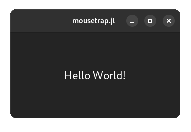
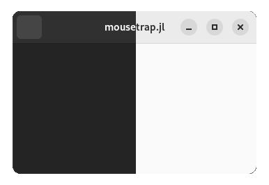
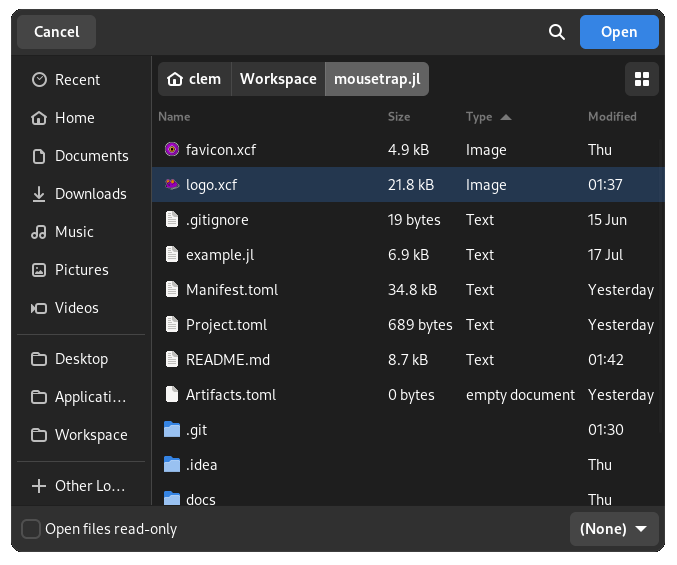
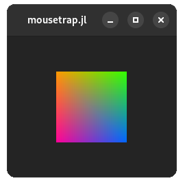

# Mousetrap


Mousetrap is a GUI library for Julia. It, and its [stand-alone C++-component of the same name](https://github.com/clemapfel/mousetrap), fully wrap [GTK4](https://docs.gtk.org/gtk4/) (which is written in C), *vastly* simplifying its interface to improve ease-of-use without sacrificing flexibility.

It aims to give developers of all skill levels the tools to start creating complex GUI applications with little time and effort.

> **Note**: Mousetrap is under active development. While backwards-compatibility for all future releases can already be guaranteed, stability, portability, and quality of the documentation may be affected. <br>
Consider participating in the development by [opening an issue](https://github.com/clemapfel/mousetrap.jl) when you encounter an error or bug (which - as of now - will most likely happen).

---

## Table of Contents
0. [Introduction](https://github.com/Clemapfel/mousetrap.jl)<br>
1. [Features](#features)<br>
2. [Planned Features](#planned-features)<br>
3. [Showcase](#showcase)<br>
3.1 [Hello World](#hello-world)<br>
3.2 [Swapping between Light- and Dark Themes](#swapping-between-light--and-dark-themes)<br>
3.3 [Opening a File Explorer Dialog](#opening-a-file-explorer-dialog)<br>
3.4 [Rendering a Rectangle using OpenGL](#rendering-a-rectangle-with-opengl)<br>
3.5 [Reacting to Mouse / Touchscreen Events](#reacting-to-mouse--touchscreen-presses)<br>
4. [Supported Platforms](#supported-platforms)<br>
5. [Installation](#installation)<br>
6. [Documentation](#documentation)<br>
7. [Credits & Donations](#credits--donations)<br>
8. [Contributing](#contributing)<br>
9. [License](#license)<br>

---

## Features
+ Create complex GUI application for Linux, Windows, and MacOS
+ Choose from over 40 different kinds of pre-made widgets, or create your own!
+ Supports mice, keyboards, touchscreens, touchpads, and stylus devices
+ Image processing facilities, well-suited for image manipulation programs
+ Fully abstracted OpenGL interface, allows for high-performance, hardware-accelerated rendering of custom shapes / shaders
+ [Hand-written manual and extensive documentation](https://clemens-cords.com/mousetrap): every exported symbol is documented

---

## Planned Features

Inn order of priority, highest first:

+ Simplify installation process to `] add mousetrap`
+ Add support for global and per-widget custom themes by exposing the CSS interface
+ Implement installation of .desktop files on end-user computers
+ Implement drag-and-drop for files, images, and widgets
+ Allow retrieving a widget from its container, for this to be possible the widgets type has to be stored C-side
+ Allow filtering and searching of selectable widget containers such as `ListView` and `ColumnView`
+ Allow adding custom signals that use the GLib marshalling system
+ Allow bundling of mousetrap apps, their resources, and all their dependencies into a portable C-executable
+ Fully polish interactive use from within the REPL
+ Make all functions that modify the global state thread-safe
+ Add an event controller to capture video game controller / joystick events
+ Expose the full `GtkTextView` and `GtkSourceView` interface, making `TextView` a fully feature text editor
+ Allow binding textures to fragment shader uniforms at texture unit 1 or higher, currently, only texture unit 0 is supported
+ Add 3D shapes and geometry shaders

---

## Showcase

### Hello World

```julia
using mousetrap
main() do app::Application
    window = Window(app)
    set_child!(window, Label("Hello World!"))
    present!(window)
end
```


---

### Swapping between Light- and Dark Themes

```julia
set_current_theme!(app, THEME_DEFAULT_LIGHT) 
```


---

### Opening a File Explorer Dialog

```julia
file_chooser = FileChooser()
on_accept!(file_chooser) do self::FileChooser, files
    println("selected files: $files")
end
present!(file_chooser)
```


---

### Rendering a Rectangle with OpenGL

```julia
render_area = RenderArea()
rectangle = Rectangle(Vector2f(-0.5, 0.5), Vector2f(1, 1))
add_render_task!(render_area, RenderTask(rectangle))
```


---

### Reacting to Mouse / Touchscreen Presses

```julia
function on_click(::ClickEventController, x, y)
    println("Click registered at ($x, $y)") # in pixels
end

click_controller = ClickEventController()
connect_signal_clicked!(on_click, click_controller)
add_controller!(window, click_controller)
```
```
Click registered at (367.5, 289.0)
```

---

## Supported Platforms

| Platform         | Basic GUI Component | OpenGL Rendering Component |
|------------------|---------------------|-----------------------------|
| Linux (64-bit)   | `✓`                | `✓`                        |
| Linux (32-bit)   | `✓`                | `✕`                        |
| Windows (64-bit) | `✓`                | `✓`                        |
| Windows (32-bit) | `✕`                | `✕`                        |
| MacOS            | `✓`                | `✕`                        |
| FreeBSD          | `✓`                | `✓`                        | 

---

## Installation

In the Julia REPL, execute:

```julia
import Pkg
Pkg.add(url="https://github.com/Clemapfel/mousetrap_windows_jll")
Pkg.add(url="https://github.com/Clemapfel/mousetrap_linux_jll")
Pkg.add(url="https://github.com/Clemapfel/mousetrap_apple_jll")
Pkg.add(url="https://github.com/Clemapfel/mousetrap.jl")
Pkg.test("mousetrap")
```

Where all four packages need to be installed, regardless of the operating system. 

Installation may take a long time. Once mousetrap is installed and precompilation is done, it can be loaded in only a few seconds during regular usage.

> **Note**: On Windows, some `GLib` log messages regarding dbus connections may appear during testing. These do not indicate a problem, as long as at the end of the testing suite it says `mousetrap tests passed`.

---

## Documentation

Documentation is available [here](https://clemens-cords.com/mousetrap). This includes a tutorial on how to get started using mousetrap, a manual introducing users to mousetrap and GUI programming in general, as well as an index of all classes, enums, and functions.

--- 

## Credits & Donations

The Julia and C++ component of mousetrap were designed and implemented by [C.Cords](https://clemens-cords.com).

Consider **donating** to support the continued development of this library:
+ [GitHub Sponsors](https://github.com/sponsors/Clemapfel)
+ [PayPal](https://www.paypal.com/donate/?hosted_button_id=8KWF3JTDF8XL2)

The goal is for mousetrap to be 100% stable and flawless when Julia [static compilation](https://github.com/JuliaLang/PackageCompiler.jl) finishes development. Static compilation and the lack of [fully featured, easy-to-use](https://github.com/JuliaGraphics/Gtk.jl/issues) GUI libraries are currently the largest factors as to why Julia is ill-suited for front-end development. Mousetrap aims to address this.

---

## Contributing

Consider contributing by taking on one of these bounty projects:

+ [App Bundler](https://github.com/users/Clemapfel/projects/2?pane=issue&itemId=33978204)
+ [Native Rendering on MacOS](https://github.com/users/Clemapfel/projects/2/views/1?pane=issue&itemId=33978341)
+ [Cross-Platform Continuous Integration](https://github.com/users/Clemapfel/projects/2?pane=issue&itemId=35737729#)

I am unable to offer any monetary reward, but I'd be happy to credit you as a co-author of mousetrap on [GitHub](https://github.com/Clemapfel/mousetrap.jl#credits) and [as a Julia package author](https://github.com/Clemapfel/mousetrap.jl/blob/main/Project.toml#L3) if your work contributes significantly to the implementation of one of these three bounty projects.

Other than this, consider participating in development by [opening an issue](https://github.com/Clemapfel/mousetrap.jl/issues) if you encounter a bug, crash, or [missing feature](https://github.com/users/Clemapfel/projects/2).

Thank you for your consideration.<br>
C.

---

## License

The current and all past version of mousetrap, including any text or assets used in mousetraps documentation, are licensed under [GNU Lesser General Public License (Version 3.0)](https://www.gnu.org/licenses/lgpl-3.0.en.html). This means it can be used in both free, open-source, as well as commercial, closed-source software.

---
