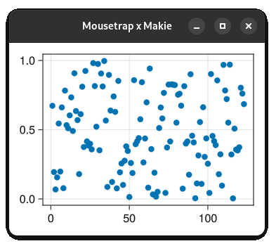

# Mousetrap


Mousetrap is a GUI library designed for Julia. It fully wraps [GTK4](https://docs.gtk.org/gtk4/) (which is written in C), *vastly* simplifying its interface to improve ease-of-use without sacrificing flexibility.

It aims to give developers of all skill levels the tools to start creating complex GUI applications with little time and effort, while taking full advantage of Julias idiosyncrasies.

> **Note**: Mousetrap is under active development. Consider participating in the development by [opening an issue](https://github.com/clemapfel/mousetrap.jl) when you encounter an error, bug, question, or missing feature.

---

## Table of Contents
0. [Introduction](https://github.com/Clemapfel/mousetrap.jl)<br>
1. [Features](#features)<br>
2. [Planned Features](#planned-features)<br>
3. [Showcase](#showcase)<br>
3.1 [Hello World](#hello-world)<br>
3.2 [Swapping between Light- and Dark Themes](#swapping-between-light--and-dark-themes)<br>
3.3 [Opening a File Explorer Dialog](#opening-a-file-explorer-dialog)<br>
3.4 [Rendering a Rectangle using OpenGL](#rendering-a-rectangle-with-opengl)<br>
3.5 [Reacting to Mouse / Touchscreen Events](#reacting-to-mouse--touchscreen-presses)<br>
4. [Supported Platforms](#supported-platforms)<br>
6. [Documentation](#documentation)<br>
5. [Installation](#installation)<br>
7. [Credits & Donations](#credits--donations)<br>
8. [License](#license)<br>

---

## Features
+ Create complex GUI application for Linux, Windows, and macOS
+ Choose from over 40 different kinds of pre-made widgets, or create your own
+ Supports mice, keyboards, touchscreens, touchpads, and stylus devices
+ Image processing facilities, well-suited for image manipulation programs
+ Built using OpenGL, allowing for high-performance, hardware-accelerated rendering, and integration of other OpenGL-based libraries such as [GLMakie](https://github.com/MakieOrg/Makie.jl)
+ [Hand-written manual and extensive documentation](https://clemens-cords.com/mousetrap): every exported symbol is documented

---

## Planned Features

In order of priority, highest first:

+ Allow bundling of Mousetrap apps using [`PackageCompiler.jl`](https://github.com/JuliaLang/PackageCompiler.jl)
+ Implement installation of .desktop files on end-user computers
+ Implement drag-and-drop for files, images, and widgets
+ Allow filtering and searching of selectable widget containers such as `ListView` and `ColumnView`
+ Allow adding custom signals that use the GLib marshalling system
+ Make all functions that modify the global state thread-safe

---

## Showcase

### Hello World

```julia
using Mousetrap
main() do app::Application
    window = Window(app)
    set_child!(window, Label("Hello World!"))
    present!(window)
end
```


---

### Swapping between Light- and Dark Themes

```julia
set_current_theme!(app, THEME_DEFAULT_LIGHT) 
```


---

### Opening a File Explorer Dialog

```julia
file_chooser = FileChooser()
on_accept!(file_chooser) do self::FileChooser, files
    println("selected files: $files")
end
present!(file_chooser)
```


---

### Rendering a Rectangle with OpenGL

```julia
render_area = RenderArea()
rectangle = Rectangle(Vector2f(-0.5, 0.5), Vector2f(1, 1))
add_render_task!(render_area, RenderTask(rectangle))
```


---

### Displaying a GLMakie Plot in a Mousetrap Window

```julia
using GLMakie, MousetrapMakie
canvas = GLMakieArea()
window = Mousetrap.Window()
set_child!(window, canvas) # can be used like any other widget

screen = create_glmakie_screen(canvas)
display(screen, scatter(rand(123)))
```


(**Note**: This feature is still experimental. See [here](https://github.com/Clemapfel/Mousetrap.jl/blob/main/test/makie_test.jl) for a complete example)

---

## Supported Platforms

Since `v0.3.0`, Mousetrap is fully portable. All features are available for all 64-bit versions of Linux, FreeBSD, macOS, and Windows.

> **Note**: Linux systems running Wayland may require additional configuration before the `RenderArea` widget becomes available. See [here](http://clemens-cords.com/mousetrap/01_manual/09_native_rendering/) for more information.

> **Note**: Ubuntu systems using proprietary NVIDIA drivers may encounter a crash on initialization, a fix is available [here](https://github.com/Clemapfel/Mousetrap.jl/issues/25#issuecomment-1731349366).

---

## Documentation

Documentation is available [here](https://clemens-cords.com/mousetrap). This includes a tutorial on how to get started using Mousetrap, a manual introducing users to Mousetrap and GUI programming in general, as well as an index of all classes, enums, and functions.

---

## Installation

In the Julia REPL, execute:

```julia
import Pkg;
begin
    Pkg.add(url="https://github.com/clemapfel/mousetrap_jll")
    Pkg.add(url="https://github.com/clemapfel/mousetrap.jl")
    Pkg.test("Mousetrap")
end
```

At the end, it should say `Mousetrap tests passed`.

> **Note**: On Windows, some `GLib` log messages regarding dbus connections may appear during testing. These do not indicate a problem.

> **Note**: On Linux Wayland, a warning regarding EGL displays may appear during installation. See the [here](http://clemens-cords.com/mousetrap/01_manual/09_native_rendering/) for how to fix this issue.

If you have had Mousetrap version 0.2.0 or earlier installed on your device before, run the following before installing the current version of Mousetrap:

```julia
import Pkg
begin
    try Pkg.rm("mousetrap") catch end
    try Pkg.rm("mousetrap_windows_jll") catch end
    try Pkg.rm("mousetrap_linux_jll") catch end
    try Pkg.rm("mousetrap_apple_jll") catch end
    Pkg.gc()
end
```

This will remove any trace of older versions that may cause conflicts.

--- 

## Credits & Donations

Mousetrap was designed and implemented by [C.Cords](https://clemens-cords.com).

It was created with no expectation of compensation and made available for free. Consider **donating** to reward past work and support the continued development of this library:
+ [GitHub Sponsors](https://github.com/sponsors/Clemapfel)
+ [PayPal](https://www.paypal.com/donate/?hosted_button_id=8KWF3JTDF8XL2)

The goal is for Mousetrap to be 100% stable and flawless when Julia [static compilation](https://github.com/JuliaLang/PackageCompiler.jl) finishes development. Static compilation and the lack of fully featured, easy-to-use, GUI libraries are currently the largest factors as to why Julia is ill-suited for front-end development. Mousetrap aims to address this.

---

## License

The current and all past version of Mousetrap, including any text or assets used in Mousetraps documentation, are licensed under [GNU Lesser General Public License (Version 3.0)](https://www.gnu.org/licenses/lgpl-3.0.en.html). This means it can be used in both free, open-source, as well as commercial, closed-source software.

