# Chapter 4: Widgets

In this chapter, we will learn:
+ What a widget is
+ Properties that all widgets share
+ What widgets are available and how to use them
+ How to create compound widgets

---

!!! note "Running snippets from this section"
    To run any partial code snippet from this section, use the following `.jl` file:
    ```julia
    using mousetrap
    main() do app::Application
        window = Window(app)

        # snippet here, creates widget `x` and adds it to `window'

        present!(window)
    end
    ```

---

## What is a widget?

Widgets are the central element to any and all GUI applications. In general, a widget is anything that can be rendered on screen. Often, wigdets are **interactable**, which means that the user can trigger behavior by interacting with the widget 
using a device such as a mouse, keyboard or touchcsreen.

For example, to interact with the widget [`Button`](@ref) from the previous chapter, the user has to move the mouse cursor
over the area of the button on screen, then press the left mouse button. This will trigger an animation where the button 
changes its appearance to look "pressed in", emit its signal `clicked` to trigger custom behavior, then return to its previous state. Having used computers for many years, most of us never thing about how things work in this gradual of a manner, and `Button` specifically makes it so we don't have to, all those actions are already implemented for us, all we have to do is place the button and connect a signal.

## Widget Signals

In mousetrap, [`Widget`](@ref) is an abstract type that all widgets subtype. `Widget` is a subtype of `SignalEmitter`, meaning
all widgets are signal emitters, but not all signal emitters are widgets. 

All widgets **share a number of signals**. These signals are accessible for every subtype of widget:

| Signal ID  | Signature                     |
|------------|-------------------------------|
| `realize`  | `(::T, [::Data_t]) -> Nothing`  |
| `destroy`  | `(::T, [::Data_t]) -> Nothing`  | 
| `show`     | `(::T, [::Data_t]) -> Nothing`  | 
| `hide`     | `(::T, [::Data_t]) -> Nothing`  |
| `map`      | `(::T, [::Data_t]) -> Nothing`  | 
| `unmap`    | `(::T, [::Data_t]) -> Nothing`  | 

Where `T` is the subtype. For example, since `Button` is a widget, the signature of `Button`s signal `realize` is `(::Button, [::Data_t]) -> Nothing`.

By the end of this chapter, we will have learned when exactly all these signals are emitted and what they mean. For now, we will just note that all widgets share these signals. For any widget in this chapter or in the docs, these signals are available. As such, they will not be listed for every `Widget` subtype.

---

## Widget Properties

When displayed on screen, a widgets size and location will be chosen dynamically. Resizing the window may or may not resize all widgets inside such that they fill the entire window. Multiple properties govern this behavior, and a somewhat complex heuristic determines the exact position and size. We can influence this process using multiple widget properties, which we will learn about in this chapter.

Each widget will choose a position and size on screen. We call this area, an axis-aligned rectangle, the widgets **allocated area**.

### Parent and Children

Widgets can be inside another widget. A widget that can contain other widgets is called a **container** widget. Each widget inside this container is called the **child** of the container.
Whether a widget can contain any children and how many depends on the type of widgets, some may contain no children, exactly one child, exactly two, or any number of children. Shared for all widgets, however, is that each widget has exactly one **parent**. This is the widget it is contained within.

Because a widget can only have exactly one parent, we cannot put the same widget instance into two containers. If we want two identical buttons on two different positions on screen, 
we have to create two button instances.

### Size Request
 
Moving onto the properties that determines the widgets size, we have its **size request**. This is a [`Vector2f`](@ref Vector2) which governs the minimum width and height of the widget, in pixels. Once set with [`set_size_request!`](@ref), no matter what, that widget will always allocate at least that amount of space. 

By default, all widgets size request is `Vector2f(0, 0)`. Setting the width and/or height of a widgets size request to `0` will tell the size manager, the algorithm determining the widgets final size on screen, that the widget has not made a request for a minimum size.

Manipulating the size request to influence a widgets minimum size is also called **size-hinting**.

### Accessing Widget Size

We can query information about a widgets current and target size using multiple functions, some of which only are available after a widget is **realized**. Realization means that the widget is initialized, has chosen it's final size on screen, and it ready to be displayed. When these conditions are met, widget will emit signal `realize`. 

Once realized, [`get_allocated_size`](@ref) and [`get_position`](@ref) return the current size and position of a widget, in pixels.

This size may or may not be equal to what we size-hinted the widget to, as size-hinting only determines the widgets minimum size. The layout manager is free to allocate a size larger than that.

Lastly, [`get_natural_size`](@ref) will access the size preferred by the layout manager. This size will always be equal to or larger than the size request. When trying to predict the size a widget will have, `get_natural_size` will give use the best measurement. Once the widget is realized, `get_allocated_size` and `get_position`  will gives us the exact value.

Layout management is very complex and the algorithm behind managing the size of the totality of all widgets is highly sophisiticated. Users of mousetrap are not required to understand this exact mechanism, only how to influence it.

On top of a widgets size request, a widgets target final allocated size depends on a number of other variables:

### Margin

Any widget has four margins: `start`, `end`, `top` and `bottom`. Usually, these correspond to empty space left, right, above, and below the widget, respectively. Margins are simply added to the corresponding side of the widget. In this way, they work similar to the [css properties of the same name](https://www.w3schools.com/css/css_margin.asp), though in mousetrap, margins may not be negative.

We use `set_margin_start`, `set_margin_end`, `set_margin_top` and `set_margin_bottom` to control each individual margin.

```julia
widget = # ...
set_margin_start!(widget, 10)
set_margin_end!(widget, 10)
set_margin_top!(widget, 10)
set_margin_bottom!(widget, 10)

# equivalent to
set_margin_horizontal(widget, 10)
set_margin_vertical(widget, 10)

# equivalent to
set_margin(widget, 10)
```

Where `set_margin_horizontal`, `set_margin_vertical` set two of the margins at the same time, while `set_margin` sets all four margins at once.

Margins are used extensively in UI design. They make an application look more professional and aesthetically pleasing. A good rule of thumb is that for a 1920x1080 display, the **margin unit** should be 10 pixels. That is, all margins should be a multiple of 10. If the display has a higher or lower resolution, the margin unit should be adjusted.

### Expansion

If the size of the parent of a widget changes, for example when resizing the window a `Button` is contained in, the widget may or may not **expand**. Expansion governs if a widget should
fill out the entire space available to it. We set expansion along the x- and y-axis separately using `set_expand_horizontally!` and `set_expand_vertically!`. If set to false, a widget will usually not grow past its natural size.

`set_expand!` is a convenience function that sets expansiong along both axes simultaneously.

```julia
widget = # ...
set_expand_horizontally(widget, false)
set_expand_vertically(widget, true)
```

### Alignment

Widget **alignment** governs how one or more widgets behave when grouped together, usually because they are all children of the same parent.

An example: a `Button` size-hinted to 100x100 pixels has expansion disabled (`set_expand!` was set to `false`). It has a margin of 0 and is placed inside a `Window`. When we scale the window, the button will not change size. Alignment, then, governs **where in the window the button is positioned**.

We set alignment for the horizontal and vertical axis separately, using `set_horizontal_alignment!` and `set_vertical_alignment!`, which both take value of the enum [`Alignment`](@ref). This enum has three possible values, whose meaning depends on whether we use this value for the horizontal or vertical alignment:

+ `ALIGNMENT_START`: left if horizontal, top if vertical
+ `ALIGNMENT_END`: right if horizontal, bottom if vertical
+ `ALIGNMENT_CENTER`: center of axis, regardless of orientation

For our example, the button would take on these locations based on which enum value we chose for each alignment axis:

| Vertical Alignment | Horizontal Alignment | Resulting Position  |
|--------------------|----------------------|---------------------|
| `ALIGNMENT_START`  | `ALIGNMENT_START`    | top left corner     |
| `ALIGNMENT_START`  | `ALIGNMENT_CENTER`   | top center          |
| `ALIGNMENT_START`  | `ALIGNMENT_END`      | top right corner    |
| `ALIGNMENT_CENTER` | `ALIGNMENT_START`    | center left         |
| `ALIGNMENT_CENTER` | `ALIGNMENT_CENTER`   | center              |
| `ALIGNMENT_CENTER` | `ALIGNMENT_END`      | center right        |
| `ALIGNMENT_END`    | `ALIGNMENT_START`    | bottom left corner  |
| `ALIGNMENT_END`    | `ALIGNMENT_CENTER`   | bottom center       |
| `ALIGNMENT_END`    | `ALIGNMENT_END`      | bottom right corner |

```julia
widget = # ...
set_horizontal_alignment!(widget, ALIGNMENT_START)
set_vertical_alignment!(widget, ALIGNMENT_START)

# equivalent to
set_alignment!(widget, ALIGNMENT_START)
```

Where `set_alignment!` sets both properties at the same time.

Using alignment, size-hinting, and expansion, we can fully control where and at what size a widget will appear on screen.

---

### Visibility & Opacity

Once a widget is realized and we call `present!` on the window it is contained in, it is **shown**, meaning it appears on screen and it emits signal `show`. If the widget leaves the screen, for example because it is removed from a container or its window is closed, it is **hidden**, emitting signal `hide`.

Another way to hide a shown widget or show a hidden widget is `set_is_visible!`:

```julia
# hide a button when it is clicked
button = Button()
connect_signal_clicked!(button) do self::Button
    set_is_visible!(self, false)
end
set_child!(window, button)
```

Here we hide a button when it is clicked. This means the button cannot be clicked again, as its interactivity is only available while it is shown. 

If we instead just want to make the button invisible, but still have it be clickable, we need use `set_opacity!`, which takes a float in `[0, 1]`, where `0` is fully transparent, `1` is fully opaque:

```julia
# make a button invisibile if it is visible, or visible if it is invisible
button = Button()
connect_signal_clicked!(button) do self::Button
    current = get_opacity(self)
    if current < 1.0
        set_opacity!(button, 1.0)
    else
        set_opacity!(button, 0.0)
    end
end
set_child!(window, button)
```

Setting opacity does emit the `hide` or `show` signals.

---

### Cursor Type

Each widget has a property governing what the user's cursor will look like while it is inside the widgets allocated area. By default, the cursor is a simple arrow. A widget intended for text-entry would want the cursor to be a [caret](https://en.wikipedia.org/wiki/Cursor_(user_interface)), while a clickable widget would likely want a [pointer](https://en.wikipedia.org/wiki/Cursor_(user_interface)#Pointer).

Some widgets already set the cursor to an appropriate shape automatically, but we can control the cursor shape for each individual widget manually using `set_cursor!`, which takes 
a value of the enum [`CursorType`](@ref):

| `CursorType` value             | Appearance                                                                                          |
|--------------------------------|-----------------------------------------------------------------------------------------------------|
| `CURSOR_TYPE_NONE`             | Invisible cursor                                                                                    |
| `CURSOR_TYPE_DEFAULT`          | Default arrow pointer                                                                               |
| `CURSOR_TYPE_POINTER`          | Hand pointing                                                                                       |
| `CURSOR_TYPE_TEXT`             | Caret                                                                                               |
| `CURSOR_TYPE_GRAB`             | Hand, not yet grabbing                                                                              |
| `CURSOR_TYPE_GRABBING`         | Hand, currently grabbing                                                                            |
| `CURSOR_TYPE_CELL`             | Cross, used for selecting cells from a table                                                        |
| `CURSOR_TYPE_CROSSHAIR`        | Crosshair, used for making pixel-perfect selections                                                 |
| `CURSOR_TYPE_HELP`             | Questionmark, instructs the user that clicking or hovering above this element will open a help menu |
| `CURSOR_TYPE_CONTEXT_MENU`     | Questionmark, instructs the user that clicking will open a context menu                             |
| `CURSOR_TYPE_NOT_ALLOWED`      | Instructs the user that this action is currently disabled                                           |
| `CURSOR_TYPE_PROGRESS`         | Spinning animation, signifies that the object is currently busy                                     |
| `CURSOR_TYPE_WAIT`             | Loading animation, Instructs the user that an action will become available soon                     |
| `CURSOR_TYPE_ZOOM_IN`          | Lens, usually with a plus icon                                                                      |
| `CURSOR_TYPE_ALL_SCROLL`       | Omni-directional scrolling                                                                          |
| `CURSOR_TYPE_MOVE`             | 4-directional arrow                                                                                 |
| `CURSOR_TYPE_NORTH_RESIZE`     | Up-arrow                                                                                            |
| `CURSOR_TYPE_NORTH_EAST_RESIZE` | Up-left arrow                                                                                       |
| `CURSOR_TYPE_EAST_RESIZE`      | Left arrow                                                                                          |
| `CURSOR_TYPE_SOUTH_EAST_RESIZE` | Down-left arrow                                                                                     |
| `CURSOR_TYPE_SOUTH_RESIZE`     | Down arrow                                                                                          |
| `CURSOR_TYPE_SOUTH_WEST_RESIZE` | Down-right arrow                                                                                    |
| `CURSOR_TYPE_WEST_RESIZE`      | Right arrow                                                                                         |
| `CURSOR_TYPE_NORTH_WEST_RESIZE` | Up-right arrow                                                                                      |
| `CURSOR_TYPE_ROW_RESIZE`        | Up-down arrow                                                                                       |
| `CURSOR_TYPE_COLUMN_RESIZE`     | Left-right arrow                                                                                    |


`Button`s default cursor is `CURSOR_TYPE_DEFAULT`. If we want to indicate to the user that the button should be clicked, we can instead set it to be a pointer:

```julia
button = Button()
set_cursor!(button, CURSOR_TYPE_POINTER)
```

The exact look of each cursor type depends on the users operating system and UI configuration. To choose a fully custom cursor, we use `set_cursor_from_image!`, which takes an `Image`. We will learn more about `Image` in the [chapter dedicated to it](./06_image_and_sound.md). Until then, this is how we set a cursor from a `.png` file on disk:

```julia
widget = # ...
set_cursor_from_image!(widget, Image("/path/to/image.png"))
```

---

### Tooltip

Each widget can optionally have a **tooltip**. This is a little window that opens when the cursor hovers over a widgets allocated area for enough time. The exact duration is decided by the users OS, we do not have control over it. 

Tooltips are usually a simple text message. For a case like this, we can set the text directly using `set_tooltip_text!`:

```julia
button = Button()
set_tooltip_text!(button, "Click to Open");
```
\image html widget_tooltip_text.png

If we want to use something more complex than just simple text, we can register an arbitrarily complex widget as a tooltip by calling `set_tooltip_widget!`. As a matter of style, this widget should not be intractable, though there is no mechanism in place to enforce this.

---

Now that we know properties shared by all widgets, we can continue onto learning about all the specific widget types. From this point onwards, we can be sure that any of these objects supports all properties and signals discussed so far.

## Window

For our first widget, we have [`Window`](@ref). Windows are central to any application, as such, `Window` and `Application` are inherently connected. We cannot create a `Window` without an application. If all windows are closed, the underlying application usually exists.

While windows are widget, they occupy a somewhat of a special place. `Window` is the only widget that does not have a parent, this is called being **top-level**, nothing is "above" the window in the parent-child hierarchy.

`Window` has exactly on child, which we set with `set_child!`, as we have many times so far already.

### Opening / Closing a Window

When we create a `Window` instance, it will be initially hidden. None of its children will be realized or shown, and the user has no way to know that the window exists. A `Window`s lifetime only begins once we call `present!`. This opens the window and shows it to the user. We've seen this in our `main` functions before:

```julia
main() do app::Application

    # create the window
    window = Window(app)
    
    # show the window, this realizes all widgets inside
    present!(window)
end
```

At any point we can call `close!`, which hides the window. This does not destroy the window permanently, unless `set_hide_on_close!` was set to `false` previously. For an application 
to exit, all its windows only need to be hidden, not permanently destroyed. Therefore, calling `close!` on all windows will also cause the application to attempt to exit.

### Close Request

`Window` has three signals, `activate_default_widget`, `activate_focused_widget`, and `close_request`, only the latter of which is relevant to us for now.

It requires a signal handler with the signature

```
(::Window, [::Data_t]) -> WindowCloseRequestResult
```

When the window handler of the users OS asks the window to close, for example by the user pressing the "x" button, this signal will be emitted. It's result, of type [`WindowCloseRequestResult`](@ref) determines whether the window actualls does close. By returning `WINDOW_CLOSE_REQUEST_RESULT_PREVENT_CLOSE`, the window will stay open:

```julia
# create a window that cannot be closed
window = Window(app)
connect_signal_close_request!(window) self::Window
    return WINDOW_CLOSE_REQUEST_RESULT_PREVENT_CLOSE
end
present!(window)
```

If the signal handler instead returns `WINDOW_CLOSE_REQUEST_RESULT_ALLOW_CLOSE`, the window will simply close, which is the default behavior. This is also what happens when no handler
is connected to signal `close_request`.

### Window Properties

Other than its singular child, `Window` has a number of other properties:

#### Title

`set_title!` sets the name displayed in the window's header bar. By default, this name will be the name of the application. We can choose to hide the title by simply calling `set_title!(window, "")`.

#### Modality & Transience

When dealing with multiple windows, we can influence the way two windows interact with each other. Two of these interactions are determined by whether a window is **modal** and whether it is **transient** for another window.

By setting `set_modal!` to true, if the window is revealed, **all other windows of the application will be deactivated**, preventing user interaction with them. This also freezes animations, it essentially pauses all other windows. The most common use-case for this is for dialogs, for example if the user requests to close the application, it is common to open a small dialog requesting the user to confirm exiting the application. While this dialog is shown, the main window should be disabled and all other processes should halt until a selection is made. This is possible by making the dialog *modal*.

Using `set_transient_for!`, we can make sure a window will always be shown in front of another. `set_transient_for!(A, B)` will make it so, while `A` overlaps `B` on the users desktop, `A` will be shown in front of `B`. 

#### Titlebar

The part on top of a window is called the **title bar**. By default, it will show the window title and a minimize-, maximize- and close-button. We can completely hide the header bar using `set_is_decorated!(window, false)`, which also means the user has now way to move or close the window, as the header bar is not accessible to them.

In addition to the child in the content area of the window, `Window` supports inserting a widget into the titlebar using [`set_titlebar_widget!`](@ref), this will usually be a `HeaderBar`, which we will learn about later in this chapter, though any arbitrary widget can be inserted.

---

## Label

In contention for being *the* most used widget, `Label`s are important to understand. A `Label` displays static text, meaning it is not interactable. It is initialized as one would expect:

```julia
label = Label("text")
```

To change a `Label`s text after initialization, we use `set_text!`. This can be any number of lines, `Label` is not just for single-line text. If our text has more than one line, a number of additional formatting options are available:

### Justify Mode

[Justification](https://en.wikipedia.org/wiki/Typographic_alignment) determines how words are distributed along the horizontal axis. There are 5 modes in total, all of which are part of the enum [`JustifyMode`](@ref), set using `set_justify_mode!`:

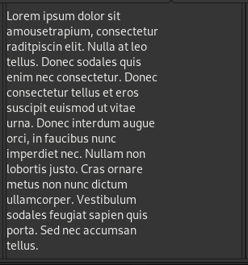
`JUSTIFY_MODE_LEFT`


`JUSTIFY_MODE_CENTER`

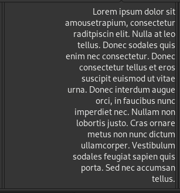
`JUSTIFY_MODE_RIGHT`


`JUSTIFY_MODE_FILL`

Where the fifth mode is `JUSTIFY_MODE_NONE` which arranges all text in exactly one line.

### Wrapping

Wrapping determines where a line break is inserted if the text's width exceeds that of `Label` allocated area. For wrapping to happen at all, the `JustifyMode` has to be set to anything **other** than `LABEL_WRAP_MODE_NONE`, which is the default.

Wrapping modes are values of the enum [`LabelWrapMode`](@ref):

| `LabelWrapMode` value  | Meaning                                                 | Example                 |
|------------------------|---------------------------------------------------------|-------------------------|
| `NONE`                 | no wrapping                                             | `"humane mousetrap"`    |
| `ONLY_ON_WORD`         | line will only be split between two words               | `"humane\nmousetrap"`   |
| `ONLY_ON_CHAR`         | line will only be split between syllables, adding a `-` | `"hu-\nmane mouse-trap"` |
| `WORD_OR_CHAR`         | line will be split between words and/or syllables       | `"humane\nmouse-trap"`   |

Where `\n` is the newline character.

### Ellipsize Mode

If a line is too long for the available space and wrapping is disabled, **ellipsizing** will take place. The corresponding enum [`EllipsizeMode`](@ref) has four possible value:

| `EllipsizeMode` value | Meaning                                                  | Example                     |
|-----------------------|----------------------------------------------------------|-----------------------------|
| `NONE`                | text will not be ellipsized                              | `"Humane mousetrap engineer"` |
| `START`               | starts with `...`, showing only the last few words       | `"...engineer"`               |
| `END`                 | ends with `...`, showing only the first few words        | `"Humane mousetrap..."`       |
| `MIDDLE`              | `...` in the center, shows start and beginning           | `"Humane...engineer"`         |

### Markup

Labels support **markup**, which allows users to change properties about individual words or characters in a way similar to text formatting in html. Markup in mousetrap uses [Pango attributes](https://docs.gtk.org/Pango/pango_markup.html), which allows for styles including the following:

| Tag          | Example                  | Result                  |
|--------------|--------------------------|-------------------------|
| `b`          | `<b>bold</b>`            | <b>bold</b>             |
| `i`          | `<i>italic</i>`          | <i>italic</i>           |
| `u`          | `<u>underline</u>`       | <u>underline</u>        |
| `s`          | `<s>strikethrough</s>`   | <s>strike-through</s>    |
| `tt`         | `<tt>inline_code</tt>`   | <tt>inline_code</tt>    |
| `small`      | `<small>small</small>`   | <small>small</small>    |
| `big`        | `<big>big</big>`         | <h3>big</h3>            |
| `sub`        | `x<sub>subscript</sub>`  | x<sub>subscript</sub>   |
| `sup`        | `x<sup>superscript</sup>` | x<sup>superscript</sup> |
| `&#` and `;` | `&#129700;`              | 🪤                      | 

Where in the last row, we used the [decimal html code](https://www.compart.com/en/unicode/U+1FAA4) for the mousetrap emoji provided by unicode.

!!! note
    Pango only accepts the **decimal** code, not hexadecimal. For example, the mousetrap emoji has the decimal code `129700`, while its hexadecimal code is `x1FAA4`. 
    To use this emote in text, we thus use `&#129700;`, **not** `&#x1FAA4;`. The latter will not work.

!!! note 
    All `<`, `>` will be parsed as style tags, regardless of whether they are escaped. To display them as characters, we us `&lt;` 
    (less-than) and `&gt;` (greater-than) instead of `<` and `>`. For example, we would `x < y` as `"x &lt; y"`.

Pango also supports colors, different fonts, text direction, and more. For these, we can [consult the Pango documentation](https://docs.gtk.org/Pango/pango_markup.html) directly.

```julia
label = Label("&lt;tt&gt;01234&lt;/tt&gt; is rendered as <tt>01234</tt>")
set_child!(window, label)
```


---

---

## Box

[`Box`](@ref) is a multi-widget container that aligns its children horizontally or vertically, depending on **orientation**. A number of widgets are orientable like this, which means they supports the functions `set_orientation!` and `get_orientation`, which take / return an enum value of enum [`Orientation`](@ref)

| `Orientation` Value       | Meaning                                  |
|---------------------------|------------------------------------------|
| `ORIENTATION_HORIZONTAL`  | Oriented left-to-right, along the x-axis |
| `ORIENTATION_VERTICAL`    | Oriented top-to-bottom, along the y-axis |

To add widgets to the box, we use `push_front!`, `push_back!` and `insert_after!`:

```julia
left = Label("LEFT")
set_margin_start!(left, 10)

center = Label("CENTER")
set_margin_horizontal!(center, 10)

right = Label("RIGHT")
set_margin_end!(right, 10)

box = Box(ORIENTATION_HORIZONTAL)

# add `left` to the start
push_front!(box, left)

# add `right to the end
push_back!(box, right)

# insert `center` after `left`
insert_after!(box, center, left)
```


In this example, we use margins to add a 10px gap in between each child. This can be done more succinctly using the boxes own **spacing** propety. By setting `set_spacing!` to `10`, we insert 10 pixels in between any two children.

Lastly, `hbox` and `vbox` are two convenience functinos that take a number of widgets and return a horizontal or vertical box with those widgets already inserted. Using this and spacing, we can write the above as two lines:

```julia
box = hbox(Label("LEFT"), Label("CENTER"), Label("RIGHT"))
set_spacing!(box, 10)
set_child!(window, box)
```
---

## CenterBox

[`CenterBox`](@ref) is an orientable container that has exactly three children. `CenterBox` prioritizes keeping the designated center child centered at all costs, making it a good choice when symmetry is desired.

We use `set_start_child!`, `set_center_child!`, and `set_end_child!` to specify the corresponding child widget:

```julia
center_box = CenterBox(ORIENTATION_HORIZONTAL)
set_start_child!(center_box, Label("start"))
set_center_child!(center_box, Button())
set_end_child!(center_box, Label("end"))
```

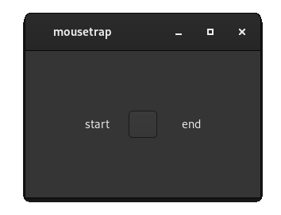

---

## Separator

Perhaps the simplest widget is [`Separator`](@ref). It simply fills its allocated area with a solid color:

```julia
separator = Separator()
set_margin!(separator, 20)
set_expand!(separator, true)
set_child!(window, separator)
```

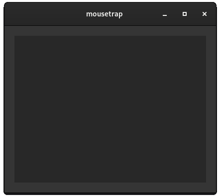

This widget is often used as a background to another widget, to fill empty space, or as en element visually separating two sections. Often, we want to have the separator be a specific thickness. This can be accomplished using size-hinting. For example, to draw a horizontal line similar to the `<hr>` element in HTML, we would do the following:

```julia
hr = Separator()
set_expand_horizontally!(hr, true)
set_expand_vertically!(hr, false)
set_size_request!(hr, Vector2f(
    0,  // width: any 
    3   // height: exactly 3 px
));
```

This will render as a line that has a height of `3` px at all times, but will assume the entire width of its parent.

---

## ImageDisplay

[`ImageDisplay`](@ref) is used to display static images.

Assuming we have an image at the absolute path `/resources/image.png`, we can create an `ImageDisplay` like so:

```julia
image_display = ImageDisplay()
create_from_file!(image_display, "/resources/image.png")

# equivalent to
image_display = ImageDisplay("/resources/image.png")
```

The following image formats are supported by `ImageDisplay`:

| Format Name             | File Extensions            |
|-------------------------|----------------------------|
| PNG                     | `.png`                     |
| JPEG                    | `.jpeg` `.jpe` `.jpg`      |
| JPEG XL image           | `.jxl`                     |
| Windows Metafile        | `.wmf` `.apm`              |
| Windows animated cursor | `.ani`                     |
| BMP                     | `.bmp`                     |
| GIF                     | `.gif`                     |
| MacOS X icon            | `.icns`                    |
| Windows icon            | `.ico` `.cur`              |
| PNM/PBM/PGM/PPM         | `.pnm` `.pbm` `.pgm` `.ppm` |
| QuickTime               | `.qtif` `.qif`             |
| Scalable Vector Graphics | `.svg` `.svgz` `.svg.gz`   |
| Targa                   | `.tga` `.targa`            |
| TIFF                    | `.tiff` `.tif`             |
| WebP                    | `.webp`                    |
| XBM                     | `.xbm`                     |
| XPM                     | `.xpm`                     |

After realization, we cannot change the contents of `ImageDisplay` directly. If the file on disk changes, `ImageDisplay` remains unchanged. If we want to update `ImageDisplay`, we need to call `create_from_file!` manually again.

---

## Button

Familiar from previous chapters, [`Button`](@ref) is commonly used to trigger behavior.

It has the two signals:

```
Base.include(Main, "signals.jl")
@signal_table(Button,
    clicked,
    activate
)
```

If the user clicks the button using a mouse `clicked` is emitted, while triggering the button by pressing enter emits `activate`. This latter mechanism of 
emitting signal `activate` is shared by a number of other widgets, while `clicked` is unique to `Button`.

`Button` has a single child that is used as its label. We set it using `set_child!`.

Other than the child widget, we can customize the look of a button further. `set_has_frame!` will make all graphical elements of the button other than its label invisible, while `set_is_circular!` changes the button from rectangular to fully rounded:


!!! details "How to generate this image"
    ```julia
    using mousetrap
    main() do app::Application
        window = Window(app)
    
        normal = Button()
        set_child!(normal, Label("01"))
    
        no_frame = Button()
        set_has_frame!(no_frame, false)
        set_child!(no_frame, Label("02"))
    
        circular = Button()
        set_is_circular!(circular, true)
        set_child!(circular, Label("03"))
    
        box = CenterBox(ORIENTATION_HORIZONTAL, normal, no_frame, circular)
        set_margin!(box, 75)
    
        set_child!(window, box)
        pesent!(window)
    end
    ```

Where the above shown buttons have the following properties:

| Button | `set_has_frame!` | `set_is_circular!` |
|--------|------------------|-------------------|
| 01     | true             | false             |
| 02     | false            | false             |
| 03     | true             | true              |

---

## ToggleButton

[`ToggleButton`](@ref) is a specialized form of `Button`. It supports most of `Button`s methods / signals, including `set_child!`, `set_has_frame!`, `set_is_circular!` and signals `activate` and `clicked`.

Unique to `ToggleButton` is that, if clicked, the button will **remain pressed**. When clicked again, it returns to being unpressed. Anytime the state of the `ToggleButton` changes, signal `toggled` will be emitted. In this way, `ToggleButton` can be used to track a boolean state.

```
Base.include(Main, "signals.jl")
@signal_table(ToggleButton,
    toggled,
    clicked,
    activate
)
```

To check whether the button is currently toggled, we use `get_is_active`, which returns `true` if the button is currently depressed, `false` otherwise.

```julia
toggle_button = ToggleButton()
connect_signal_toggled!(toggle_button) do self::ToggleButton
  println("state is now: " get_is_active(self))
end
set_child!(window, toggle_button)
```

---

## CheckButton

[`CheckButton`](@ref) is very similar to `ToggleButton` in function - but not appearance. `CheckButton` is an empty box in which a checkmark appears when it is toggled. Just like before, we query whether it is pressed by calling `get_is_active`. 

```
Base.include(Main, "signals.jl")
@signal_table(ToggleButton,
    toggled,
    clicked
)
```

`CheckButton` can be in one of **three** states, which are represented by the enum [`CheckButtonState`](@ref). The button can either be `CHECK_BUTTON_STATE_ACTIVE`, `CHECK_BUTTON_STATE_INACTIVE`, or `CHECK_BUTTON_STATE_INCONSISTENT`. This changes the appearance of the button:

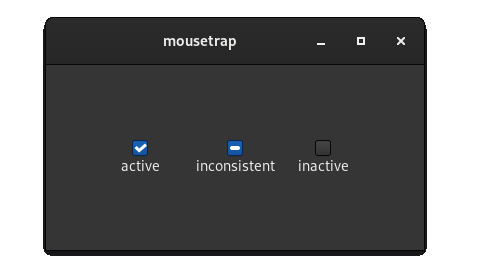

!!! details "How to generate this image"
    ```julia
    using mousetrap
    main() do app::Application
    
        window = Window(app)
    
        active = CheckButton()
        set_state!(active, CHECK_BUTTON_STATE_ACTIVE)
        active_box = vbox(active, Label("active"))
    
        inconsistent = CheckButton()
        set_state!(inconsistent, CHECK_BUTTON_STATE_INCONSISTENT)
        inconsistent_box = vbox(inconsistent, Label("inconsistent"))
    
        inactive = CheckButton()
        set_state!(inactive, CHECK_BUTTON_STATE_INACTIVE)
        inactive_box = vbox(inactive, Label("inactive"))
    
        for button in [active, inconsistent, inactive]
            set_horizontal_alignment!(button, ALIGNMENT_CENTER)
        end
    
        box = CenterBox(ORIENTATION_HORIZONTAL, active_box, inconsistent_box, inactive_box)
        set_margin!(box, 75)
    
        set_child!(window, box)
        present!(window)
    end
    ```

Note that `get_is_active` will only return `true` if the current state is specifically `CHECK_BUTTON_STATE_ACTIVE`. `toggled` is emitted whenever the state changes, regardless of which state the `CheckButton` was in.

---

## Switch

As the last widget intended to convey a boolean state to the user, we have [`Switch`](@ref), which has an appearance similar to a light switch. `Switch` does not emit `toggled`, instead, we connect to the `activate` signal, which is emitted anytime the switch is operated.

```
Base.include(Main, "signals.jl")
@signal_table(Switch,
    activate
)
```


!!! details "How to generate this image"
    ```julia
    main() do app::Application
    
        window = Window(app)
    
        active = Switch()
        set_is_active!(active, true)
        active_box = vbox(active, Label("active"))
    
        inactive = Switch()
        set_is_active!(inactive, false)
        inactive_box = vbox(inactive, Label("inactive"))
    
        for switch in [active, inactive]
            set_horizontal_alignment!(switch, ALIGNMENT_CENTER)
            set_margin!(switch, 10)
        end
    
        box = CenterBox(ORIENTATION_HORIZONTAL)
        set_start_child!(box, active_box)
        set_end_child!(box, inactive_box)
        set_margin!(box, 75)
    
        set_child!(window, box)
        present!(window)
    end
    ```
---

---

## Adjustment

From widgets conveying a boolean state, we'll now move on to widgets conveying a discrete number. These let the user choose a value from a **range**, which, in mousetrap, is represented by a signal emitter called [`Adjustment`](@ref).

`Adjustment` has four properties:

+ `lower`: lower bound of the range
+ `upper`: upper bound of the range
+ `increment`: step increment
+ `value`: current value, in `[lower, upper]`

For example, expressing the previous range like so:

```julia
auto adjustment = Adjustment(
    1,      // value
    0,      // lower
    2,      // upper
    0.5     // increment    
);
```

Will make the use able to select from the values `{0, 0.5, 1, 1.5, 2}`, with `1` being selected on initialization.

We usually do not need to create our own `Adjustment`, rather, it is provided by a number of widgets which use it to select their value. Notably, if the `Adjustment` is modified, that widgets value is modified, and if the widget is modified, the  adjustment is too. 

Adjustment has two signals:

```
Base.include(Main, "signals.jl")
@signal_table(Adjustment,
    value_changed,
    properties_changed
)
```

We can connect to `value_changed` to monitor the value property of an `Adjustment` (and thus whatever widget is controlled by it), while `properties_changed` is emitted when one of `upper`, `lower` or `step increment` changes.

---

## SpinButton

`SpinButton` is used to pick an exact value from a range. The user can click the rectangular area and manually enter a value using the keyboard, or they can increase or decrease the current value by the step increment of the the widgets `Adjustment` by pressing the plus or minus button.

We supply the properties of the range underlying the `SpinButton` to its constructor:

```julia
# create SpinButton with range [0, 2] and increment 0.5
spin_button = SpinButton(0, 2, 0.5)
```

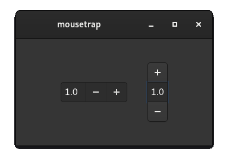

!!! details "How to generate this image"
    ```julia
    main() do app::Application
        window = Window(app)
    
        horizontal = SpinButton(0, 2, 0.5)
        set_value!(horizontal, 1)
    
        # Add invisible separator buffers above and below spin button for better symmetry
        horizontal_buffer = CenterBox(
            ORIENTATION_VERTICAL, 
            Separator(; opacity = 0.0),
            horizontal,
            Separator(; opacity = 0.0)
        )
    
        vertical = SpinButton(0, 2, 0.5)
        set_value!(vertical, 1)
        set_orientation!(vertical, ORIENTATION_VERTICAL)
    
        box = CenterBox(ORIENTATION_HORIZONTAL)
        set_start_child!(box, horizontal_buffer)
        set_end_child!(box, vertical)
    
        set_child!(window, box)
        present!(window)
    end             
    ```

We set and access any property of spin button using `get_value`, `set_value!`, `get_lower`, `set_lower!`, etc. These work exactly as if we were modifying the underlying `Adjustment`, which we can also obtain using `get_adjustment`.

`SpinButton` has two signals, one of which, `value_changed`, we recognized from `Adjustment`. To react to the user changing the value of a `SpinButton`, we would do the following:

```julia
spin_button = SpinButton(0, 2, 0.5)
connect_signal_value_changed!(spin_button) do self::SpinButton
    println("Value is now: $(get_value(self))")
end
```

The other signal is `wrapped`, which is emitted when [`set_should_wrap!`](@ref) was set to `true` and the spin buttons value under- or overflows.

---

## Scale


!!! detail "How to generate this image"
    ```julia
    main() do app::Application
        window = Window(app)

        horizontal = Scale(0, 2, 0.5)
        set_orientation!(horizontal, ORIENTATION_HORIZONTAL)
        set_value!(horizontal, 1)
        set_size_request!(horizontal, Vector2f(200, 0))

        vertical = Scale(0, 2, 0.5)
        set_orientation!(vertical, ORIENTATION_VERTICAL)
        set_value!(vertical, 1)
        set_size_request!(vertical, Vector2f(0, 200))

        box = CenterBox(ORIENTATION_HORIZONTAL)
        set_start_child!(box, horizontal)
        set_end_child!(box, vertical)

        set_margin_horizontal!(box, 75)
        set_margin_vertical!(box, 40)

        set_child!(window, box)
        present!(window)
    end
    ```

[`Scale`](@ref), just like `SpinButton`, is a widget that allows a user to choose a value from the underlying `Adjustment`. This is done by click-dragging the knob of the scale, or clicking anywhere on its rail. In this way, it is usually harder to pick an exact decimal value on a `Scale` as opposed to a `SpinButton`. We can aid in this task by displaying the exact value next to the scale, which is enabled with [`set_should_draw_value!`](@ref):

!!! detail "How to generate this image"
    ```julia
    main() do app::Application
        window = Window(app)

        window = Window(app)

        horizontal = Scale(0, 2, 0.5)
        set_orientation!(horizontal, ORIENTATION_HORIZONTAL)
        set_value!(horizontal, 1)
        set_size_request!(horizontal, Vector2f(200, 0))
        set_should_draw_value!(horizontal, true)

        vertical = Scale(0, 2, 0.5)
        set_orientation!(vertical, ORIENTATION_VERTICAL)
        set_value!(vertical, 1)
        set_size_request!(vertical, Vector2f(0, 200))
        set_should_draw_value!(vertical, true)

        box = CenterBox(ORIENTATION_HORIZONTAL)
        set_start_child!(box, horizontal)
        set_end_child!(box, vertical)

        set_margin_horizontal!(box, 75)
        set_margin_vertical!(box, 40)

        set_child!(window, box)
        present!(window)
    end
    ```

`Scale`supports most of `SpinButton`s functions, including querying information about its underlying range and settings the orientation, and signal `value_changed`:

```julia
scale = Scale(0, 2, 0.5)
connect_signal_value_changed!(scale) do self::Scale
    println("Value is now: $(get_value(self))")
end
```

---           

## ScrollBar

Similar to `Scale`, [`ScrollBar`](@ref) is used to pick a value from an adjustment. It is often used as a way to choose which part of a widget should be shown on screen. For an already automated way of doing this, see `Viewport`.

---

## LevelBar

[`LevelBar](@ref) is used to display a fraction to indicate the level of something, for example the volume of a playback device.

To create a `LevelBar`, we need to specify the minimum and maximum value of the range we wish to display. We can then set the current value using `set_value!`. The resulting fraction is computed automatically, based on the upper and lower limit we supplied to the constructor:

```julia
# create a LevelBar for range [0, 2]
level_bar = LevelBar(0, 2)
set_value!(level_bar, 1.0); // set to 50%
```

Unlike the previous widgets, `LevelBar` does not have a step increment.

Once the bar reaches 75%, it changes color:


!!! details "How to generate this image"
    ```julia
    main() do app::Application
        window = Window(app)

        box = Box(ORIENTATION_VERTICAL)
        set_spacing!(box, 10)
        set_margin!(box, 10)

        n_bars = 5
        for i in 1:n_bars
            fraction = Float32(i) / n_bars
            label = Label(string(Int64(round(fraction * 100))) * "%")
            set_size_request!(label, Vector2f(50, 0))

            bar = LevelBar(0, 1)
            set_value!(bar, fraction)
            set_expand_horizontally!(bar, true)

            row_box = Box(ORIENTATION_HORIZONTAL)
            set_spacing!(box, 10)
            push_back!(row_box, label)
            push_back!(row_box, bar)

            push_back!(box, row_box)
        end

        set_child!(window, box)
        present!(window)
    end
    ```

`LevelBar` also supports displaying a discrete value, in which case it will be drawn segmented. To enable this, we set `set_mode!` to `LEVEL_BAR_DISPLAY_MODE_DISCRETE`, as opposed to `LEVEL_BAR_MODE_CONTINUOUS`, which is the default.

---

## ProgressBar

Similarly to `LevelBar`, [`ProgressBar`](@ref) communicates a fraction to the user, which is frequently use to show the user how much of a task is currently completed.

`ProgressBar` only expresses values in `[0, 1]`, and [`set_fraction!`](@ref) will only accept values in this range.

Using `set_show_text!`, we can make it so the current percentage is drawn along with the progress bar, or we can draw a custom label using `set_text!`


!!! details "How to generate this image"
    ```julia
    main() do app::Application
        window = Window(app)

        box = Box(ORIENTATION_VERTICAL)
    
        progress_bar = ProgressBar()
        set_fraction!(progress_bar, 0.47)
        set_vertical_alignment!(progress_bar, ALIGNMENT_CENTER)
        set_expand!(progress_bar, true)
        set_show_text!(progress_bar, true)
        set_margin!(progress_bar, 10)
        
        set_child!(window, progress_bar)
        present!(window)
    end
    ```
---

## Spinner

To signal progress when we do not have an exact fraction, we use [`Spinner`](@ref) which is a small spinning icon. Once we set [`set_is_spinning!`](@ref) to `true`, a spinning animatino will play, indicating to the user that work is being done.


!!! details "How to generate this image"
    ```julia
    main() do app::Application

        window = Window(app)

        spinner = Spinner()
        set_is_spinning!(spinner, true)

        set_child!(window, spinner)
        present!(window)
    end
    ```

---

## Entry

Text entry is central to many application. Mousetrap offers two widgets that allow the user to type freely. [`Entry`](@ref) is the widget of choice for single-line text entry.

The entries currently displayed text is stored in an internal text buffer. We can freely access or modify the buffers content with `Entry::get_text` and `Entry::set_text`.

While we could control the size of an `Entry` using size-hinting, a better way is `get_max_width_chars!`, which resizes the entry such that is length is enough to fit a certain number of characters into its area.

`Entry` supports "password mode", which is when each character typed is replaced with a dot. This is to prevent a third party looking at a user screen and seeing what they typed. To enter password mode, we set `set_text_visible!` to `false`. Note that this does not actually encrypt the text buffer in memory, it is a purely visual change.


!!! details "How to generate this image"
    ```julia
    main() do app::Application

        window = Window(app)

        clear = Entry()
        set_text!(clear, "text")

        password = Entry()
        set_text!(password, "text")
        set_text_visible!(password, false)

        box = vbox(clear, password)
        set_spacing!(box, 10)
        set_margin_horizontal!(box, 75)
        set_margin_vertical!(box, 40)

        set_child!(window, box)
        present!(window)
    end
    ```

Lastly, `Entry` is **activatable**, when the user presses the enter key while the cursor is inside the entires text area, it will emite signal `activate`. Its other signal, `text_changed`, is emitted whenever the internal text buffer changes in anyway. We would 

Other than `activate`, `Entry` has one more signal, `text_changed`, which is emitted whenever the internal buffer changes. Checking this signals signature, we see that we can connect to it like so:

```julia
entry = Entry()
set_text!(entry, "Write here")
connect_signal_text_changed!(entry) do self::Entry
    println("text is now: $(get_text(self))")
end
```

Note that the user cannot insert a newline character using the enter key. `Entry` should exclusively be used for text prompts which have **no line breaks**. For multi-line text entry, we should use the next widget instead.

---

## TextView

[`TextView`](@ref) is the multi-line equivalent of `Entry`. It supports a number of basic text-editor features, including **undo / redo**, which are triggered by the user pressing Control + Z or Control + Y respectively. We as developers can also trigger this behavior manually with `undo!` / `redo!`.

Much like `Label`, we can set how the text aligns horizontally using `set_justify_mode!`. To further customize how text is displayed, we can choose the **internal margin**, which is the distance between the frame of the `TextView` and the text inside of it. `set_left_margin!`, `set_right_margin!`, `set_top_margin!` and `set_bottom_margin!` allow us to choose these values freely.

`TextView` does **not** have the `activate` signal, pressing enter while the cursor is inside the widget will simply create a new line. Instead, it only has signal `text_changed`, which behaves identical to that of `Entry`:

```julia
text_view = TextView()
set_text!(text_view, "Write here")
connect_signal_text_changed!(text_view) do self::TextView
    println("text is now: $(get_text(self))")
end
```

---

---

## Dropdown

We sometimes want users to be able to pick a value from a **set list of values**, which may or may not be numeric. [`DropDown`](@ref) allows for this. If clicked, a window presents the user with a list of items. The user can click on any of these, then that item will be made the currently selected item.

We add an item using `push_back!`, which takes a string, which will be used as the items label:

```julia
dropdown = DropDown()
item_01_id = push_back!(dropdown, "Item #01")
item_02_id = push_back!(dropdown, "Item #02")
item_03_id = push_back!(dropdown, "Item #03")
```


`push_back!` returns the internal id of the item. We should keep track of this ID, as it will be used to identify the currently selected item, which we can compare against the result of `get_selected`.

If we do loose track of the ID, we can always retrieve it using `get_item_at`, which returns the ID of the item at a given position.

`push_back!`, and its equivalents `push_front!` and `insert!`, provide a method that also takes a callback. This callback will be invoked when the item is selected, it has the signature:

```
(::DropDown, [::Data_t]) -> Nothing
```

```julia
dropdown = DropDown()
push_back!(dropdown, "Item #01") do self::DropDown
    println("Item #01 selected")
end
push_back!(dropdown, "Item #02") do self::DropDown
    println("Item #03 selected")
end
push_back!(dropdown, "Item #03") do self::DropDown
    println("Item #03 selected")
end
```

This gives us a better mechanism of keeping track of which item is currently selected. Instead of querying the `DropDown` using `get_selected` and react to its result, we should instead register a callback using this method.

Lastly, sometimes we want a different label for when an item is selected, and for when the user opens the menu to select an item. For this situation, `push_back!` offers a method that lets us specify the labels separately:

```julia
dropdown = DropDown()
push_back!(dropdown,
    Label("Item #01"),  # Widget displayed in dropdown menu
    Label("01")         # Widget displayed when item is selected
)

push_back!(dropdown, Label("Item #02"), Label("02"))
push_back!(dropdown, Label("Item #03"), Label("03"))
```


Where we had to first create a `Label` instance, then use it as the label widget, as this method of `push_back!` takes any two *widgets*, as opposed to just strings. This gives us incredible flexibility with how we want the dropdown to be displayed. This method, along with all methods of `push_front!` and `insert!`, also supports adding a callback as the first argument, which behaves exactly as before.

---

---

## Frame

[`Frame`](@ref) is a purely cosmetic widget that displays its singular child in a frame with a small border and rounded corners:


!!! details "How to generate this image"
    ```julia
    main() do app::Application

        window = Window(app)

        left = Separator()
        right = Separator()

        for separator in [left, right]
            set_size_request!(separator, Vector2f(50, 50))
            set_expand!(separator, false)
        end

        box = CenterBox(ORIENTATION_HORIZONTAL)
        set_start_child!(box, left)
        set_end_child!(box, Frame(right))

        set_margin_horizontal!(box, 75)
        set_margin_vertical!(box, 40)
    
        set_child!(window, box)
        present!(window)
    end
    ```

Using [`set_label_widget!`](@ref), we can furthermore choose a widget to be displayed above the child widget of the frame. This will usually be a `Label`, though `set_label_widget!` accepts any kind of widget.

`Frame` is rarely necessary, but will make GUIs seem more aesthetically pleasing and polished. 

---

## AspectFrame

Not to be confused with `Frame`, [`AspectFrame`](@ref) adds no graphical element to its singular child. Instead, the widget added with `set_child!` will be forced to allocate a size that conforms to a specific **aspect ratio**. That is, its width-to-height ratio will stay constant, regardless of the aspect ratio of its parent.

We choose the aspect ratio in `AspectFrame`s constructor, though we can later adjust it using `set_ratio!`. Both of these functions accept a floating point ratio calculated as `width / height`. For example, if we want to force a widget to keep an aspect ratio of 4:3, we would do:

```julia
child_widget = # ...
aspect_frame = AspectFrame(4.0 / 3.0)
set_child!(aspect_frame, child_widget);
```

---


## Overlay

So far, all widget containers have aligned their children such that they do not overlap. In cases where we do want overlapping to happen, for example if we want to render one widget on ront of another, we have to use [`Overlay`](@ref)

`Overlay` has one "base" widget, which is at the conceptual bottom of the overlay. We set this widget using `set_child!`. We can then add any number of widgets on top of the base widget using `add_overlay!`:


!!! details "How to generate this image"
    ```julia
    main() do app::Application

        window = Window(app)

        lower = Button()
        set_horizontal_alignment!(lower, ALIGNMENT_START)
        set_vertical_alignment!(lower, ALIGNMENT_START)

        upper = Button()
        set_horizontal_alignment!(upper, ALIGNMENT_END)
        set_vertical_alignment!(upper, ALIGNMENT_END)

        overlay = Overlay()
        set_child!(overlay, lower)
        add_overlay!(overlay, upper)

        set_child!(window, AspectFrame(1, overlay))
        present!(window)
    end
    ```

Where the position and size of overlayed widgets depend on their expansion and alignment properties.

By default, `Overlay` will allocate exactly as much space as the base widget (set with `set_child!`) does. If one of the overlaid widgets takes up more space than the base widget, it will be truncated. We can avoid this by supplying a second argument to `add_overlay!`, which is a boolean indicated whether the overlay widget should be included in the entire container's size allocation. That is, if the overlaid widget is larger than the base widget, the `Overlay` will resize itself such that the entire overlaid widget is visible:

```julia
add_overlay!(overlay, overlaid_widge; include_in_measurement = true); 
```

---

## Paned

[`Paned`](@ref) is a widget that always has exactly two children. Between the two children, a visual barrier is drawn. The user can click on this barrier and drag it horizontally or vertically, depending on the orientation of the `Paned`. This gives the user the option to resize how much of a shared space one of the two widgets allocates.

`Paned` is orientable, depending on its orientation, `set_start_child!` and  `set_end_child!` add a widget to the corresponding side.


!!! details "How to generate this image"
    ```julia
    function generate_child(label::String)
        out = Frame(Overlay(Separator(), Label(label)))
        set_margin!(out, 10)
        return out
    end

    main() do app::Application

        window = Window(app)

        paned = Paned(ORIENTATION_HORIZONTAL)
        set_start_child!(paned, generate_child("Left"))
        set_end_child!(paned, generate_child("Right"))

        set_start_child_shrinkable!(paned, true)
        set_end_child_shrinkable!(paned, true)

        set_child!(window, paned)
        present!(window)
    end
    ```

`Paned` has two per-child properties: whether a child is **resizable** and whether it is **shrinkable**.

Resizable means that if the `Paned` changes size, the child should change size with it.

Shrinkable sets whether the side of the `Paned` can be made smaller than the allocated size of that sides child widget. If set to `true`, the user can drag the `Paned`s barrier, such that one of the widgets is partially or completely hidden:

```julia
set_start_child_shrinkable!(paned, true)
set_end_child_shrinkable!(paned, true)
```


---

## Revealer

While not technically necessary, animations can improve user experience drastically. Not only do they add visual style, they can hide abrupt transitions or small loading times. As such, they should be in any advanced GUI designer's repertoire.

One of the most common applications for animations is the act of hiding or showing a widget.
[`Revealer`](@ref) was made for this purpose.,


To trigger the `Revealer`s animation and change whether the child widget is currently visible, we call `set_revealed!` which takes a boolean as its argument. If the widget goes from hidden to shown or shown to hidden, the animation will play. Once the animation is done, signal `revealed` will be emittedd.

### Transition Animation

We have control over the kind and speed of the transition animation. By calling `set_transition_duration!`, we can set the exact amount of time an animation should take. For example, to set the animation duration to 1 second:

```julia
revealer = Revealer()
set_child!(revealer, #= widget =#)
set_transition_duration!(revealer, seconds(1));
```

Where `seconds` returns a [`mousetrap.Time`](@ref).

Apart from the speed, we also have a choice of animation **type**, represented by the enum [`RevealerTransitionType`](@ref). Animations include a simple cross-fade, sliding, swinging, or no animation at all, which instantly shows or hides the widget.


!!! details "How to generate this image"
    ```julia
    main() do app::Application
        window = Window(app)

        # create child
        child = Frame(Overlay(Separator(), Label("<span size='200%'>[Item]</span>")))
        set_margin!(child, 10)
        set_size_request!(child, Vector2f(0, 100))

        # setup revealer
        revealer = Revealer()
        set_child!(revealer, child)
        set_transition_duration!(revealer, seconds(1))
        set_transition_type!(revealer, REVEALER_TRANSITION_TYPE_SLIDE_DOWN)

        # create a button that, when clicked, triggers the revealer animation
        button = Button()
        connect_signal_clicked!(button, revealer) do self::Button, revealer::Revealer
            set_revealed!(revealer, !get_revealed(revealer))
        end
    
        set_child!(window, vbox(button, revealer))
        present!(window)
    end
    ```
---

## Expander

[`Expander`](@ref) is similar to `Revealer`, in that it also has exactly one child widget, and it shows / hides the widget. Unlike `Revealer`, there is no animation attached to `Expander`. Instead, it hides the widget behind a collapsible label.

Expander has two children, the label, set with `set_label_widget!`, and its child, set with `set_child!`, which is the widget that will be shown / hidden.

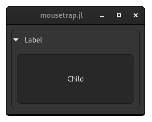

!!! details "How to generate this image"
    ```julia
    main() do app::Application
        window = Window(app)

        child = Frame(Overlay(Separator(), Label("Child")))
        set_margin!(child, 10)
        set_size_request!(child, Vector2f(0, 100))

        label = Label("Label")
        set_margin!(label, 10)
    
        expander_and_frame = Frame(Expander(child, label))
        set_margin!(expander_and_frame, 10)

        set_child!(window, expander_and_frame)
        present!(window)
    end
    ```

Note that `Expander` should not be used for the purpose of creating nested lists, as `ListView`, a widget we will learn about later in this chapter, is better suited for this purpose.


---

## Viewport

By default, most containers will allocate a size equal to or exceeding that of its children. For example, if we create a widget that has a natural size of 5000x1000 px and use it as the child of a `Window`, the `Window` will attempt to allocate 5000x1000 pixels on screen, making the window far larger than most screens can display. 

Someimtes, widgets that are this large are unavoidable, which is why there is a widget that offers viewing only parts of its child: [`Viewport`](@ref).

We set the viewports singular child using `set_child!`, after which the user can operate the two scrollbars to change which part of the child is currently visible:


!!! details "How to generate this image"
    ```julia
    main() do app::Application

        window = Window(app)

        child = Frame(Overlay(Separator(), Label("<span size='800%'>CHILD</span>")))
        set_margin!(child, 10);

        viewport = Viewport()
        set_child!(viewport, child)

        set_child!(window, viewport)
        present!(window)
    end
    ```

### Size Propagation

By default, `Viewport` will disregard the size of its child and simply allocate an area based only on the properties of the `Viewport` itself. This behavior can be overridden by setting the viewports **size propagation**

If `set_propagate_natural_height!` is set to true, the viewports height will be equal thte height of its child. Conversely, `set_propagate_natural_width!` does the same for the childs width.

```julia
set_propagate_natural_width!(viewport, true)
set_propagate_natural_height!(viewport, false)
```


Here, the viewport will be the same width as the child, but the viewports height is independent of that of its child. 

### Scrollbar Policy

`Viewport` has two scrollbars, controlling the horizontal and vertical position. By default, these will automatically reveal themself when the users cursor enters the viewport, hiding themself once the cursor exists.

This behavior of if and when to reveal the scrollbars is determined by the viewports 
*scrollbar policy**, set with `set_horizontal_scrollbar_policy!` and  `set_vertical_scrollbar_policy!`, both of which take a value of the enum [`ScrollbarVisibilityPolicy`](@ref), which has the following instances:

+ `SCROLLBAR_VISIBILITY_POLICY_NEVER`: scrollbar always hidden
+ `SCROLLBAR_VISIBILITY_POLICY_ALWAYS`: scrollbar is always shown
+ `SCROLLBAR_VISIBILITY_POLICY_AUTOMATIC`: scrollbar hides/shows automatically, see above

If `set_propagate_natural_height!` is set to `true`, the vertical scrollbar will always be hidden, regardless of policy. The same is true for `set_propagate_natural_width!` and the horizontal scrollbar.

### Scrollbar Position

Lastly, we can customize the location of both scrollbars at the same time using `set_scrollbar_placement!`, which takes one of the following values of the enum [`CornerPlacement`](@ref).

+ `CORNER_PLACEMENT_TOP_LEFT`: horizontal scrollbar at the top, vertical scrollbar on the left
+ `CORNER_PLACEMENT_TOP_RIGHT`: horizontal at the top, vertical on the right
+ `CORNER_PLACEMENT_BOTTOM_LEFT`: horizontal at the bottom, vertical on the left
+ `CORNER_PLACEMENT_BOTTOM_RIGHT`: horizontal at the bottom, vertical on the right

### Signals

If we want to react to the user scrolling the `Viewport`s child, we can either connect to its signal `scroll_child`, or we can access the `Adjustment` controlling each  scrollbar using `get_horizontal_adjustment` and `get_vertical_adjustment`, then connect to the signals of `Adjustment`s

With this, scrollbar policy, size propagation we have full control over every aspect of `Viewport`.

---

## Popover

A [`Popover`](@ref) is a special kind of window. It is always [modal](#modality--transience). Rather than having the normal window decoration with a close button and title, `Popover` closes dynamically (or when requested by the application). 

Showing the popover is called **popup**, closing the popover is called **popdown**, `Popover` correspondingly has `popup!` and `popdown!` to trigger this behavior.

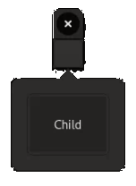

!!! details "How to generate this image"
    ```julia
    main() do app::Application
        window = Window(app)

        child = Frame(Overlay(Separator(), Label("Child")))
        set_size_request!(child, Vector2f(100, 75))
        set_margin!(child, 10);

        popover = Popover()
        set_child!(popover, child)

        # create a button, attach the popover to it
        button = Button()
        attach_to!(popover, button)

        # when the button is clicked, the popover is shown. It hides automatically
        connect_signal_clicked!(button, popover) do self::Button, popover::Popover
            popup!(popover)
        end

        set_child!(window, button)
        present!(window)
    end
    ```

Popovers can only be shown while they are **attached** to another widget. We use `attach_to!` to specify this widget, while `set_child!` chooses which widget to display inside the popover. Like `Window`, `Popover` always has exactly one child.

Manually calling `popup!` or `popdown!` to show / hide the `Popover` can be bothersome, to address this, mousetrap offers a widget that automatically attaches the popover and controls its visibility: [`PopoverButton`](@ref)

## PopoverButton

Like `Button`, `PopoverButton` has a single child, can be circular, and has the `activate` signals. Instead of triggering behavior, `PopoverButton`s purpose is to reveal and hide a `Popover`.

We first create the `Popover`, then connect it to the button using `set_popover!`. After this, if the user clicks the `PopoverButton`, the popover is shown.

```julia
popover = Popover()
set_child!(popover, child)
popover_button = PopoverButton(popover)
```

Additionally, an arrow is shown next to the label of the `PopoverButton`, indicating to the user that, when it is clicked, a popover will open.

---

## SelectionModel

We will now move on to **selectable widgets**, which tend to be the most complex and powerful widgets in mousetrap.

All selectable widgets have on thing in common: their multiple children are managed by a **selection model**. This model is a list of widgets. For each widget, the model will keep track of whether that widget is currently selected. If it is, a graphical element will be added to the selectable widget that indicates to the user which item(s) are currently selected.


Modifying the model will modify the selectable widget, and modifying the selectable widget will modify the model. In this way, the two are linked, similar to how `Adjustment` works. We use `select!` and `unselect!` to change the selection manually, while `get_selection!` returns a vector with one or more of the selected items indices.

`SelectionModel` has a signal `selection_changed`, which is emitted anytime an item is selected or unselected in any way. This signal requires the signature
```
(::SelectionModel, position::Integer, n_items::Integer, [::Data_t]) -> Nothing
```
Where `position` is the new index of the changed item (1-based), while `n_items` is the number of currently selected items.

Each model has an associated property called the **selection mode**, which is expressed by the enum [`SelectionMode`](@ref). This governs how many items can be selected. 

| `SelectionMode`           | Number of Items |
|---------------------------|-----------------|
| `SELECTION_MODE_NONE`     | exactly zero    |
| `SELECTION_MODE_SINGLE`   | exactly one     |
| `SELECTION_MODE_MULTIPLE` | zero or more    |

We specify the selection mode when creating a selectable widget, such as our first widget: `ListView`.

## ListView

[`ListView`](@ref) is a widget that arranges its children in a row or column, depending on orientation. We add children using `push_back!`, `push_front!` and `insert!`:

```julia
list_view = ListView(ORIENTATION_VERTICAL, SELECTION_MODE_SINGLE)
push_back!(list_view, Label("Child #01"))
push_back!(list_view, Label("Child #02"))
push_back!(list_view, Label("Child #03"))
```


Where the second child is currently selected.

`ListView` can be requested to automatically show separators in-between two items by setting `set_show_separators!` to `true`. To check which item is selected, we should instead query its selection model, which we obtain using `get_selection_model`.

### Nested Trees

By default, `ListView` displays its children in a linear list, either horizontally or vertically. `ListView` also supports **nested lists**, sometimes called a **tree view**:


!!! details "How to generate this image"
    ```julia
    main() do app::Application

        window = Window(app)

        list_view = ListView(ORIENTATION_VERTICAL, SELECTION_MODE_SINGLE)
        push_back!(list_view, Label("Child #01"))
        child_02_it = push_back!(list_view, Label("Child #02"))
        push_back!(list_view, Label("Child #03"))

        push_back!(list_view, Label("Nested Child #01"), child_02_it)
        nested_child_02_it = push_back!(list_view, Label("Nested Child #02"), child_02_it)

        push_back!(list_view, Label("Inner Child #01"), nested_child_02_it)

        frame = Frame(list_view)
        set_margin!(frame, 10)
        set_child!(window, frame)
        present!(window)
    end
    ```

Each item of a `ListView` can in itself be made a list view. To do this, we use an optional argument of `push_back!` (or `push_front!`, `insert!`), which is an **iterator**.

This iterator identifies which list view to insert the item in. We obtain this iterator like so:

```julia
list_view = ListView()
child_01_it = push_back!(list_view, Label("Child #01"))
child_02_it = push_back!(list_view, Lable("Child #02"))
child_03_it = push_back!(list_view, Lable("Child #03"))
```

If we now want to insert an item as a child of `Child #02`, we use its operator as the optional argument:

```julia
nested_child_01_it = push_back!(list_view, Label("Nested Child #01"), child_02_it)
```

To insert a new widget as the child of this already nested list, we use its iterator. Through this mechanism, we can create arbitrarily deep nested lists.

If we do not want a nested list, we can instead completely ignore the iterator. Specifying no iterator means we will be inserting items into the outer most list.

---

## GridView

[`GridView`](@ref) supports many of the same functions as `ListView`, including `push_back!`, `push_front!`, and `insert!`. Unlike `ListView`, `GridView` cannot be nested, as it instead displays its children in a **uniform grid**.

`GridView`s constructor also takes an orientation as well as the selection mode. The orientation determines in which order elements will be shown, consider the next two images, the first of which is a `GridView` whose orientation is `ORIENTATION_HORIZONTAL`, while the latters is `ORIENTATION_VERTICAL`:

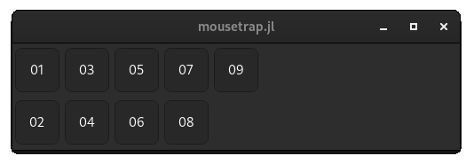
*A horizontal `GridView`*
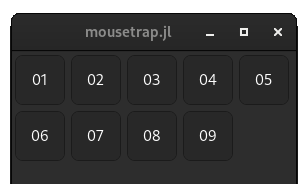
*A vertical `GridView`

!!! details "How to generate this image"
    ```julia
    function generate_child(label::String) ::Widget

        child = Frame(Overlay(Separator(), Label(label)))
        set_size_request!(child, Vector2f(50, 50))
        set_expand!(child, false)
        return AspectFrame(1, child)
    end

    main() do app::Application
        window = Window(app)

        grid_view = GridView(ORIENTATION_VERTICAL) # or `ORIENTATION_HORIZONTAL`
        set_expand!(grid_view, true)

        for i in 1:9
            push_back!(grid_view, generate_child("0$i"))
        end

        separator = Separator()
        set_expand!(separator, true)
        set_expand!(grid_view, false)

        set_child!(window, vbox(separator, grid_view))
        present!(window)
    end
    ```

We can control the exact distribution of widgets more closely by using `set_max_n_columns!` and `set_min_n_columns!`, which make it so the grid view will always have the given number of columns (or rows, for a horizontal `GridView`).

---

## Column View

[`ColumnView`](@ref) is used to display widgets as a table, with rows and columns. Each column has a title, which uniquely identifies it.

To fill our `ColumnView`, we first instance it, then allocate a number of columns:

```julia
column_view = ColumnView()

column_01 = push_back_column!(column_view, "Column #01")
column_02 = push_back_column!(column_view, "Column #02")
column_03 = push_back_column!(column_view, "Column #03")
```

We can add a column at any point, even after rows have been added. Along with `push_back_column!`, `push_front_column!`, `insert_column!` are also available. 
All of these functions return an object of type `ColumnViewColumn`.

To add a widget into the n-th row (1-based) of a `ColumnViewColumn`, we use `set_widget_at!`

```julia
# add 3 labels into column 1 row 1 - 3
set_widget_at!(column_view, column_01, Label("01"))
set_widget_at!(column_view, column_01, Label("02"))
set_widget_at!(column_view, column_01, Label("03"))
```

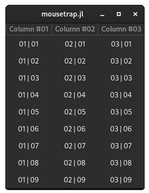

!!! details "How to generate this image"
    ```julia
    main() do app::Application

        println("called")

        window = Window(app)
        set_title!(window, "mousetrap.jl")

        column_view = ColumnView()

        column_01 = push_back_column!(column_view, "Column #01")
        column_02 = push_back_column!(column_view, "Column #02")
        column_03 = push_back_column!(column_view, "Column #03")

        column_i = 1
        for column in [column_01, column_02, column_03]
            for row_i in 1:9
                set_widget_at!(column_view, column, row_i, Label("0$column_i | 0$row_i"))
            end
            column_i = column_i + 1
        end

        set_expand!(column_view, true)
        set_child!(window, column_view)
        present!(window)
    end
    ```

Any rows that do not yet have widgets will be backfilled and appear empty. If we loose track of the `ColumnViewColumn` instance returned when adding a new column, we can retrieve it using `get_column_at` or `get_column_with_title`, the latter of which takes the unique title we chose when adding the column.

Since most of the time we will want all cells in a row to contain a widget, we can also use `push_back_row!`, `push_front_row`, or `insert_row!`, which insert n widgets at once, where n is the number of columns:

```julia
# add 1st widget to 1st column, 2nd widget to 2nd column, etc.
push_back_row!(column_view, Label("Column 01 Child"), Label("Column 02 Child"), Label("Column 03 Child"))
```

This is a more convenient way to fill the column view, though if we later want to edit it, we will have to use `set_widget_at!` to override widgets in any rows.

`ColumnViewColumn` has a number of other features, we can make it so the user can freely resize each column by setting `set_resizable!` to `true`, or we can force each column to have an exact width using `set_fixed_width!`, which takes a number of pixels.

---

## Stack

[`Stack'](@ref) is a selectable widget that can only ever display exactly one child at a time. Each child of the stack is called a **page**.

We add a page using `add_child!`, which takes any widget, and the pages title. This title is mandatory and it has to uniquely identify the page. `add_child!` returns the pages ID, which, similarly to how adding elements to `DropDown` works, we need to keep track of in order to later refer to pages in a position-independent manner.

```julia
stack = Stack()

id_01 = add_child!(stack, #= Page Widget #01 =#, "Page #01")
id_02 = add_child!(stack, #= Page Widget #02 =#, "Page #02")
id_03 = add_child!(stack, #= Page Widget #03 =#, "Page #03")
```

To check which page is currently visible, we use `get_visible_child`, which returns that pages ID. If we loose track of a pages ID, we can retrieve the ID of a stack page at a given position using `get_child_at`.

To keep track of which page is currently selected, we should connect to the stacks underlying `SelectionModel`, just like we would with `ListView` and `GridView`:

```julia
stack = Stack()
stack_model = get_selection_model(stack)
connect_signal_selection_changed!(stack_model, stack) do x::SelectionModel, position::Integer, n_items::Integer, stack::Stack
    println("Current stack page is now: $(get_child_at(stack, position))")
end
```

Where we provided the `Stack` instance to the selection models signal handler as the optional `data` argument.

While we can change the currently active page by `set_visible_child!`, our users do not. To allow them to change the page of a `Stack`, we either need
to provide another widget and modify the stack from within its signals, or we can use one of two widgets whose only purpose is to choose the page of a stack: 
`StackSwitcher` and `StackSidebar`.

### StackSwitcher

[`StackSwitcher`](@ref) presents the user with a row of buttons, each of which use the corresponding stack pages title:

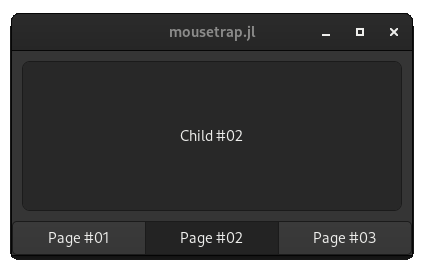

!!! details "How to generate this image"
    ```julia
    function generate_child(label::String) ::Widget
        child = Frame(Overlay(Separator(), Label(label)))
        set_size_request!(child, Vector2f(150, 150))
        set_margin!(child, 10)
        return child
    end

    main() do app::Application
        window = Window(app)

        stack = Stack()

        add_child!(stack, generate_child("Child #01"), "Page #01")
        add_child!(stack, generate_child("Child #02"), "Page #02")
        add_child!(stack, generate_child("Child #03"), "Page #03")

        stack_model = get_selection_model(stack)
        connect_signal_selection_changed!(stack_model, stack) do x::SelectionModel, position::Integer, n_items::Integer, stack::Stack
            println("Current stack page is now: $(get_child_at(stack, position))")
        end

        set_child!(window, vbox(stack, StackSwitcher(stack))) # create StackSwitcher from stack
        present!(window)
    end
    ```

`StackSwitcher` has no other methods or properties, though it provides the signals that all widgets share.

### StackSidebar

[`StackSidebar`](@ref) has the same purpose as `StackSwitcher`, though it displays the list of stack pages as a vertical list:

!!! details "How to generate this image"
    ```julia
    function generate_child(label::String) ::Widget
        child = Frame(Overlay(Separator(), Label(label)))
        set_size_request!(child, Vector2f(150, 150))
        set_margin!(child, 10)
        return child
    end

    main() do app::Application
        window = Window(app)

        stack = Stack()

        add_child!(stack, generate_child("Child #01"), "Page #01")
        add_child!(stack, generate_child("Child #02"), "Page #02")
        add_child!(stack, generate_child("Child #03"), "Page #03")

        stack_model = get_selection_model(stack)
        connect_signal_selection_changed!(stack_model, stack) do x::SelectionModel, position::Integer, n_items::Integer, stack::Stack
            println("Current stack page is now: $(get_child_at(stack, position))")
        end

        set_child!(window, vbox(stack, StackSwitcher(stack))) # Create StackSidebar from stack
        present!(window)
    end
    ```

Other than this visual component, its purpose is identical to that of `StackSwitcher`.

### Transition Animation

When changing which of the stacks pages is currently shown, regardless of how that selection was triggered, an animation transitioning from one page to the other plays. Similar to `Revealer`, we can influence the type and speed of animation in multiple ways:

+ `set_transition_duration!` choose how long the animation will take to complete
+ `set_interpolate_size!`, if set to `true`, makes it such that while the transition animation plays, the stack will change from the size of the previous child to the size of the current child gradually. If set to `false`, this size change happens instantly
+ `set_animation_type!` governs the type of animation, which is one of the enum values of `StackTransitionType`.

If we want all of the stacks children to allocate the same size, we can set `set_is_vertically_homogeneous!` and `set_is_horizonally_homogeneous!` to `true`, in which case 
the stack will assume the height or widget of its largest child, respectively.

---

## Grid

Not to be confused with `GridView`, [`Grid`](@ref) arranges its children in a **non-uniform** grid:


!!! details "How to generate this image"
    ```julia
    function generate_child(label::String) ::Widget
        child = Frame(Overlay(Separator(), Label(label)))
        set_size_request!(child, Vector2f(50, 50))
        return child
    end

    main() do app::Application

        window = Window(app)
        
        grid = Grid()

        mousetrap.insert!(grid, generate_child("01"), 1, 1, 2, 1)
        mousetrap.insert!(grid, generate_child("02"), 3, 1, 1, 2)
        mousetrap.insert!(grid, generate_child("03"), 4, 1, 1, 1)
        mousetrap.insert!(grid, generate_child("04"), 1, 2, 1, 2)
        mousetrap.insert!(grid, generate_child("05"), 2, 2, 1, 1)
        mousetrap.insert!(grid, generate_child("06"), 4, 2, 1, 1)
        mousetrap.insert!(grid, generate_child("07"), 2, 3, 3, 1)
    
        set_margin!(grid, 10)
        set_child!(window, grid)
        present!(window)
    end
    ```

Each widget in the grid has a x- and y-position, along with a widget and height, both measured in **number of cells** . 

For example, in the image above, the widget labeled `05` has the x-position of 2, y-position of 2, a width of 1 cell and a height of 1 cell. 

```julia
mousetrap.insert!(
    grid, 
    #= widget =#,
    2,  # x-position
    2,  # y-position
    1,  # width
    1   # height
)
```

Meanwhile, the widget labeled `07` has an x-position of 2, y-position of 3, width of 3 cells and height of 1 cell.

```julia
mousetrap.insert!(
    grid, 
    #= widget =#, 
    2,  # x-position
    3,  # y-position
    3,  # width
    1   # height
)
```

We have to take care ourselfs that no two widgets overlap. 

`set_column_spacing!` and `set_row_spacing!` automatically insert margins in between columns and rows, while `set_rows_homogeneous!` and `set_columns_homogeneous!` make it so all rows or columns will allocate the same height and widget, respectively.

`Grid` offers a more flexible, but also more manual way of arranging widgets in 2D space.

---

## Notebook

[`Notebook`](@ref) is very similar to `Stack`, it always displays exactly one child. Unlike `Stack`, it comes with a built-in way for users to select which child to show.

Each notebook page has two widget, the **child widget**, which is displayed in the content area of each page, and the **label widget**, which is the label used for the tab. This will usually be a `Label`, though any widget can be used.

We add pages using `push_back!`, `push_front!` or `insert!`, which take the child and label widget as their arguments:

```julia
notebook = Notebook()

push_back!(notebook, #= Child #01 =#, Label("Label #01"))
push_back!(notebook, #= Child #02 =#, Label("Label #02"))
push_back!(notebook, #= Child #03 =#, Label("Label #03"))
```


!!! details "How to generate this image"
    ```julia
    function generate_child(label::String) ::Widget
        child = Frame(Overlay(Separator(), Label(label)))
        set_size_request!(child, Vector2f(150, 150))
        set_margin!(child, 10)
        return child
    end

    main() do app::Application
        window = Window(app)

        notebook = Notebook()

        push_back!(notebook, generate_child("Child #01"), Label("Label #01"))
        push_back!(notebook, generate_child("Child #02"), Label("Label #02"))
        push_back!(notebook, generate_child("Child #03"), Label("Label #03"))

        set_child!(window, notebook)
        present!(window)
    end
    ```

We can allow the user to reorder the pages by setting `set_tabs_reorderable!` to `true`.

If we want to change the currently selected page, we use `next_page!`, `previous_page!`, or `goto_page!`, the latter of which takes the page position as an integer.

To react to the user changing the currently selected page, we have to connect to one of notebooks unique signals, `page_added`, `page_removed`, `page_reordered` and `page_selection_changed`, all of which require a signal handler with the signature 

```julia
(::Notebook, page_index::Integer, [::Data_t]) -> Nothing
```

For example, if we want to react to the user currently selected page changing, we would connect to signal `page_selection_changed` like so:

```julia
notebook = Notebook()
connect_signal_page_selection_changed!(notebook) do x::Notebook, index::Integer
    println("Page #$index is now selected")
end
```

---

## Compound Widgets

Now that we have many new widgets in our arsenal, a natural question is "how do we make our own?". If we want to construct a completely new widget, pixel-by-pixel, line-by-line, we will have to wait until the chapter on [native rendering](./09_native_rendering.md). Until then, we are already perfectly capable of creating what is called a **compound widget**.

A compound widget is a widget that groups many other, pre-made widgets together. Compound widgets give an easy mechanism to 
logically group a collection of widgets, and treat them as a whole, instead of having to operate on each of its parts individually.

In order for a Julia object to be considered a `Widget`, that is, all functions that take a `mousetrap.Widget` also work 
on this new object, it has to implement the **widget interface**. An object is considered a `Widget` if...

+ it is direct or indirect subtype of `Widget`
+ `get_top_level_widget`, which maps it to its top-level widget, is defined for this type

In this section we will work through an example, which will help explain what both of these conditions mean, and how to fullfill them.

### Example: Placeholder

In the previous section on selectable containers such as a `ListView` and `GridView`, we used this "placeholder" widget:

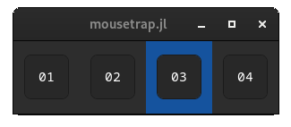

This is a list view with four elements, each of the elements is an object of type `Placeholder`. 

Looking closely, we see that each placeholder has a `Label` with the title, a `Separator` behind the label. Because they are rendered on top of each other, an `Overlay` has to be involved. A `Frame` is used to give the element rounded corners, lastly, each element is square, which means its size is managed by an `AspectFrame`.

Creating a new Julia struct with these elements, we get:

```julia
struct Placeholder
    label::Label
    separator::Separator
    overlay::Overlay
    frame::Frame
    aspect_frame::AspectFrame
end
```

We add a constructo that assembles these widgets in the way we see them:

```julia
function Placeholder(text::String)
    out = Placeholder(
        Label("<tt>" * text * "</tt>")  # label with monospaced text 
        Separator()                     # background
        Overlay()                       # overlay to layer label on top of background
        Frame()                         # frame for outline and rounded corners
        AspectFrame(1.0)                # square aspect frame
   )     
   
   # make the background the lower most layer
   set_child!(out.overlay, out.separator)
   
   # add the label on top
   add_overlay(out.ovleray, out.label; include_in_measurement = true)
   
   # add everything into the `Frame`
   set_child!(frame, overlay)
   
   # force frame to be square
   set_child!(aspect_frame, frame)
   
   return out
end
```

With our compound widget assembled, we will want to make it the child of the window:

```julia
main() do app::Application
    window = Window(app)
    set_child!(window, Placeholder("Test")
    present!(window)
end 
```
```
[ERROR] In mousetrap.main: MethodError: no method matching set_child!(::Window, ::Placeholder)

Closest candidates are:
  set_child!(::Window, ::Widget)
   @ mousetrap ~/Workspace/mousetrap.jl/src/mousetrap.jl:1457
```

We can't add it as a child because `Placeholder`, the new Julia struct, is not yet considered a widget. 

### Widget Interface

To solve this we come back to our two properties that make something a widget:
1) it is direct or indirect subtype of `Widget`
2) `get_top_level_widget`, which maps it to its top-level widget, is defined for this type

Solving 1), we make `Placeholder` a subtype of `mousetra.Widget`:

```julia
struct Placeholder <: Widget
    label::Label
    separator::Separator
    overlay::Overlay
    frame::Frame
    aspect_frame::AspectFrame
end
```

To implement `get_top_level_widget`, we need to look at how we assembled `Placeholder` during its constructor, then figure out which widget is indeed the top-most.

We can write the `Placeholder` architecture out like so:

```cpp
AspectFrame \
    Frame \
        Overlay \
            Label
            Separator
```

Where a widget with `\` is a widget container. The only widget without a direct parent is the `AspectFrame`, therefore `aspect_frame` is the top-level widget.

Given this, we implement `get_top_level_widget`:

```julia
mousetrap.get_top_level_widget(x::Placeholder) = x.aspect_frame
```

Where the `mousetrap.` prefix is necessary to tell the compiler that we are overloading that method, not creating a new method in our current module.

With `Widget` subtyped and `get_top_level_widget` implemented, our `main` now looks like this:

```julia
struct Placeholder
    label::Label
    separator::Separator
    overlay::Overlay
    frame::Frame
    aspect_frame::AspectFrame
end

function Placeholder(text::String)
    out = Placeholder(
        Label("<tt>" * text * "</tt>")
        Separator()
        Overlay() 
        Frame() 
        AspectFrame(1.0)
    )     
    
    set_child!(out.overlay, out.separator)
    add_overlay(out.ovleray, out.label; include_in_measurement = true)
    set_child!(frame, overlay)
    set_child!(aspect_frame, frame)
    return out
end

main() do app::Application
    window = Window(app)
    set_child!(window, Placeholder("TEST")
    present!(window)
end
```

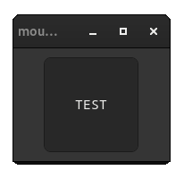

Now that `Placeholder` is a proper widget, all of mousetraps functions, including all widget signals, have become avaialable to use.

Using this technique, we can build an application piece by piece. A compound widget itself can be made up of multiple other compound widgets, an in some way the entire application itself is just one giant compound widget, with the `Window` as the top-level widget.

Of course, we are only able to interact with the compound widget by interacting with each of its components, which is fairly limiting. In the next chapter, we will change this. By learning about **event handling**, we will be able to react to any kind of user-interaction, giving us the last tool needed to create an application that isn't just a collection of pre-made widgets, but something we have built ourself.

