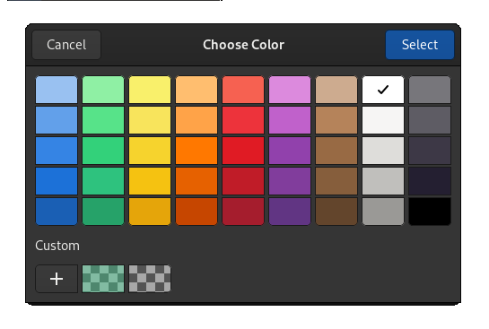
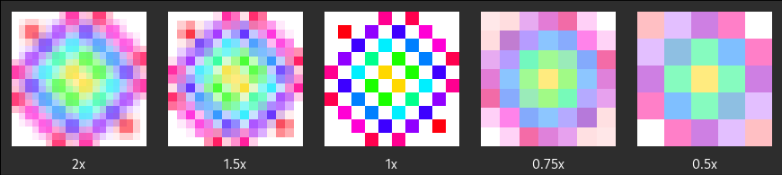
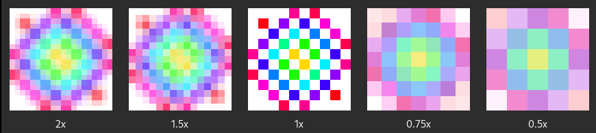

```@meta
DocTestSetup = quote
  using Mousetrap
  function Window(app::Application)
      out = Mousetrap.Window(app)
      set_tick_callback!(out, out) do clock, self
          close!(self)
          return TICK_CALLBACK_RESULT_DISCONTINUE
      end
      return out
  end

    function present!(chooser::ColorChooser)
     # noop
    end
end
```

# Chapter 6: Images

In this chapter, we will learn:
+ How to use colors in Mousetrap
+ How to present the user with a color chooser dialog
+ How to load, store, modify, and display 2D images

---

## Introduction

Mousetrap was originally written as the GUI engine for an unreleased frame-by-frame animation app. This history is why it contains a fully-featured image processing suite, making it well-suited for image-editing applications right out of the box.

## Colors

Mousetrap offers two color representations, [`RGBA`](@ref) and [`HSVA`](@ref), which have the following components:

| representation | component   | meaning         |
|----------------|-------------|-----------------|
| `RGBA`         | `r`         | red             |
| `RGBA`         | `g`         | green           |
| `RGBA`         | `b`         | blue            |
| `RGBA`         | `a`         | opacity (alpha) |
| ----------     | ----------- | --------        |
| `HSVA`         | `h`         | hue             |
| `HSVA`         | `s`         | saturation      |
| `HSVA`         | `v`         | value (chroma)  |
| `HSVA`         | `a`         | opacity (alpha) |

For more information on these color systems, see [here for RGBA](https://en.wikipedia.org/wiki/RGBA_color_model) and [here for HSVA](https://en.wikipedia.org/wiki/HSL_and_HSV).

For both representations, all components are 32-bit floats in `[0, 1]`. The **alpha** component is also called **opacity**, which is the inverse of *transparency*. An alpha value of 1 means the color is fully opaque, a value of 0 means it is fully transparent, making it invisible when displayed on screen.

### Converting Colors

We can freely convert between `RGBA` and `HSVA`. To do this, we use [`rgba_to_hsva`](@ref) and [`hsva_to_rgba`](@ref):

```jldoctest; output = false
rgba = RGBA(0.1, 0.2, 0.3, 0.4)
as_hsva = rgba_to_hsva(rgba)
as_rgba = hsva_to_rgba(as_hsva)
@assert isapprox(rgba, as_rgba) # true
# output
```

Note the use of `isapprox`, which can also be written as `rgba ≈ as_rgba`. Conversion can introduce floating point error, but their precision will be such that for the actual color on screen, a difference is not noticeable. If we directly compare the floating point components, the above assertion would fail.

### Color to Hexadecimal

Mousetrap offers a function to convert `RGBA` to its HTML color code. This code is a a string of the form `#RRGGBB`, where `RR` is the red, `GG` the green, and `BB` the blue component, in unsigned 8-bit hexadecimal. For example, the color `RGBA(1, 0, 1, 1)` would have the HTML-code `#FF00FF`, where the alpha component was omitted. Using `html_code_to_rgba` and `rgba_to_html_code`, we can freely convert between a colors in-memory and hexadecimal representation.

For example, if we want to use an `Entry` for the user to be able to enter a color as an HTML color code, we could do the following:

```jldoctest; output = false
entry = Entry()
connect_signal_activate!(entry) do self::Entry
    text = get_text(self)
    println(text)
    if is_valid_html_code(text)
        println("User entered: $(html_code_to_rgba(text))")
    else
        # handle malformatted string
    end
    return nothing
end
# output
```

If parsing was successful, `is_valid_html_code` will return `true`, at which point we can be sure that `html_code_to_rgba` will return a valid color.

---

## Color Chooser

While manual entry like this works, it is hardly very user-friendly. For a more intuitive way to have our users select a color, Mousetrap offers a purpose-built dialog: [`ColorChooser`](@ref). 

`ColorChooser`s constructor takes the title of the window as its only argument. After initialization, we can show the dialog to the user by calling `present!`, just like with a `Window`:

```julia
color_chooser = ColorChooser("Choose Color")
present!(color_chooser)
```



If the user clicks on the `+` in the bottom left corner, they are taken to a new page that lets them select each component of the color directly:


To actually trigger behavior once the user selects a color, we need to register a *callback*. `ColorChooser` has two callbacks, one invoked when the user makes the selection by clicking "select", and another when the user dismisses the dialog, for example by closing its window.

We register the former using `on_accept!`, which requires a function with the signature:
```
(::ColorChooser, color::RGBA, [::Data_t]) -> Nothing
```

Where `color` will be the color the user selected.

The function called when the dialog is dismissed is registered using `on_cancel!`, which requires a callback with the signature:
```
(::ColorChooser, [::Data_t]) -> Nothing
```

We would use these two functions like so:

```jldoctest; output = false
color_chooser = ColorChooser("Choose Color")

# react to user selection
on_accept!(color_chooser) do self::ColorChooser, color::RGBA
    println("Selected $color")
end

# react to use dismissing the dialog
on_cancel!(color_chooser) do self::ColorChooser
    println("color selection canceleld")
end

present!(color_chooser)
# output
```
 
At any point, we can also access the last selected color by calling [`get_color`](@ref) on the `ColorChooser` instance.

---

## Images

Now that we know how to handle colors, we continue onto images. In general, an image is a two-dimensional matrix of colors. Each element in the matrix is called a **pixel**. An image of size 400x300 will have 400 * 300 = 120000 pixels. Each pixel is a color in `RGBA` format.

Images are represented by the [`Image`](@ref) class. This class is not a widget or signal emitter; it is simply a way to manage memory (in the form of a pixel matrix) in RAM. If we want to show an image on screen, we need the help of other widgets.

### Creating an Image

#### Loading an Image from Disk

Most commonly, we will want to load an image from an already existing file. This can be achieved with [`create_from_file!`](@ref), which takes the path as a string:

```julia
image = Image()
create_from_file!(image, "/path/to/image.png");
```

#### Supported Image Formats

The following image formats are supported:

| Format Name             | File Extensions |
|-------------------------|-----------------|
| PNG                     | `.png`  |
| JPEG                    | `.jpeg` `.jpe` `.jpg`  |
| JPEG XL image           | `.jxl`  |
| Windows Metafile        | `.wmf` `.apm`  |
| Windows animated cursor | `.ani`  |
| BMP                     | `.bmp`  |
| GIF                     | `.gif`  |
| MacOS X icon            | `.icns`  |
| Windows icon            | `.ico` `.cur`  |
| PNM/PBM/PGM/PPM         | `.pnm` `.pbm` `.pgm` `.ppm`  |
| QuickTime               | `.qtif` `.qif`  |
| Scalable Vector Graphics | `.svg` `.svgz` `.svg.gz`  |
| Targa                   | `.tga` `.targa`  |
| TIFF                    | `.tiff` `.tif`  |
| WebP                    | `.webp`  |
| XBM                     | `.xbm`  |
| XPM                     | `.xpm`  |

It is recommended to use `Image` only for raster-based file types. While possible, for vector-graphics-based types like `.ico` and `.svg`, Mousetrap offers another more specialized class, [`Icon`](@ref), which we will learn about in the [next chapter](./07_os_interface.md). 

#### Creating an Image from Scratch

Sometimes, we want to fill an image with our custom image data programmatically. For this, we use [`create!`](@ref), which allocates an image of a given size and fills each pixel with the color supplied as an optional argument. 

For example, the following allocates an image of size 400x300, then sets every pixel to red (`RGBA(1, 0, 0, 1)`):

```cpp
image = Image()
create!(image, 400, 300, RGBA(1, 0, 0, 1));
```

If unspecified, the image will be filled with `RGBA(0, 0, 0, 0)`, making it appear fully transparent when displayed using a widget.

### Modifying an Image

An all-red image will usually not be very useful, of course. To overwrite a single pixel, we use [`set_pixel!`](@ref), which takes as its first argument the pixel coordinate (1-based, with the origin at the top-left, just like a matrix), along with a color.

We can access any pixel using [`get_pixel`](@ref), which only takes the pixel coordinates. If the coordinates are out of range, `RGBA(0, 0, 0, 0)` will be returned.

```julia
# set the alpha component of the pixel at 32, 32 to zero
image = # ...
color = get_pixel(image, 32, 32)
color.a = 0
set_pixel!(image, 32, 32, color)
```

### Scaling

To change an image's size, we have two options: **scaling**  the image or **cropping** it. These operations work identically to those in common image-manipulation programs, such as GIMP or Photoshop.

To scale an image, we call [`as_scaled`](@ref). This function returns a new image; it **does not modify the original image**. For example, scaling our 400x300 image to 800x600:

```cpp
image = // ... 400x300 image
scaled = as_scaled(image, 800, 600);
```

Only `scaled` will be of size `800x600`, `image` has not changed.

#### Interpolation 

When scaling, we have a choice of scaling algorithm that fills in newly generated pixels through **interpolation**. Mousetrap offers four interpolation types, supplied by the enum [`InterpolationType`](@ref). Below, we see how each type affects the final image, where the image labeled with `1x` is the original image with a resolution of 10x10 pixels.

 
`INTERPOLATION_TYPE_NEAREST`

 
`INTERPOLATION_TYPE_BILINEAR`

 
`INTERPOLATION_TYPE_HYPERBOLIC`

 
`INTERPOLATION_TYPE_TILES`

The main difference between `INTERPOLATION_TYPE_BILINEAR` and `INTERPOLATION_TYPE_HYPERBOLIC` is that of performance. Hyperbolic interpolation offers superior smoothing but does so at about 1.5 times the speed when compared to bilinear interpolation, meaning hyperbolic is about 50% slower. For an image this small, this will hardly matter, but when working with very large images, this can be a difference of seconds.

If no interpolation type is specified when calling `as_scaled`, `INTERPOLATION_TYPE_TILES` will be chosen as the default.

### Cropping

To crop an image, we use [`as_cropped`](@ref). Similar to `as_scaled`, this function returns a newly allocated image, it does not modify the original image.

`as_cropped` takes 4 arguments, the new width and height, and the x- and y-**offset**. The offset specifies which pixel is used as the new top-left coordinate of the cropped image. This offset can be negative. We can also specify a new resolution greater than that of the current image. Any newly allocated space that is not part of the original image will be filled with `RGBA(0, 0, 0, 0)`:

```julia
image = # ...
# add a 10 px empty border around the image, keeping the original centered
current_size = get_size(image)
resized_image = as_cropped(-10, -10, current_size.x + 10, current_size.y + 10)
```

Cropping like this is often called "Resize Canvas" in common image manipulation apps.

### Flipping

Lastly, we have [`as_flipped`](@ref) which flips the image along the x- and/or y-axes. Just like before, `as_flipped` returns a newly allocated image and does not modify the original. It takes two booleans, indicating along which axis the image should be flipped:

```julia
image = # ...
horizontally_flipped = as_flipped(image, true, false)
vertically_flipped = as_flipped(image, false, true)
```

### Saving an Image to Disk

Having edited our image, we can store it on the users' disk using [`save_to_file`](@ref). This function takes a path as a string and returns a boolean indicating whether the operation was successful. The resulting image format will be deduced based on the file extension. For example, to save an image as a `.png` to the location `/assets/export`, we would do:

```julia
image = # ...
save_to_file(image, "/assets/export/out.png")
```

---

## Displaying Images

Now that we know how to load and manipulate images in memory, we will most likely want a way to display them. We've already seen a widget capable of this: [`ImageDisplay`](@ref). 

So far, we have been using `create_from_file!` to load the image directly from the disk. To create an `ImageDisplay` from an image in memory we use [`create_from_image!`](@ref).

`ImageDisplay` [deep-copies](https://docs.julialang.org/en/v1/base/base/#Base.deepcopy) the contents of the image, the underlying data cannot be modified after this point. This means if we change the original `Image`, `ImageDisplay` **will not change**. To update the `ImageDisplay`, we need to call `create_from_image!` again. 

By default, `ImageDisplay` will expand according to the widget property of the same name. The graphical component of all widgets is expanded using linear interpolation, which may blur images in an undesirable way. To make sure `ImageDisplay` is always at the correct resolution and displays an image 1-to-1 (that is, 1 pixel of the image is exactly 1 pixel on the screen), we can use the following trick:

```julia
image = Image()
create_from_file!(image, #= load image of size 400x300 =#)

image_display = ImageDisplay()
create_from_image!(image_display, image)

# prevent expansion along both dimensions
set_expand!(image_display, false)

# set minimum size to images original resolution
set_size_request!(image_display, get_size(image_display))
```

where `get_size` returns the resolution of the image the `ImageDisplay` was created from.

Because expansion is disabled, `ImageDisplay` will always be exactly the size of its size request, which we set as the original resolution of the underlying image, making it so it will always be exactly 400x300 pixels on screen.

## Updating Images on Screen

`create_from_image!` is a costly operation and would be insufficient to, for example, fluently display an animation at 60fps. We would have to call `create_from_image!` every frame, which is not feasible on most machines.

In situations like this, we should instead use a custom render widget to display the image as an **OpenGL texture**, which has no problems rendering large, frequently updated images in a performant manner. We will learn more about textures in the [chapter on native rendering](./09_native_rendering.md).
