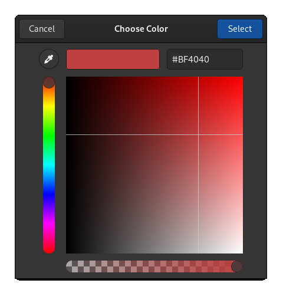
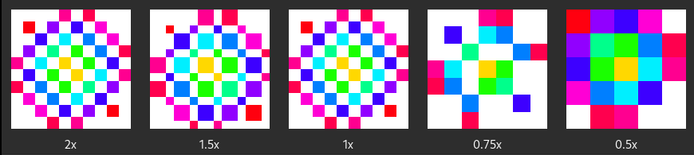
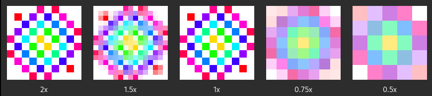

# Chapter 6: Images

In this chapter we will learn:
+ How to use colors in mousetrap
+ How to load, store, modify, and display 2d images
---

## Introduction

Mousetrap was originally written as the GUI engine for an unreleased frame-by-frame animation app. This history is why it contains a fully-featured image processing suite, making it well-suited for image-editing applications right out of the box.

## Colors

Mousetrap offers two color representations, [`RGBA`](@ref) and [`HSVA`](@ref), which have the following components:

| representation | component   | meaning         |
|----------------|-------------|-----------------|
| `RGBA`         | `r`         | red             |
| `RGBA`         | `g`         | green           |
| `RGBA`         | `b`         | blue            |
| `RGBA`         | `a`         | opacity (alpha) |
| ----------     | ----------- | --------        |
| `HSVA`         | `h`         | hue             |
| `HSVA`         | `s`         | saturation      |
| `HSVA`         | `v`         | value (chroma)  |
| `HSVA`         | `a`         | opacity (alpha) |

For more information on these color systems, see [here for RGBA](https://en.wikipedia.org/wiki/RGBA_color_model) and [here for HSVA](https://en.wikipedia.org/wiki/HSL_and_HSV).

For both representations, all components are 32-bit floats in `[0, 1]`. The **alpha** component is also called **opacity**, which the inverse of *transparency*. An alpha value of 1 means the color is fully opaque, a value of 0 means it is fully transparent, making it invisible when displayed on screen.

### Converting Colors

We can freely convert between `RGBA` and `HSVA`. To do this, we use [`rgba_to_hsva`](@ref) and [`hsva_to_rgba`](@ref):

```julia
rgba = RGBA(0.1, 0.2, 0.3, 0.4)
as_hsva = rgba_to_hsva(rgba)
as_rgba = hsva_to_rgba(as_hsva)
@assert rgba == as_rgba # true
```

### Color to Hexadecimal

Mousetrap offers a function to convert `RGBA` to its html-color-code. This code is a a string of the form `#RRGGBB`, where `RR` is the red, `GG` the green, and `BB` the blue component, in 8-bit hexadecimal. For example, the color `RGBA(1, 0, 1, 1)` would have the html-code `#FF00FF`, where the alpha component was ommitted. Using `html_code_to_rgba` and `rgba_to_html_code`, we freely convert between color and hexadecimal representation intended for html.

For example, if we wanted to create an `Entry` that allows the user type the hexadecimal as a way of choosing a color, we could implement this like so:

```julia
entry = Entry()
connect_signal_activate!(entry) do self::Entry
    text = get_text(self)
    println(text)
    if is_valid_html_code(text)
        println("User entered: $(html_code_to_rgba(text))")
    else
        # handle malformatted string
    end
end
```

If parsing was succesfull, `is_valid_html_code` will return `true`, at which point we can be sure that `html_code_to_rgba` will return a valid color.

## Color Chooser

While the manual text entry works, it is hardly very user friendly. To address this, mousetrap offers a purpose-build dialog that allows the user to select a color: [`ColorChooser`](@ref). 

This class works very similar to `FileChooser`, it is a dialog, meaning it is not a widget and cannot be inserted into a widget container, it will always be inside its own window.

To create the dialog, we call its constructor, which takes an optional title. We can then show the dialog to the user using `present!`:

```julia
color_chooser = ColorChooser("Choose Color")
present!(color_chooser)
```


If the user clicks on the `+` in the bottom left corner, they are taken to a new page that lets the select any color in RGBA:



While this is nice, we will most likely want to react to the user selected a color. To do this, we register a callback using `on_accept!` and `on_cancel!`.

`on_accept!` is invoked when the user selects a color, its callback is required to have the signature:
```
(::ColorChooser, color::RGBA, [::Data_t]) -> Cvoid
```
Where `color` will be the color the user selected.

`on_cancel!` is invoked when the user closes the dialog in any way, without selecting a color. It's signature is 
```
(::ColorChooser, [::Data_t]) -> Cvoid
```

To ask for a color selection and react to the user picking a color or dismissing the dialog, we can do the following:

```julia
 color_chooser = ColorChooser("Choose Color")

on_accept!(color_chooser) do self::ColorChooser, color::RGBA
    println("Selected $color")
end

on_cancel!(color_chooser) do self::ColorChooser
    println("color selection canceleld")
end

present!(color_chooser)
```
 
At any point, we can also access the color that was last selected, by calling [`get_color`](@ref) on the `ColorChooser` instance.

---

## Images

Now that we know how to handle colors, we continue onto images. In general, an image are a 2-dimensional matrix of colors. Each element in the matrix is called a **pixel**. An image of size 400x300 will have a 400 * 300 = 120000 pixes. Each pixel is a color in `RGBA` format.

Images are represented by the [`Image`](@ref) class. This class is not a widget or signal emitter, it is simply a way to manage memory (in the form of a pixel matrix) in RAM. If we want to show an image on screen, we need the help of other widgets.

### Creating an Image

#### Loading an Image from Disk

Most commonly, we will want load an image from an already existing file. This can be achieved with [`create_from_file!`](@ref), which takes the path as a string:

```julia
image = Image()
create_from_file!(image, "/path/to/image.png");
```

#### Supported Image Formats

The following image formats are supported:

| Format Name             | File Extensions |
|-------------------------|-----------------|
| PNG                     | `.png`  |
| JPEG                    | `.jpeg` `.jpe` `.jpg`  |
| JPEG XL image           | `.jxl`  |
| Windows Metafile        | `.wmf` `.apm`  |
| Windows animated cursor | `.ani`  |
| BMP                     | `.bmp`  |
| GIF                     | `.gif`  |
| MacOS X icon            | `.icns`  |
| Windows icon            | `.ico` `.cur`  |
| PNM/PBM/PGM/PPM         | `.pnm` `.pbm` `.pgm` `.ppm`  |
| QuickTime               | `.qtif` `.qif`  |
| Scalable Vector Graphics | `.svg` `.svgz` `.svg.gz`  |
| Targa                   | `.tga` `.targa`  |
| TIFF                    | `.tiff` `.tif`  |
| WebP                    | `.webp`  |
| XBM                     | `.xbm`  |
| XPM                     | `.xpm`  |

It is recommended to use `Image` only for raster-based file types. While possible, for vector-graphics based types like `.ico` and `.svg`, mousetrap offers another more specialized class, [`Icon`](@ref), which we learned about in the [chapter on operating system interfacing](./07_os_interface.md). 

#### Creating an Image from Scratch

Sometimes, we want to fill an image with our own custom image data programmatically. For this, we use [`create!`](@ref), which allocates an image of a given size and fills each pixel with the color supplied as an optional argument. For example, the following allocates and image of size 400x300, then sets every pixel to red (`RGBA(1, 0, 0, 1)`):

```cpp
image = Image()
create!(image, 400, 300, RGBA(1, 0, 0, 1));
```

If unspecified, the image will be filled with `RGBA(0, 0, 0, 0)`, making it appear fully transparent when displayed using a widget.

### Saving an Image to Disk

We use [`save_to_file`](@ref) to store an image to the disk. This will save the image data to the given path, automatically determining the correct file type based on the file extension given in the path. For example, using the path `/resources/save_image.png` will store the image as a PNG file.

### Modifying an Image

An all-red image will usually not be very useful, we will want to fill the image with custom data, possibly algorithmically. 

To overwrite a single pixel, we use [`set_pixel!`](@ref), which takes as its first argument the pixels coordinate (1-based, with the origin at the top-left, just like a matrix), along with a color.

We can access any pixel using [`get_pixel`](@ref), which only takes the pixels coordinates. If the coordinates are out of range, `RGBA(0, 0, 0, 0)` will be returned.

### Scaling

To change an images size, we have two options: **scaling**  the image and **cropping** it. These operations work identical to those in common image-manipulation programs, such as GIMP or Photoshop.

To scale an image, we call [`as_scaled`](@ref). This functions returns a new image, it **does not modify the original image**. For example, scaling our 400x300 image to 800x600:

```cpp
image = // ... 400x300 image
scaled = as_scaled(image, 800, 600);
```

Only `scaled` will be of size `800x600`, `image` has not changed.

#### Interpolation 

When scaling, we have a choice of scaling algorithm, which fills in newly generated pixels through **interpolation**. Mousetrap offers four interpolation types, supplied by the enum [`InterpolationType`](@ref). Below, we see how each type affects the final image, where the image labeled with `1x` is the original image with a resolution of 10x10 pixels.

 
*INTERPOLATION_TYPE_NEAREST*

 
*INTERPOLATION_TYPE_BILINEAR* 

 
*INTERPOLATION_TYPE_HYPERBOLIC*
<
 
*INTERPOLATION_TYPE_ILES* 

The main difference between `BILINEAR` and `HYPERBOLIC` is that of performance, `HYPERBOLIC` offers superior smoothing, but does so at about 1.5 times the speed when compared to `BILINEAR` interpolation, meaning `HYPERBOLIC` is about 50% slower. If no interpolation type is specified when calling `as_scaled`, `INTERPOLATION_TYPE_TILES` will be chosen by default.

### Cropping

To crop an image we use [`as_cropped`](@ref). Similar to `as_scaled`, this functions returns a newly allocated image, it does not modify the original image.

`as_cropped` takes 4 arguments, the new width and height, and the x- and y-**offset**. The offset specifies which pixel is used as the new top-left coordinate of the cropped image. This offset can be negative and we can also specify a new resolution greater than that of the current image.  Any newly allocated space that is not part of the original image will be filled with `RGBA(0, 0, 0, 0)`. Cropping like this is often called "Resize Canvas" in common image manipulation apps.

### Flipping

Lastly we have [`as_flipped`](@ref) which flips the image along the x- and/or y-axis. Just like before, `as_flipped` returns a newly allocated image and does not modify the original. It takes two booleans, indicating along which axis the image should be flipped:

```cpp
const auto image = Image(//...
auto horizontally_flipped = image.as_flipped(true, false);
auto vertically_flipped = image.as_flipped(false, true);
```

---

## Displaying Images

Now that we know how to load and manipulate images in memory, we most likely will want a way to display them. We've already seen a widget capable of this: [`ImageDisplay`](@ref). So far, we have been using `create_from_file!` to load the image directly from the disk, as well as `create_from_icon!` to make it so the `ImageDisplay` displays an icon. Adding to these, we can create an `ImageDisplay` from an image in memory using [`create_from_image!`](@ref).

`ImageDisplay` deep-copies the contents of the image, the underlying data cannot be modified after this point. This means, if we change the original `Image`, `ImageDisplay` **will not change**. To update the `ImageDisplay`, we need to call `create_from_image!` again. 

By default, `ImageDisplay` will expand according to the widget property of the same name. The graphical component of all widgets are expanded using linear interpolation, which may blur images in an undesired way. To make sure `ImageDisplay` is always at the correct resolution and displays an image 1-to-1 (that is, 1 pixel of the image is exactly 1 pixel on the screen), we can use the following trick:

```julia
image = Image()
create_from_file!(image, #= load image of size 400x300 =#)

image_display = ImageDisplay()
create_from_image!(image_display, image)

# prevent expansion along both dimensions
set_expand!(image_display, false)

# set minimum size to images original resolution
set_size_request!(image_display, get_size(image_display))
```

where `get_size` returns the resolution of the image the `ImageDisplay` was created from.

Because expansion is disabled, `ImageDisplay` will always be exactly the size of its size request, which we set as the original resolution of the underlying image, making it always be exactly 400x300 pixels on screen.

---

## Updating Images on Screen

`create_from_image!` is an extremely costly operation and would be insufficient to, for example, fluently display an animation at 60fps. We would have to call `create_from_image!` every frame, which is not feasible on most machines.

In situations like this, we should instead use a custom render widget to display the image as an **OpenGL texture**, which has no problems rendering large, frequently-updated images in a performant manner. We will learn more about textures in the [chapter on native rendering](./09_native_rendering.md).
