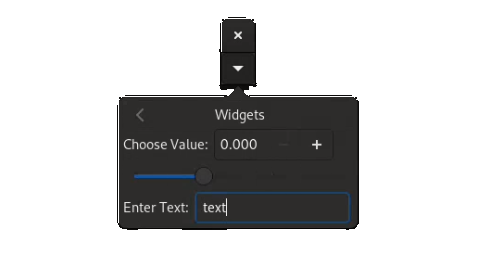
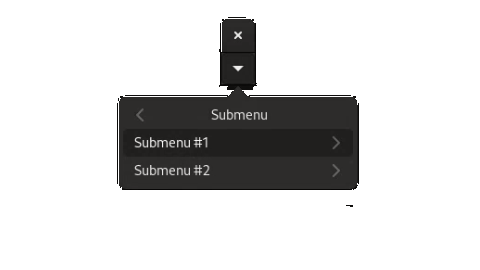
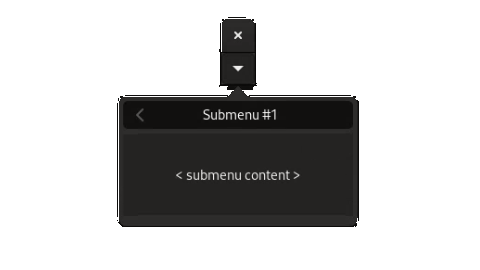
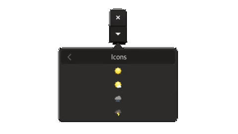

# Chapter 7: Menus

In this chapter, we will learn:
+ How to create complex, nested menus
+ How to display menus using `PopoverMenu` and `MenuBar`
+ Best-practice style guide for menus

---

In the [chapter on actions](./03_actions) we learned that we can trigger an action using [`Button`](@ref), by assigning an action to it using [`set_action!`](@ref).
this works if we want to have a GUI element that has a few actions, in reality, an application can have hundreds of different actions. Asking users to trigger these using
an equal number of buttons would be unsustainable. For situations like these, we should instead turn to **menus**.

## MenuModel Architecture

In mousetrap, menus follows the [model-view architectural pattern](https://en.wikipedia.org/wiki/Model%E2%80%93view%E2%80%93controller). To create a menu, we need
the menus model, which holds information about how the menu is structured, along with a view, which takes the models and transforms it into an interactable
widget users can manipulate.

!!! Note "Running Snippets from this Section"

    To follow along with code snippets from this section, we can use the following `.jl` file:
    ```julia
    using mousetrap 
    main() do app::Application

        window = Window(app)
        
        # create dummy action
        action = Action("dummy.action", app) do x 
            println("triggered.")
        end

        # model that we will be modifying in the snippet
        root = MenuModel()

        # snippet goes here

        # display
        add_submenu!(root, "Title", model)
        view = PopoverButton(PopoverMenu(root))
        set_child!(window, view)
        present!(window)
    end
    ```

## Menu Items

[`MenuModel`](@ref), the model component of mousetrap menus, is a list of **menu items**, in a specific order. If item A is added before item B at runtime, then A will appear above item B. There are multiple different types of menu items, all with their own purpose. The function we choose to add an item to the model determines the items type. There are 4 types of menu items, which we will go over in this section.

### Item Type #1: Action

The first and most simple item type is called "action". Added via [`add_action!`](@ref), which takes both a label and an [`Action`](@ref) instance, this item is a simple button with text. If the user clicks the button, the action is executed.

Similar to `Button`, if the action is disabled (via [`set_enabled`](@ref)), the menu item will appear "greyed out" and cannot be activated.

```cpp
add_action!(model, "Action Item #1", action)
add_action!(model, "Action item #2", action)
add_action!(model, "Action item #3", action)
```


### Item Type #2: Widgets

Secondly, we have perhaps the most powerful type of item: A custom widget. We add an item of this type using [`add_widget`](@ref), which only takes a single argument, the widget itself. This widget can be arbitrarily complex, though it is usually not adviced to insert an entire `ColumnView` into a tiny menu. Good-practic examples include `Button`, `Entry`, `CheckButton`, `ToggleButton`, `Switch` and `SpinButton`, all of which are interactable.

We do not supply an `Action` instance with this item, if we want the user interacting with the menu item to trigger behavior, we will have to connect that behavior to the signals of the widget thats inserted into the menu.

```cpp
add_widget!(model, hbox(Label("Choose Value:  "), SpinButton(0, 1, 0.01)))
add_widget!(model, Scale(0, 1, 0.01, ORIENTATION_HORIZONTAL))
add_widget!(model, hbox(Label("Enter Text:  "), Entry()))
```



Widgets are the most flexible of menu items. They should be used with caution, and only if absolutely necessary. It is often better to create an action that opens a separate dialog which contains the widget, as opposed to directly adding the widget to the menu.

### Item Type #3: Submenu

`MenuModel` can be **nested**, which means we can insert a `MenuModel` into another `MenuModel`. This is similar to `ListView` or file-system tree: a folder can contain regular files (menu items), or it can contain othe folders (menu models), which in turn can also contain another file or folder, etc. `MenuModel` can similarly be infinitely nested, though it is usually not recommended to go deeper than 2 or 3 levels.

We call a `MenuModel` that is nested within another model a **submenu**. It will show up as a button with a label, along with an indicator that it is a submenu, usually a `>` shape. Clicking this item will reveal the submenu.

To add this type of submenu item, we use [`add_submenu!`](@ref), which takes a title and another menu model:

```julia
submenu_01 = MenuModel()
add_widget!(submenu_01, submenu_content())
add_submenu!(model, "Submenu #1", submenu_01)

submenu_02 = MenuModel()
add_widget!(submenu_02, submenu_content())
add_submenu!(model, "Submenu #2", submenu_02)
```


Clicking on of these items will reveal the submenu content:



Where `submenu_content()` returns a simple place-holder widget.

### Item Type #4: Icons

A prettier analog to the "action"-type menu item, an "icon"-type, added via [`add_icon!`](@ref) takes an [`Icon`](@ref), along with an action. The entire menu item will be just the icon, it may not have any text. If the icon is clicked, the action is executed.

```julia
add_icon!(model, Icon(#=...=#), action)
add_icon!(model, Icon(#=...=#), action)
add_icon!(model, Icon(#=...=#), action)
add_icon!(model, Icon(#=...=#), action)    
```


Where we used the default icons for weather-indicators as placeholders.

When creating a menu item with an action, we have to decide to either use a simple text label, or use an icon, we may not have both.

### Item Type #5: Sections

Lastly we have **sections**. Sections are like submenus, in that they are a menu inside another menu. The difference is in the way this inner menu is displayed.

When adding a submenu with `add_submenu!`, a single new item will appear in the outer menu. When clicked, the menu "slides" to reveal the submenu. 

With sections, the inner menu is instead inserted into the outer menu directly; both are shown at the same time. 

We add a "section"-type item using [`add_section!`](@ref), which takes another menu model and a title, which will be used as a header for the section:

```julia
section = MenuModel()
add_action!(section, "Section Item #01", action)
add_action!(section, "Section Item #02", action)
add_action!(section, "Section Item #03", action)
add_section!(model, "Section Label", section)
```


We see that the section label, `"Section Label"` in this case, is displayed above all its items, which are inserted into the outer menu. In this way, sections can be helpful to group a number of menu items together, which makes a menu easier to parse without adding another nested level via a submenu.

#### Section Formats

[`add_section!`](@ref) takes one additional, optional argument, which is a [`SectionFormat`](@ref). This enum has a number of values that govern how the sections is displayed:

+ `SECTION_FORMAT_CIRCULAR_BUTTONS` displays all its elements in circular buttons
+ `SECTION_FORMAT_HORIZONTAL_BUTTONS`: display its elements as a row of rectangular buttons
+ `SECTION_FORMAT_INLINE_BUTTONS`: display all buttons right of the section heading

The following shows these section formats:

```julia
# generate a menu model with the 4 weather icons, then add as section with given format
function add_icon_section(title::String, format::SectionFormat)
        
    section = MenuModel()
    add_icon!(section, Icon(#=...=#), action)
    add_icon!(section, Icon(#=...=#), action)
    add_icon!(section, Icon(#=...=#), action)
    add_icon!(section, Icon(#=...=#), action)    
    add_section!(icon_model, title, section, format)
end

add_icon_section("Normal", SECTION_FORMAT_NORMAL)
add_icon_section("Horizontal Buttons", SECTION_FORMAT_HORIZONTAL_BUTTONS)
add_icon_section("Inline Buttons:  ", SECTION_FORMAT_INLINE_BUTTONS)
add_icon_section("Circular Buttons", SECTION_FORMAT_CIRCULAR_BUTTONS)
```


Using `SectionFormat` and mixing number of menu item types, we can construct arbitrarily complex menus, which is why we should take care that the highest priority for constructing menus it user experience. It's okay if they are complex and look nice, as long as they are easy to parse.

---

## Displaying Menus

Now that we have learned to construct the menu **model**, we should turn our attention to the **view**, a widget displaying a `MenuModel`.

### PopoverMenu

[`PopoverMenu`](@ref) is a sibling of [`Popover`](@ref). It consists of a small dialog that is only displayed when we ask it to. While `Popover` displays an arbitrary widget, `PopoverMenu` displays a menu model for us.

For ease of use, it's easiest to connect the `PopoverMenu` to a [`PopoverButton`](@ref), using [`set_popover_menu!`](@ref).

```julia
model = MenuModel()

# fill `model` here

popover_menu = PopoverMenu(model)
popover_button = PopoverButton()
set_popover_menu!(popover_button, popover_menu)

# add the button to the window so we can click it
set_child!(window, popover_button)
```

The above can also be written as a convenient one-liner:

```julia
model = MenuModel()
set_child!(window, PopoverButton(PopoverMenu(model))) 
```

The `PopoverMenu`-`PopoverButton` combo should be reserved for **context menus**, which are menus that act on some local part of the application. For a menu that affects the entire application and that should be accesible at all times, we should use the next menu model view widget.

### MenuBar

Familiar to any user of a modern desktop GUI, [`MenuBar`] is a widget that is usually displayed at the top of the main application window:


\image html menus_menubar.html

We see `MenuBar` it is a horizontal list of items. When the user clicks on one of the items, a nested menu opens. Just like before, menus can be nested a theoretically infinite amount of times.

Unlike `PopoverMenu`, `MenuBar` requires its `MenuModel` to have a certain structure: **all top-level items have to be submenus**.

What does this mean? Let's work through the menu shown in the image above. We created it like so using the following snippet:

```cpp
auto model = MenuModel();

auto file_submenu = MenuModel();
file_submenu.add_action("Open", /* action */);

auto file_recent_submenu = MenuModel();
file_recent_submenu.add_action("Project 01", /* action */);
file_recent_submenu.add_action("Project 02", /* action */);
file_recent_submenu.add_action("Other...", /* action */);
file_submenu.add_submenu("Recent...", file_recent_submenu);

file_submenu.add_action("Save", /* action */);
file_submenu.add_action("Save As", /* action */);
file_submenu.add_action("Exit", /* action */);

auto help_submenu = MenuModel();
model.add_submenu("File", file_submenu);
model.add_submenu("Help", help_submenu);

auto menubar = MenuBar(model);
```

Where, in a real application, each item will have a different action.

To make the nesting easier to understand, we can write the structure of the model similar to how we would describe a folder structure:

```
model \
    File \
        Open
        Recent... \
            Project 01
            Project 02
            Other...
        Save
        Save As
        Exit
    Help \
        (...)
```

Where any line suffixed with a `\` is a submenu.

We see that we have four models in total. The top-most menu model is called `model`, it is what `MenuBar` will be initialized with.
Next, we have the model called `file_submenu`, which has the title `File`. It containes five items, titled `Open`, `Recent...`, `Save`, `Save As` and `Exit`. `Recent...` is a submenu-type item, created from a `MenuModel` called `file_recent_submenu` in the above code. This model, in turn, has three items.  On the same level as `File`, we have a second menu `Help`.

The **top-level** menu is `model`. It is used as the argument for the constructor of `MenuBar`. We see that all direct children of `model` (`File` and `Help`) **are themself submenus** (they were added using `add_submenu`). No direct child of `model` is an action-, widget- or section-type item. This is what is required for `MenuBar`. All top-level items have to be submenus.

Apart from this requirement, the rest of the menu can have any arbitrary structure.

In summary:

+ For `MenuBar`, the toplevel menu can only have submenus as direct children
+ For `PopoverMenu`, there are no requirements

This, along with the aesthetic difference, makes both types of menu model view suited for different purposes. Usually, an application will only have a single `MenuBar` at the top of the main menu, while it may have many different `PopoverMenu`s all over.

---

## Style Endnote

Menus are extremely powerful and, conversely, they are complex to understand. With practice and good software / UI design, we can create deep, complex menus that are still easy to understand and use. We, as developers, should make this our first priority. The action-interface and model-view design are nice, but first and foremost our menus should be stable and easy to use by end users.

Some additional notes:

### Ellipses

Some may be curious as to why some menu items have `...` added at the end of their labels, while some have not. This is not a universal standard, but it is common for `...` to indicate that clicking this item will open another window, menu, or dialog. If clicking an item simply triggers an action (such as `Save` or `Exit`), `...` is ommitted. If the item opens a window, widget, or submenu, `...` is appended to the menu label, as is the case with `Recent...` above.

### Maximum Menu Depth

Regarding menu depth, best practice is to never go deeper than 3 levels. The above example with `File > Recent... > Project 01` shows a good situation in which a 3-level-deep menu may be justified. Going any deeper is rarely advice, adding a section should always be considered before adding a submenu.

### Section Grouping

Lastly, some schools of UI design believe that **every menu item should be inside a section**. For example, if we were to follow this philosophy for our above example, we would redesign it like so:

\image html menus_menubar_with_sections.html

This adds considerable complexity to the code (adding 4 models, one for each section, making our total 8). In return, items are grouped logically and each item gets a "heading", which helps make long menus easier to understand. Every developer has to decide for themself whether this is a good choice or not. What all should agree on, however, is that if something makes the developers job harder but makes the users experience better, it is worth the effort.

