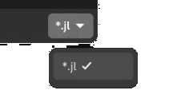
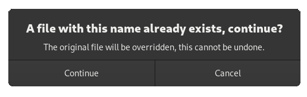

# Chapter 7: Operating System Interface

In this chapter, we will learn:
+ How to properly do logging
+ How to copy / move / create / delete files 
+ How to automatically open a file or url for the user
+ How to access a files metadata
+ How to monitor a file changing
+ How to open a dialog that lets users select files
+ How to open an alert dialog that the user has to dismiss
+ How to store arbitrary objects in an .ini file
+ How to load and use icons 

---

## Logging

### Introduction

When shipping applications, stability is paramount. Nobody will use an app if it keeps crashing, especially if that crash may corrupt important files.

The best way to prevent crashing is to follow [proper testing procedures](https://www.globalapptesting.com/blog/software-testing). For a small team, it is inevitable that some things will slip through the cracks. When an enduser comes to us with a problem or bug, they most likely will not be able to precisely describe the state of the application, and, depending on the user base, they may not be able to describe the problem at all.

This is where objective information about what exactly was happening is invaluable. **Logging** is the act of creating this information. Information about the current and past state of the application is stored in a file, so that when a crash or bug occurrs, we can simply ask the user to provide use with the log file and analyze it ourselves.

When working through past chapters, we may have already encountered some logging information. For example, if we try to do the following:

```cpp
box = Box()
push_back!(box, box)
```

We get the following message printed to our console:

```
(example_target:45245): mousetrap-CRITICAL **: 16:44:27.065: In Box::push_back!: Attempting to insert widget into itself. This would cause an infinite loop
```

We cannot insert a widget into itself, mousetrap prevented this action and printed a log message to inform us of this instead. This cushions the applications stability from potential developer errors. Any and all functions should follow this philosphy: prevent the error or bug, then print a log message instead. 

### Log Message Properties

Let's go through each part of the above message, one-by-one:

#### Application ID

First we have `(example_target:45245)`, this is the identification of our application. During normal runtime, this information may not be very useful. Once the log is stored to a system-level log file, however, many applications may log at the same time to the same file. Knowing which log message came from which application is integral in this context.

#### Log Domain

Next we have `mousetrap-CRITICAL`. The word before the `-` is the **log domain**. This is a developer-defined identification that should state which part of the application or library caused the logging message. Pre-defined domains include `mousetrap` for mousetrap-specific warnings, `GTK` for GTK-based warning, `GLib`, `Gio`, `Gdk`, etc. As a users of mousetrap, we should choose a new log domain. For example, if we create a new application called "Foo Image Manipulation Program", we should choose a descriptive log domain, such as `foo_image_manipulation_program`, `FIMP`, or `foo`.

#### Log Levels

`CRITICAL` is the messages **log level**. Mousetrap offers the following log levels:

+ `DEBUG` is for messages that should not appear when the end user uses the application, they are **only meant for developers** themself
+ `INFO` is for **benign status updates**, for example `successfully opened file at (...)`. These message will not be stored or printed to console, unless we specifically request the logging suite to do so
+ `WARNING` is for messages that should attempt to **prevent undesired but not critical behavior before it occurrs*, for example, when attempting to close a file while it is still being written to, a warning should be printed and the closing should be postponed until writing is done
+ `CRITICAL` is for errors. In many langauges, an error means the end of runtime, which is unacceptable for GUI applications. If the application throws an Julia exception, for example, that exception should be caught and printed as a `CRITICAL` log message nstead of letting it end runtime. This is the responsibility of the software developer, they should do their best to make it so an application cannot crash under any circumstances.
+ `FATAL` is the most severe log level and should only be used as an absolute last resort. Once a `FATAL` warning is printed, the application exits immediately. These should be reserved to issues that make it impossible to run an application, for example `no gaphics card detected. Quitting...`

We see that our message from before was designated as `CRITICAL`. This is because adding a widget to itself would effectively deadlock the application, ending runtime. This makes it an issue too severe for a `WARNING`, but it is still recoverable (by preventing the insertion), therefore `FATAL` would be inappropraite. `WARNING`s may be triggered by users, if a user is able to trigger a `CRITICAL` log message, this inherently means we as developers failed to prevent the user form doing so. An issue like this should be patched immediately.

#### Time Stamp

Next, we have `16:44:27.065`, this is the **time stamp** of the log message, with millisecond precision. When stored the log to a file, the current date and year is also appended to the time stamp.

#### Message

Lastly we have the **log message**. Log messages should contain the name of the function they are called from, for example, in the above message it says `In Box::push_back!`, telling developers that the error happened in that function. This makes debugging easier.

Messages should not end with a `\n` (a newline), as one is automatically appended to the end of the message.

### Printing Messages

All interaction with the log is handled by by only a few macros. To print a log message of a given log level, we use `@log_debug`, `@log_info`, `@log_warning`, `@log_critical` and `@log_fatal`. These macros takes as their first argument the log domain, and as the second argument the mssage.

As mentioned before, messages of level `DEBUG` and `INFO` are only printed if we speficially request them to do so. We enable these on a per-log-domain basis, using `set_surpress_info` and `set_surpress_debug` respectively. For example, if our log domain is `foo`:

```cpp
// define custom domain
const FOO_DOMAIN = "foo";

// print `INFO` level message but nothing will happen because it is surpressed by default
@log_info FOO_DOMAIN "Surpressed message"

// enable `INFO` level messages
set_surpress_info(FOO_DOMAIN, false)

// message will be printed
@log_info FOO_DOMAIN "No longer surpressed message"
```

Shipped applications, that is, applications intended for end users that are no longer under development, should surpress all `DEBUG` and `INFO` messages. They should only be enabled during development.

### Logging to a File

If the operating system is Linux, many log message will be written to the default location, usually `/var/log`. On other operating systems, message may not be stored at all.

Regardless of OS, we can forward all logging, including that of mousetrap itself, to a file using `set_log_file`, which takes the file path as a string. If the file already exist, it will be appended to (as opposed to being overriden). If the file does not yet exist, it will be created. If this operation was unsuccesful, `false` will be returned.

When stored to a file, logging message will have a different format that may or may not list additional information when compared to logging to a console. The philosophy behind this is that it is better to log as much information as possible, then use second party software to filter it, as opposed to missing crucial information for the sake of brevity:

```cpp
const LogDomain FOO_DOMAIN = "foo"
if !set_log_file(FOO_DOMAIN, "example_log.txt")
    @log_critical FOO_DOMAIN "In set_log_file: Unable to create file at `example_log.txt`"
end

@log_warning FOO_DOMAIN "Example Message"
```

Will add the following lines to a `example_log.txt`

```
[23-05-06 23:01:34,920]: In example.main: Example Message
	GLIB_DOMAIN foo
	MOUSETRAP_LEVEL WARNING
	PRIORITY 4
```

Any and all finished applications should print as many log messages as is practical. This allows for better scalability and collaboration, as even contributors with minimal programming expertise are usually able to work through a log file, identifying the point at which our application failed.

---

## File System

Most GUI applications on desktops are centralized around modifying files. A text or image editor will often want to export files, while a video game will want to create a save file. Conversely, Mousetrap offers a robust, operating-system-agnostic way of interacting with the users file system.

There are two kinds of objects in a file system: **files**, which contain arbitrary data, and **directories**, which contain other files and/or other directories. We also call a directory a **folder**. 

Examples for files that are not folders include `.png`, `.txt`, `.jl` text files, shared libraries, binaries, or executable files.

A **path** is a string, made up of folder names separated by `/`, (or `\` on windows, though this should be avoided). Examples include `/var/log`, `~/Desktop`, etc. A path starting at root (`/` on unix, usually `C:/` on windows) is called an **absolute path**, while any other path is called a **relative path**. 

An **uri** (universal resource identifier) is another way to express the location of the file. It follows a [strict scheme](https://en.wikipedia.org/wiki/Uniform_Resource_Identifier), which is followed by most internet browsers and should be preferred to regular paths for file transfers between different machines, or when referring to files on the internet.

### FileDescriptor

When querying info about a file, we use [`FileDescriptor`](@ref), which represents information about a file or folder. This object is non-mutating, meaning it is incapable of changing anything about the actual file on the disk. In other words, `FileDescriptor` is read-only. This is important to realize.

We can create a file descriptor from a path like so:

```cpp
readonly = FileDescriptor()
create_from_path!(readonly, "/home/user/Desktop/example.txt");
```

Where the argument to `create_from_path!` will be automatically detected as either a relative or absolute path. If it is not an absolute path, it will be prefixed with the applications runtime directory. For example if we create a `FileDescriptor` from path `"resources/image.png"`, and our application is located in `/usr/bin`, then the path will be treated as `/usr/bin/resources/image.png`.

`FileDescriptor` does not make sure the undelying file or folder actually exists, or that it is a valid file. Creating a descriptor from an invalid path or a path that does not point to a file or folder works just fine, and we won't get a warning. To check wether a file descriptor points to a valid file or folder, we have to use [`exists`](@ref). 

In order to query whether a `FileDescriptor` points to a file or a directory, we use [`is_file`](@ref) and [`is_folder`](@ref) respectively. If the file pointed to by `FileDescriptor` does not exist, both of these functions will return `false`.

`FileDescriptor` allows us to query a variety of information about the file, including, but not limited to:

+ [`get_path`](@ref) returns the location of the file as a path, eg. `~/Desktop/example.txt`
+ [`get_uri`](@ref) returns the location as an uri, eg. `file://~/Desktop/example.txt`
+ [`get_file_extension`](@ref) returns the file extension, eg. `txt`
+ [`is_executable`](@ref) checks whether the file is executable
+ [`get_content_type`](@ref) returns the [MIME type](https://en.wikipedia.org/wiki/Media_type), eg. `text/plain`

For less common metadata information, we can use [`query_info`](@ref), which takes an **attribute identifier** as a string. A list of identifiers can be found [here](https://gitlab.gnome.org/GNOME/glib/-/blob/main/gio/gfileinfo.h#L46), though, depending on the type of file and operating system, not all of these attributes may have a corresponding value.

If the file is a folder, we can use [`get_children`](@ref) to get all files and/or directories inside that folder. `get_children` takes a boolean as its other argument, which specifies whether it should list all children and children of children recursively.

---

## Manipulating the Disk

`FileDescriptor` being non-mutating means we need a different part of mousetrap in order to actually modify files on the users disk. For file input / output, such as reading the contents of files, we should use the [Julia standard library](https://docs.julialang.org/en/v1/base/file/), which is well-suited for this task. For manipulation files as a whole, as opposed to their contents, mousetrap offers multiple functions for common tasks:

### Creating Files

[`create_file_at!`](@ref) creates a file at a given location. It takes a file descriptor as its only argument. If `should_replace` is set to `false` and the file already exists, no operation will be performed

```julia
if create_file_at!(FileDescriptor("/absolute/path/to/file.txt"), replace = false)
    # ...
end
```

`create_directory_at!` performs a similar action, except it creates a directory instead of a file.

### Deleting Files

To permanently delete a file, we use [`delete_at!`](@ref), which takes a file descriptor as its argument. This immediately deletes the file, making it unable to be recovered. We usually want to avoid doing this, in which case should use [`move_to_trash!`](@ref).

```julia
to_delete = FileDescriptor("/path/to/delete/file.txt")
if !move_to_trash(to_delete)
    @log_warning FOO_DOMAIN "In example: Unable to delete file at `$(get_path(to_delete))`"
end
```

### Moving / Copying File

To move a fil e from one location to another, we use [`move!`](@ref). If we want to copy a file or directory instead of moving it, we use [`copy!`](@ref mousetrap.copy!):

```julia
from = FileDescriptor("/path/from/file.txt")
to = FileDescriptor("/different_path/to/file.txt")
if !move!(from, to)
    @log_warning FOO_DOMAIN "In example: Unable to move file from `$(get_path(from))` to `$(get_path(to))`"
end
```

### Changing File Properties

> (this feature is not yet implemented)

### Opening a File or URL

Often we will want to open an external file for the user, for example showing the license in a text editor or opening a donation page from a menu. Mousetrap offers three functions 
suited for this.

[`open_file`](@ref) will open a file on disk, usually presenting a user with a number of applications that can open the file. For example, opening a `.txt` file, the user will be presented with a number of text editors, at which point this function will open that application for them.

Similarly, [`show_in_file_explorer`](@ref) will open the users file explorer to the enclosing folder of the file. For example, if the file is at `/home/user/Desktop/file.txt`, then this function will open the folder `/hom/user/Desktop` in the users file explorer, then highlight the file `file.txt`.

Lastly, [`open_url`](@ref) takes a url as a string, opening the users default internet browser to that page.

All of these functions are designed to work on all operating systems, making them a convenient way to perform what would be quite a complex task otherwise.

---

### Monitoring File Changes

Often, when writing a GUI, we want the graphical interface to reflect the contents of a file on the disk. A good example would be a text editor. We can modify the file from inside our own application, however, if the file is modified by a third entity, such as another application, a conflict may arise. In this case, we will usually want to update the state of our application, whenever the underlying file changes. This is made possible by [`FileMonitor`](@ref), which monitors a file or directory for changes.

`FileMonitor` cannot be created directly, instead, we first create a `FileDescriptor`, then call [`create_monitor`](@ref), which returns the `FileMonitor` instance.

`FileMonitor` works similar to a signal emitter. To register a function that is called whenever the file changes, we use `on_file_changed!`, which expects a function with the signature 
```
(::FileMonitor, event::FileMonitorEvent, self::FileDescriptor, other::FileDescriptor, [::Data_t]) -> Cvoid
```

where

+ `event` is a [`FileMonitorEvent`](@ref), describing the type of action performed, see below
+ `self` is a descriptor pointing to the file or folder that is being monitored
+ `other` is a descriptor that may or may not point to the other releveant file, see below
+ `Data_t` is any arbitrary data

The following monitor events are supported:

| `FileMonitorEvent`                     | Meaning                      | value of `self`          | value of `other`   |
|----------------------------------------|------------------------------|--------------------------|--------------------|
| `FILE_MONITOR_EVENT_CHANGED`           | File was modified in any way | modified file            | none               |
| `FILE_MONITOR_EVENT_DELETED`           | File was deleted             | monitored file or folder | deleted file       |
| `FILE_MONITOR_EVENT_CREATED`           | File was created             | monitored file or folder | newly created file |
| `FILE_MONITOR_EVENT_ATTRIBUTE_CHANGED` | File metadata changed        | changed file             | none               |
| `FILE_MONITOR_EVENT_RENAMED`           | Files name changed           | changed file             | none               |
| `FILE_MONITOR_EVENT_MOVED_IN`          | File was moved into self     | monitored folder         | moved file         |
| `FILE_MONITOR_EVENT_MOVED_OUT`         | File was moved out of self   | monitored folder         | moved file         | 

For example, if we want to trigger an action whenever `/path/to/file.txt` changes, we could do the following:

```julia
to_watch = FileDescriptor("/path/to/file.txt")  # equivalent to create_from_path!
monitor = create_monitor(to_watch)

function on_file_changed_callback(monitor::FileMonitor, event::FileMonitorEvent, self::FileDescriptor, other::FileDescriptor)
    if event == FILE_MONITOR_EVENT_CHANGED
        println("File at $(get_path(self)) changed.")
    end
end
on_file_changed!(on_file_changed_callback, monitor)
```

If we no longer want to monitor a file, we can call [`cancel!`](@ref), at which point the `FileMonitor` instance may be safely deallocated.

---

## File Chooser Dialog

Opening a dialog to allow a user to select a file or folder is a task so common, most operating systems provide a native widget just for this purpose. Mousetrap, conversely, also has an object tailor-made for this: [`FileChooser`](@ref)

`FileChooser` is not a widget, and it cannot emit any signals. it is what's called a **dialog**, which is a graphical object that can only exists in its own window.

Its constructor takes two arguments, a [`FileChooserAction`](@ref) and the resulting dialog windows title. `FileChooserAction` is an enum, whose value determine which **mode** the `FileChooser` will perform in:

| `FileChooserAction` value | Users may select...         |
|---------------------------|-----------------------------|
| `FILE_CHOOSER_ACTION_OPEN_FILE` | exactly one file            |
| `FILE_CHOOSER_ACTION_OPEN_MULTIPLE_FILES` | one or more files           |
| `FILE_CHOOSER_ACTION_SELECT_FOLDER` | zero or one folder          |
| `FILE_CHOOSER_ACTION_SELECT_MULTIPLE_FOLDERS` | zero or more folders        |
| `FILE_CHOOSER_ACTION_SAVE` | new files name and location |

Depending on which `FileChooserAction` we choose, `FileChooser` will automatically change its layout and behavior. After creating the object, we can show it to the user using `present!`:

```cpp
file_chooser = FileChooser(FILE_CHOOSER_ACTION_OPEN_MULTIPLE_FILES)
present!(file_chooser)
```


In order to react to the user making a selection or canceling the operation, we need to register a callback with the file chooser.

[`on_accept!`](@ref) takes a function that is invoked when the user makes a file selection. This function is required to have the signature
```julia
(::FileChooser, files::Vector{FileDescriptor}, [::Data_t]) -> Cvoid
```
Where `files` may contain one or more files, depending on the `FileChooserAction` used when creating the dialog.

The callback registered using `on_cancel!` is called if the user cancels or otherwise closes the dialog. This function requires a different signature:

```julia
(::FileChooser, [::Data_t]) -> Cvoid
```

Using these, we can trigger custom behavior if / when the user makes a selection:

```julia
file_chooser = FileChooser(FILE_CHOOSER_ACTION_OPEN_MULTIPLE_FILES)

on_accept!(file_chooser) do self::FileChooser, files::Vector{FileDescriptor}
    println("User chose files at $files")
end
on_cancel!(file_chooser) do self::FileChooser
    println("User cancelled the dialog")
end

present!(file_chooser)
```

### FileFilter

Looking again at the previous screenshot in this section, we see that in the bottom right corner of the dialog, a drop-down with the currently selected item `(None)` is seen. This is the currently active **filter**, where `(None)` means no filter is active.

By adding a filter, we make it so only files that pass that filter will be shown and thus be selectable. This is useful when we want to limit file selection to only a certain type of files, for example, an image manipulation application would only allow loadable image files as the file type for an `Open...` dialog.

We construct a `FileFilter` by first choosing a name. This string will be used as the title of the filter, which is shown in the `FileChooser`s drop-down:

```julia
file_filter = FileFilter("*.jl")
```

We now have to specify which files should pass the filter. `FileFilter` offers multiple functions for this:

| `FileFilter` Method                             | Argument       | Resulting Allowed Files                                   |
|-------------------------------------------------|----------------|-----------------------------------------------------------|
| [`add_allowed_suffix!`](@ref)                   | `jl`           | files ending in `.jl`                                     |
| [`add_allow_all_supported_image_formats!`](@ref) | (no argument)  | file types that can be loaded by [`ImageDisplay`](@ref)s  |
| [`add_allowed_mime_type!`](@ref)                 | `text/plain`   | files classified as plain text, for example `.txt`        |
| [`add_allowed_pattern!`](@ref)                    | `*.jl`         | files whose name conform to the given regular expression  |

Where a table with the allowed image formats is available in [the chapter on images](06_image_and_sound.md#supported-image-formats).

After having set up our filter, we simply add it to the `FileChooser` instance using [`add_filter!`](@ref):

```cpp
 filter = FileFilter("*.jl")
add_allowed_suffix!(filter, "jl")
add_filter!(file_chooser, filter)
```



By default, no `FileFilter`s will be registered, which means the `FileChooser` will display all possible file types. We can control which filter is active when the dialog opens using [`set_initial_filter!`](@ref)

---

## Alert Dialog

A very common for an application that manipulates files is to make sure the user knows they are overriding a file, for example when the users selects a location using a `FileChooser` whos action is `FILE_CHOOSER_ACTION_SAVE_FILE`.

While we could construct a custom widget for this purpose, put that widget in a `Window`, then present that window to the user, a task as common as this should be possible in only a few lines. For this purpose, mousetrap offers [`AlertDialog`](@ref), which is a dialog that shows a message to the user, along with one or more buttons they can click.

Each `AlertDialog` has a **message**, a **detailed description**, as well as one or more **button labels**. We can choose all of these in the `AlertDialog`s constructor. For example, if we want to show a dialog that informs the user that a file is being overwritten, we could do:

```julia
overwrite_file_warning_dialog = AlertDialog(
    ["Continue", "Cancel"],  # buttons
    "A file with this name already exists, continue?", # message
    "The original file will be overridden, this cannot be undone." # detail description
)
```

While we could `present!` this dialog to the user now



We haven't yet connected any behavior to the user pressing a button. To do this, we use `on_selection!`, which takes a callback with the following signature:

```
(::AlertDialog, button_index::Integer, [::Data_t]) -> Cvoid
```

Where `button_index` is the index of the button, from left to right (1-based), or `0` if the dialog was dismissed without pressing a button.

Continuing our example of warning the user when they're about to overwrite a file, we could do the following:

```julia
# create the dialog
overwrite_file_warning_dialog = AlertDialog(
    ["Continue", "Cancel"],  # buttons
    "A file with this name already exists, continue?", # message
    "The original file will be overridden, this cannot be undone." # detail description
)

# add a callback
on_selection!(overwrite_file_warning_dialog) do self::AlertDialog, button_index::Integer
    if button_index == 1 # "Continue" pressed
        # write file
    else  # "Cancel" pressed or otherwise dismissed
        # do not write file
    end
end

# show the dialog, because it is modal, this will pause all other windows
present!(overwrite_file_warning_dialog)
```

With this, we have a vastly simplified mechanism of how to show short, message-style dialogs to the user.

---

## Glib Keyfiles

For many objects like images, mousetrap [offers ways to store them on the disk](@ref save_to_file) For custom objects, such as the state of our application, we have no such option. While it may sometimes be necessary, for most purposes we do not need to create a custom file type, instead, we can use the [**GLib KeyFile**](https://docs.gtk.org/glib/struct.KeyFile.html), whose syntax is heavily inspired by Windows `.ini` settings files.

Keyfiles are human-readable and easy to edit, which makes them better suited for certain purposes when compared to [json](https://docs.fileformat.com/web/json/) or [xml](https://docs.fileformat.com/web/xml/) files.

Thanks to [`mousetrap.KeyFile`](@ref), loading, saving, and modifying key files is easy and convenient.

### Glib Keyfile Syntax

In a keyfile, every line is one of four types:

+ **Empty**, it has no characters or only control characters and spaces
+ **Comment**, it begins with `#`
+ **Group**, has the form `[group_name]`, where group name is any name not containing a space
+ **Key**, has the form `key=value`, where key is any name and value is of a format discussed below

For example, the following is a valid key file:

```txt
# keybindings 
[image_view.key_bindings]

# store current file
save_file=<Control>s

# miscellanous config
[image_view.window]

# default window size
width=400
height=300

# default background color
default_color_rgba=0.1;0.7;0.2;1
```

Let's go through each line one-by-one:

+ `# keybindings`, and other lines starting with `#`, are parsed as comments
+ `[image_view.key_bindings]` designates the first **group**. Similar to how actions are named, we should use `.` to convey scoping, and pick descriptive names
+ `save_file=<Control>s` is the first key-value pair, which is in the group `image_view.key_bindings`, it has the key `save_file` and the value `<Control>s`, which is a **string** that can be parsed as a shortcut
+ `[image_view.window]` is our second group, its name is `image_view.window`
+ `width=400` and `height=300` are two key-value pairs in group `[image_view.window]`. Their values are **numbers**, `400` and `300`, which are integers
+ `default_color_rgba=0.1;0.7;0.2;1` is the third key-vaue pair in group `image_view.window`. It has the value `0.1;0.7;0.2;1` which is a **list of numbers**. As suggested by this entries key, this list should be interpreted as `RGBA(0.1, 0.7, 0.2, 1)`

Key-value pairs belong to the group that was last opened. Groups cannot be nested, they always have a depth of 1 and every key-value-pair has to be inside exactly one group.

### Accessing Values

If the above keyfile is stored at `resources/example_key_file.txt`, we can access the values of the above named keys like so:

```julia
file = KeyFile()
load_from_file!(file, "resources/example_key_file.txt")

# retrieve value as String
save_file_keybinding = get_value(file, "image_view.key_binding", "save_file", String)

# retrieve values as int
width = get_value(file, "image_view.window", "width", Int32)
height = get_value(file, "image_view.window", "height", Int32)

# retrieve value as RGBA
default_color = get_value(file, "image_view.window", "default_color_rgba", RGBA)
```

We see that the general syntax to access a keyfile value is `get_value(<file>, <group_name>, <key_name>, <type>)`, where `type` is one of the following:

| Type                      | Example Value                                | Format                            |
|---------------------------|----------------------------------------------|-----------------------------------|
| Bool                      | `true`                                       | `true`                            |
| Vector{Bool}              | `[true, false, true]`                        | `true;false;true`                 |
| Cint (Int32)              | `32`                                         | `32`                              |
| Vector{Cint}              | `[12, 34, 56]`                               | `12;34;56`                        |
| Csize_t (UInt64)          | `984`                                        | `948`                             |
| Vector{Csize_t}           | `[124, 123, 192]`                            | `124;123;192`                     |
| Cfloat (Float32)          | `3.14`                                       | `3.14`                            |
| Vector{Cfloat}            | `[1.2, 3.4, 5.6]`                            | `1.2;3.4;5.6`                     |
| Cdouble (Float64)         | `3.14569`                                    | `3.14569`                         |
| Vector{Cdouble}           | `[1.123, 0.151, 3.121]`                      | `1.123;0.151;3.121`               |
| String                    | `"foo"`                                      | `foo`                             |
| Vector{String}            | `["foo", "lib", "bar"]`                      | `foo;lib;bar`                     |
| RGBA                      | `RGBA(0.1, 0.9, 0, 1)`                       | `0.1;0.9;0.0;1.0`                 |
 | Image                     | `RGBA(1, 0, 1, 1), RGBA(0.5, 0.5, 0.7, 0.0)` | `1.0;0.0;1.0;1.0;0.5;0.5;0.7;0.0` | 

We can also access comments. To access the comment above a group name `group_name`, we use [`get_comment_above`](@ref) which takes either just a group name for comments above groups, or a group- and key-name for comments above key-value pairs.

### Storing Values

We use [`set_value!`](@ref) to modify the value of a keyfile entry. Thanks to method dispatch, we do not have to specify the type of value in Julia.

```cpp
set_value!(file, "image_view.window", "default_color_rgba", RGBA(1, 0, 1, 1));
```

To modify comments, we use `add_comment_above`, which, just like before, takes only a group id to modify the comment above a group, or both a group id and key to modify the comment above a key-value pair.

When writing to an instance of `KeyFile`, only the value in memory is modified, **not the file on the disk**. To update the actual stored file, we need to call `save_to_file!`. 

---

## Icons

We've seen before how to load and display an image using `Image`. One of the most common applications for this is to use the resulting picture as the label of a `Button`. In common language, this picture will often be called an **icon**.

In modern desktop applications, we may have dozens of these images used as visual labels for widgets. While it is possible to simply store all these images as `.png`s and load them manually with `Image`, this is hardly very scalable. Furthermore, this method does not allow use to modify all pictures at the same time, which may be necessary to for example increase icon size for visually impaired users.

A better way to handle images in a context like is this is provided by [`Icon`](@ref).

`Icon` is similar to an image file, though it usually does not contain pixel data. `Icon`s can be loaded from `.png` files, but also allows `.svg` (vector graphics), and `.ico` (web browser icons). `Icon` supports the exact same file formats as `Image`, though we should usually prefer loading icons from vector-graphics files, as opposed to raster-based, as the latter may not scale smoothly to different resolutions. `Icon` is similar to a file descriptor, in that it does not contain any data and it is non-mutating and immutable, we cannot change the underlying image of an `Icon`.

### Creating and Viewing Icons

The simplest way to create an `Icon` is to load it as if it was an `Image`. If we have a vector graphics file at`resources/save_icon.svg`, we would load it like so:

```cpp
icon = Icon()
create_from_file!(icon, "resources/save_icon.svg", 48);
```

Where `48` means the icon will be initialized with a resolution of 48x48 pixels. `Icon`s can only be square.

If we want to display this icon using a widget, we can use `ImageDisplay`s [`create_from_icon!`](@ref). Ths is similar to images, however, because `Icon` will usually not be rasted-based, the `ImageDisplay` will scale much more smoothly to any resolution, as no interpolation has to take place.

Other than with `ImageDisplay`, we have other ways to use icons in graphical widgets: We can directly make the icon a child of a `Button` or `ToggleButton` using [`set_icon!`](@ref). Icons can furthermore be inserted to the left or right of an entry using [`set_primary_icon!`](@ref), and [`set_secondary_icon!`](@ref), and they can be used in menus, which we will learn about in the next chapter.

## Icon Themes

!!! Note 
    This chapter is not yet complete, consider viewing the document of [`IconTheme`](@ref) and its related functions.