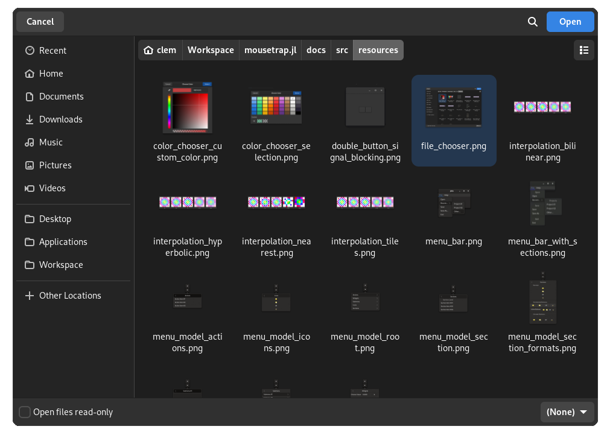

# Chapter 7: Operating System Interface

In this chapter, we will learn:
+ What other features `Application` has
+ How to change our apps UI theme
+ How to properly do logging
+ How to copy / move / create / delete files 
+ How to automatically open a file or url for the user
+ How to access a file's metadata
+ How to monitor a file changing
+ How to open a dialog that lets users select files
+ How to open an alert dialog that the user has to dismiss
+ How to store arbitrary objects in an .ini file
+ How to load and use icons 

---

## Application

We have already used it many times so far, but [`Application`](@ref), which is a signal emitter, offers a number of additional functionalities. It provides the following signals:

```@eval
using mousetrap
mousetrap.@signal_table(Application,
    activate,
    shutdown
)
```

All initialization of widgets and anything else our app uses should be done inside the `activate` signal handler, while `shutdown` can be used to safely free assets. 

[`main`](@ref), which we have used so far instead of connecting to signals, is actually just a convenience function that wraps the following behavior:

```julia
main("com.example") do app::Application
    # behavior here
end

# is mostly equivalent to
app = Application("com.example")
connect_signal_activate!(app) do app::Application
    # behavior here
end
run!(app)
```

### ID

In the previous code snippet, `"com.example"` is the **application ID**. This ID will be used to identify the application on the user's OS. It should be unique, meaning that no other application on the user's operating system shares this ID. 

The application ID has to contain at least one `.` and should be a human-readable identifier in [RDNN format](https://docs.flatpak.org/en/latest/conventions.html#application-ids). For example, if our app is called "Foo Image Manipulation Program" and the apps website domain is `fimp.org`, we should use `org.fimp` as our ID.

!!! warning "Running two apps with the same ID"
    If two applications with the same ID are active at the same time, **they will share assets**.

    This may introduce side effects, if both instances modify the same internal variable or widget, it may create a [race-condition](https://en.wikipedia.org/wiki/Race_condition#In_software).

### Starting / Ending Runtime

[`run!`](@ref) starts the application. This function initializes the various back-ends needed to show widgets, after which it emits signal `activate`. This is why we cannot initialize a widget before `run!` was called, or we will get an error:

```
julia> label = Label()

(process:15357): mousetrap-ERROR **: 21:22:29.003: 
    Attempting to construct a widget, but the GTK4 backend has not yet been initialized.
    (...)
    You have most likely attempted to construct a widget outside of `main` while using mousetrap interactively.
```

We can force initialization without an `Application` instance with `mousetrap.detail.initialize()`, though this is usually not recommended.

At any point, we can attempt to end runtime by calling [`quit!`](@ref). This will usually cause the application to emit its signal `shutdown`. We should always `quit!` before calling Julias `exit()`, otherwise the apps process will be killed immediately, which can lead to undefined behavior.

### Holding & Busy

Each app on a user's system has two boolean flags: whether it is currently **holding** and whether it is currently **busy**.

Holding means that the application will attempt to prevent exiting in any way. We set this flag by calling [`hold!`](@ref), which should be used to prevent the user from accidentally ending runtime while an important process is running. 

We have to make sure to call [`release!`](@ref) to undo a previous `hold!`, after which the app can exit normally again.

Being **busy** marks the app so that the OS recognizes that it is currently busy. This will prevent the "`app` is not responding" dialog many OS will trigger automatically when an app freezes. Sometimes, freezing is unavoidable because a costly operation is taking place. During times like this, we should call [`mark_as_busy!`](@ref), which notifies the OS that everything is still working as intended, it will just take a while. Once the expensive task is complete, [`unmark_as_busy!`](@ref) reverts the flag.

### Theme 

Each pre-made widget in mousetrap has their exact look specified in what is called a **theme**. This theme is a collection of css classes, which determine how a widget will look. These themes are applied globally, we cannot choose a theme for just one widget, it applies to all of them.

Mousetrap supports four default themes, which are a values of enum [`Theme`](@ref):

+ `THEME_DEFAULT_LIGHT`
+ `THEME_DEFAULT_DARK`
+ `THEME_HIGH_CONTRAST_LIGHT`
+ `THEME_HIGH_CONTRAST_DARK`

At any point after the back-end has been initialized, we can swap the global theme using [`set_current_theme!`](@ref). This will immediately change the look  of allwidgets, allowing apps to change the entire GUI with just one function call at runtime.

For example, to create a window that has button to switch between light and dark themes in its header bar, we could do the following:

```julia
main() do app::Application

    window = Window(app)

    # add theme swap button to windows header bar
    header_bar = HeaderBar()
    swap_button = Button()
    set_tooltip_tex(swap_button, "Click to Swap Themes")
    connect_signal_clicked!(swap_button, app) do self::Button, app::Application

        # get currently used theme
        current = get_current_theme(app)

        # swap light with dark, preservng whether the theme is high contrast
        if current == THEME_DEFAULT_DARK
            next = THEME_DEFAULT_LIGHT
        elseif current == THEME_DEFAULT_LIGHT
            next = THEME_DEFAULT_DARK
        elseif current == THEME_HIGH_CONTRAST_DARK
            next = THEME_HIGH_CONTRAST_LIGHT
        elseif current == THEME_HIGH_CONTRAST_LIGHT
            next = THEME_HIGH_CONTRAST_DARK
        end

        # set new theme
        set_current_theme!(app, next)
    end
    push_front!(header_bar, swap_button)
    set_titlebar_widget!(window, header_bar)

    present!(window)
end
```

---

For most purposes, simply using [`main`](@ref) as we have so far is a safer and easier way to start runtime. Nonetheless, it is important to understand how application lifetime works under the hood, as in some situations, more fine-control is required.

---

## Logging

### Introduction

When shipping applications, stability is paramount. Nobody will use an app if it keeps crashing, especially if that crash may corrupt important files.

The best way to prevent crashes is to follow [proper testing procedures](https://www.globalapptesting.com/blog/software-testing). For a small team, it is inevitable that some things will slip through the cracks. When an end-user comes to us with a problem or bug, they most likely will not be able to precisely describe the state of the application, and, depending on the user base, they may not be able to describe the problem at all.

This is where objective information about what exactly was happening right before the crash is invaluable. **Logging** is the act of creating this information. Information about the current and past states of the application is stored in a file. This way, when a crash or bug occurs, we can simply ask the user to provide us with the log file to analyze ourselves.

When working through past chapters, we may have already encountered some logging information. For example, if we try to do the following:

```cpp
box = Box()
push_back!(box, box)
```

We get the following message, printed to our console:

```
(example_target:45245): mousetrap-CRITICAL **: 16:44:27.065: In Box::push_back!: Attempting to insert widget into itself. This would cause an infinite loop
```

We cannot insert a widget into itself, mousetrap prevented this action and printed a log message to inform us of this instead. This protects the applications' stability from potential developer errors. Any and all functions should follow this philosophy: **prevent the error or bug, print a log message instead**. 

### Log Message Properties

Let's go through each part of the above message, one-by-one:

#### Application ID

First, we have `(example_target:45245)`, which is the identification of our application. During normal runtime, this information may not be very useful. Once the log is stored in a system-level log file, however, many applications may log at the same time to the same file. Knowing which log message came from which application is integral in this context.

#### Log Domain

Next we have `mousetrap-CRITICAL`. The word before the `-` is the **log domain**. This is a developer-defined identification that should state which part of the application or library caused the logging message. Pre-defined domains include `mousetrap` and `mousetrap.jl` for mousetrap specific warnings, `GTK` for GTK-based warning, `GLib`, `Gio`, etc. 

As a user of mousetrap, we should choose a new log domain. For example, if we create a new application called "Foo Image Manipulation Program", we should choose a descriptive log domain, such as `foo_image_manipulation_program`, `FIMP`, or `foo`.

#### Log Levels

`CRITICAL` is the messages **log level**. Mousetrap offers the following log levels:

+ `DEBUG` is for messages that should not appear when the end user operates the application, they are **only meant for developers**. These messages will not be stored or printed to the console unless we specifically request the logging suite to do so
+ `INFO` is for **benign status updates**, for example, `successfully opened file at (...)`. We should not overuse these, as they can clutter up log files.
+ `WARNING` is for messages that should attempt to **prevent undesirable but not critical behavior before it occurs**. For example, when attempting to close a file while it is still being written to, a warning should be printed and the closing should be postponed until the writing is done.
+ `CRITICAL` is for errors. In many languages, an error means the end of runtime, which is unacceptable for GUI applications. If the application throws an Julia exception, that exception [should be caught](https://docs.julialang.org/en/v1/manual/control-flow/#Exception-Handling) and printed as a `CRITICAL` log message instead. 
+ `FATAL` is the most severe log level and should only be used as an absolute last resort. Once a `FATAL` warning is printed, the application exits immediately. These should be reserved for issues that make it impossible to run an application, for example `no gaphics card detected. quitting...`

We see that our message from before was designated as `CRITICAL`. This is because adding a widget to itself would effectively deadlock the application, ending runtime. This makes it an issue too severe for a `WARNING`, but it is still recoverable (by preventing the insertion), therefore `FATAL` would be inappropriate. 

`WARNING`s may be triggered by users. If a user is able to trigger a `CRITICAL` log message, this inherently means we as developers failed to prevent the user from doing so. An issue like this should be addressed by redesigning the application, as opposed to educating users. For a large enough user base, the latter will inevitably fail and cause the error to happen anyway.

#### Time Stamp

After the log level, we have `16:44:27.065`, this is the **time stamp** of the log message, with millisecond precision. When storing the message to a file, the current date and year are also appended to the time stamp.

#### Message

Lastly, we have the **log message**. Log messages should contain the name of the function they are called from; for example, in the above message, it says `In Box::push_back!`, telling developers that the error happened in that function. This makes debugging easier.

Messages should not end with a `\n` (a newline), as one is automatically appended to the end of the message.

### Printing Messages

All interaction with the log is handled by only a few functions. To print a log message of a given log level, we use `log_debug`, `log_info`, `log_warning`, `log_critical` and `log_fatal`. These functions take as their first argument the log domain and as their second argument the message as a string.

As mentioned before, messages of level `DEBUG` are only printed if we specifically request them to do so. We enable these on a per-log-domain basis, [`set_surpress_debug!`](@ref), while we can choose to surpress message with log level `INFO` using [`set_surpress_info!`](@ref). 

For example, if our log domain is `foo`:

```julia
# define custom domain
const FOO_DOMAIN = "foo"

# print `DEBUG` level message but nothing will happen because it is surpressed by default
log_debug(FOO_DOMAIN, "Surpressed message")

# enable `INFO` level messages
set_surpress_debug!(FOO_DOMAIN, false)

# message will be printed
log_debug(FOO_DOMAIN, "No longer surpressed message")
```

Note that logging will only work once our `Application` instance is initialized. This is because the logging system needs a valid application ID, which is only registered once `Application` emits its `activate` signal.

### Logging to a File

If the operating system is Linux, many log messages will be written to the default location, usually `/var/log`. On other operating systems, messages may not be stored at all.

Regardless of OS, we can forward all logging, including that of mousetrap itself, to a file using [`set_log_file!`](@ref), which takes the file path as a string. If the file already exists, it will be appended to (as opposed to being overwritten). If the file does not yet exist, it will be created. On successfully opening the file, `true` will be returned. We should react to the function's result, as not being able to log should be considered a fatal error.

When stored to a file, logging messages will have a different format that may or may not list additional information when compared to logging to a console. The philosophy behind this is that it is better to log as much information as possible, then use second party software to filter it, as opposed to missing crucial information for the sake of brevity:

```cpp
const LogDomain FOO_DOMAIN = "foo"
if !set_log_file(FOO_DOMAIN, "example_log.txt")
    log_fatal(FOO_DOMAIN, "In set_log_file: Unable to create file at `example_log.txt`")
end

log_warning(FOO_DOMAIN, "Example Message")
```

Will add the following lines to a `example_log.txt`

```
[23-05-06 23:01:34,920]: In example.main: Example Message
    GLIB_DOMAIN foo
    MOUSETRAP_LEVEL WARNING
    PRIORITY 4
```

Mousetraps logging system should be preferred over the native Julia one. Sending a message with Julias `@info`, will not be printed to the mousetrap log file and will not be accessible by a mousetrap application.

---

## File System

Most GUI applications on desktops are centralized around modifying files. A text or image editor will often want to export files, while a video game will want to create or load a save file. Conversely, Mousetrap offers a robust, operating-system-agnostic way of interacting with the user's file system.

There are two kinds of objects in a file system: **files**, which contain arbitrary data, and **directories**, which contain other files and/or other directories. We also call a directory a **folder**. 

Examples for files that are not folders include `.png`, `.txt`, `.jl` text files, shared libraries, binaries, or executable files.

A **path** is a string, made up of folder names separated by `/`, (or `\` on windows, though this should be avoided). Examples include `/var/log`, `~/Desktop`, etc. A path starting at root (`/` on unix, usually `C:/` on windows) is called an **absolute path**, while any other path is called a **relative path**. 

An **uri** (universal resource identifier) is another way to express the location of the file. It follows a [strict scheme](https://en.wikipedia.org/wiki/Uniform_Resource_Identifier), which is followed by most internet browsers, and should be preferred to regular paths for file transfers between different machines, or when referring to files on the internet.

### FileDescriptor

When querying information about a file, we use [`FileDescriptor`](@ref), which represents information about a file or folder. This object is **non-mutating**, meaning it is incapable of changing anything about the actual file on the disk. In other words, **`FileDescriptor` is read-only**.

We can create a file descriptor from a path like so:

```cpp
readonly = FileDescriptor()
create_from_path!(readonly, "/home/user/Desktop/example.txt");
```

Where the argument to [`create_from_path!`](@ref) will be automatically detected as either a relative or absolute path. If it is not an absolute path, it will be prefixed with the applications runtime directory. For example, if we create a `FileDescriptor` from path `"assets/image.png"`, and our application is located in `/usr/bin/foo`, then the path will be treated as `/usr/bin/foo/assets/image.png`.

`FileDescriptor` does not make sure the underlying file or folder actually exists or that it is a valid file. Creating a descriptor from an invalid path or a path that does not point to a file or folder works just fine, and we won't get a warning. To check whether a file descriptor points to a valid file or folder, we have to use [`exists`](@ref). 

In order to check whether a `FileDescriptor` points to a file (as opposed to a directory), we use [`is_file`](@ref) or [`is_folder`](@ref), respectively. If the file pointed to by `FileDescriptor` does not exist, both of these functions will return `false`.

`FileDescriptor` allows us to query a variety of information about the file or folder, including, but not limited to:

+ [`get_path`](@ref) returns the location of the file as a path, eg. `~/Desktop/example.txt`
+ [`get_uri`](@ref) returns the location as an uri, eg. `file://~/Desktop/example.txt`
+ [`get_file_extension`](@ref) returns the file extension, eg. `txt`
+ [`is_executable`](@ref) checks whether the file is executable
+ [`get_content_type`](@ref) returns the [MIME type](https://en.wikipedia.org/wiki/Media_type), eg. `text/plain`

For less common metadata information, we can use [`query_info`](@ref), which takes an **attribute identifier** as a string. A list of identifiers can be found [here](https://gitlab.gnome.org/GNOME/glib/-/blob/main/gio/gfileinfo.h#L46), though, depending on the type of file and operating system, not all of these attributes may have a corresponding value.

If the file is a folder, we can use [`get_children`](@ref) to get all files and/or directories inside that folder. `get_children` takes a boolean as its other argument, which specifies whether it should list all children recursively.

---

## Manipulating the Disk

`FileDescriptor` being non-mutating means we need a different part of mousetrap in order to actually modify files on the users' disk. For file input / output, such as reading the contents of files, we should use the [Julia standard library](https://docs.julialang.org/en/v1/base/file/), which is well-suited for this task. 

For manipulating files as a whole, as opposed to their contents, mousetrap offers multiple functions for common tasks:

### Creating Files

[`create_file_at!`](@ref) creates a file at a given location. It takes a file descriptor as its only argument. If `should_replace` is set to `false` and the file already exists, no operation will be performed

```julia
if create_file_at!(FileDescriptor("/absolute/path/to/file.txt"), replace = false)
    # use file
end
```

[`create_directory_at!`](@ref) performs a similar action, except it creates a directory instead of a file.

### Deleting Files

To permanently delete a file, we use [`delete_at!`](@ref), which takes a file descriptor as its argument. This immediately deletes the file, making it unable to be recovered. In some cases, this may be too risky, in which case should use [`move_to_trash!`](@ref) instead:

```julia
to_delete = FileDescriptor("/path/to/delete/file.txt")
if !move_to_trash(to_delete)
    log_warning(FOO_DOMAIN, "In example: Unable to delete file at `$(get_path(to_delete))`")
end
```

### Moving / Copying File

To move a file from one location to another, we use [`move!`](@ref). If we want to copy a file or directory instead of moving it, we use [`mousetrap.copy!`](@ref):

```julia
from = FileDescriptor("/path/from/file.txt")
to = FileDescriptor("/different_path/to/file.txt")
if !move!(from, to)
    log_warning(FOO_DOMAIN, "In example: Unable to move file from `$(get_path(from))` to `$(get_path(to))`")
end
```

### Changing File Metadata

!!! info 
    (this feature is not yet implemented)

### Opening a File or URL

Often, we will want to open an external file for the user, for example, showing the license of our app in a text editor or opening a donation page from a menu. Mousetrap offers three functions well-suited for this.

[`open_file`](@ref) will open a file on disk, usually presenting a user with a number of applications that can open the file. For example, when opening a `.txt` file, the user will be presented with a list of text editors installed on their system. When they select one, that application will be started and open the file.

Similarly, [`show_in_file_explorer`](@ref) will open the user's file explorer to the enclosing folder of the file. 

Lastly, [`open_url`](@ref) takes an URL as a string, opening the user's default internet browser to show that page.

All of these functions are designed to work on all operating systems, making them a convenient way to perform what would be quite a complex task otherwise.

---

### Monitoring File Changes

Often, when writing a GUI, we want the graphical interface to reflect the contents of a file on the disk. A good example would be a text editor. We can modify the file from inside our own application, however, if the file is modified by a third entity, such as another application, a conflict may arise. In this case, we will usually want to update the state of our application such that it reflects the state of the file on disk. This should happen whenever the underlying file changes. 

This is made possible by [`FileMonitor`](@ref), which monitors a file or directory for changes.

`FileMonitor` cannot be created directly, instead, we first create a `FileDescriptor`, then call [`create_monitor`](@ref), which returns the `FileMonitor` instance.

`FileMonitor` works similar to a signal emitter. To register a function that is called whenever the file changes, we use [`on_file_changed!`](@ref), which expects a function with the signature 

```julia
(::FileMonitor, event::FileMonitorEvent, self::FileDescriptor, other::FileDescriptor, [::Data_t]) -> Nothing
```

where

+ `event` is a [`FileMonitorEvent`](@ref), describing the type of action performed, see below
+ `self` is a descriptor pointing to the file or folder that is being monitored
+ `other` is a descriptor that may or may not point to the other relevant file, see below
+ `Data_t` is optional arbitrary data

The following monitor events are supported:

| `FileMonitorEvent`                     | Meaning                      | value of `self`          | value of `other`   |
|----------------------------------------|------------------------------|--------------------------|--------------------|
| `FILE_MONITOR_EVENT_CHANGED`           | File's content was modified in any way | modified file            | none               |
| `FILE_MONITOR_EVENT_DELETED`           | File was deleted             | monitored file or folder | deleted file       |
| `FILE_MONITOR_EVENT_CREATED`           | File was created             | monitored file or folder | newly created file |
| `FILE_MONITOR_EVENT_ATTRIBUTE_CHANGED` | File metadata changed        | changed file             | none               |
| `FILE_MONITOR_EVENT_RENAMED`           | File's name changed           | changed file             | none               |
| `FILE_MONITOR_EVENT_MOVED_IN`          | File was moved into self     | monitored folder         | moved file         |
| `FILE_MONITOR_EVENT_MOVED_OUT`         | File was moved out of self   | monitored folder         | moved file         | 

For example, if we want to trigger an action whenever `/path/to/file.txt` changes its content, we could do the following:

```julia
to_watch = FileDescriptor("/path/to/file.txt")  # equivalent to create_from_path!
monitor = create_monitor(to_watch)

function on_file_changed_callback(monitor::FileMonitor, event::FileMonitorEvent, self::FileDescriptor, other::FileDescriptor)
    if event == FILE_MONITOR_EVENT_CHANGED
        println("File at $(get_path(self)) changed.")
    end
end
on_file_changed!(on_file_changed_callback, monitor)
```

If we no longer want to monitor a file, we can call [`cancel!`](@ref), at which point the `FileMonitor` instance may be safely deallocated.

---

## File Chooser Dialog

Opening a dialog to allow a user to select a file or folder is a task so common, most operating systems provide a native widget just for this purpose. Mousetrap, conversely, also has an object tailor-made for this: [`FileChooser`](@ref)

`FileChooser` is not a widget, and it cannot emit any signals. It is what's called a **dialog**, which is a graphical object that can only exist in its own window.

Its constructor takes two arguments: a [`FileChooserAction`](@ref) and the resulting dialog window's title. `FileChooserAction` is an enum whose value determines which **mode** the `FileChooser` will perform in:

| `FileChooserAction` value | Users may select...         |
|---------------------------|-----------------------------|
| `FILE_CHOOSER_ACTION_OPEN_FILE` | exactly one file            |
| `FILE_CHOOSER_ACTION_OPEN_MULTIPLE_FILES` | one or more files           |
| `FILE_CHOOSER_ACTION_SELECT_FOLDER` | zero or one folder          |
| `FILE_CHOOSER_ACTION_SELECT_MULTIPLE_FOLDERS` | zero or more folders        |
| `FILE_CHOOSER_ACTION_SAVE` | file name and location |

Depending on which `FileChooserAction` we choose, `FileChooser` will automatically change its layout and behavior. After creating the object, we can show it to the user using `present!`:

```cpp
file_chooser = FileChooser(FILE_CHOOSER_ACTION_OPEN_MULTIPLE_FILES)
present!(file_chooser)
```



In order to react to the user making a selection or canceling the operation, we need to register a **callback** with the file chooser.

[`on_accept!`](@ref) takes a function that is invoked when the user makes a file selection, for example by pressing the "Open" button. This function is required to have the signature

```julia
(::FileChooser, files::Vector{FileDescriptor}, [::Data_t]) -> Nothing
```
Where `files` may contain zero or more file descriptors, depending on the `FileChooserAction` used when creating the dialog.

The callback registered using [`on_cancel!`](@ref) is called when the user cancels or otherwise closes the dialog. This function requires a different signature:

```julia
(::FileChooser, [::Data_t]) -> Nothing
```

Using these, we can trigger custom behavior if / when the user makes a selection:

```julia
file_chooser = FileChooser(FILE_CHOOSER_ACTION_OPEN_MULTIPLE_FILES)

on_accept!(file_chooser) do self::FileChooser, files::Vector{FileDescriptor}
    println("User chose files at $files")
end
on_cancel!(file_chooser) do self::FileChooser
    println("User cancelled the dialog")
end

present!(file_chooser)
```
### FileFilter

Looking again at the previous screenshot in this section, we see that in the bottom right corner of the dialog, a drop-down with the currently selected item `(None)` is seen. This is the currently active **filter**, where `(None)` means no filter is active.

By adding a filter, we make it so only files that pass that filter will be shown - and thus be selectable. This is useful when we want to limit file selection to only a certain type of file; for example, an image manipulation application would only allow loadable image files as the file type for an `Open...` dialog.

We construct a [`FileFilter`](@ref) by first choosing a name. This string will be used as the title of the filter, which is shown in the `FileChooser`s drop-down:

```julia
file_filter = FileFilter("Julia Files")
```

We now have to specify which files should pass the filter. `FileFilter` offers multiple functions for this:

| `FileFilter` Method                             | Argument       | Resulting Allowed Files                                   |
|-------------------------------------------------|----------------|-----------------------------------------------------------|
| [`add_allowed_suffix!`](@ref)                   | `jl`           | files ending in `.jl`                                     |
| [`add_allow_all_supported_image_formats!`](@ref) | (no argument)  | file types that can be loaded by [`ImageDisplay`](@ref)s  |
| [`add_allowed_mime_type!`](@ref)                 | `text/plain`   | files classified as plain text, for example `.txt`        |
| [`add_allowed_pattern!`](@ref)                    | `*.jl`         | files whose name match the given regular expression  |

Where a table with the allowed image formats is available in [the chapter on images](06_image_and_sound.md#supported-image-formats).

After having set up our filter, we simply add it to the `FileChooser` instance using [`add_filter!`](@ref):

```julia
filter = FileFilter("*.jl")
add_allowed_suffix!(filter, "jl")
add_filter!(file_chooser, filter)
```


By default, no `FileFilter`s will be registered, which means the `FileChooser` will display all possible file types. We can control which filter is active when the dialog opens using [`set_initial_filter!`](@ref).

!!! info
    We can call `set_initial_filter!` with a filter that has not yet been added with `add_filter!`. This will make it so the initial filter is active when the dialog opens, but cannot be changed, as only filters added with `add_filter!` will be selectable from the dialogs dropdown.

---

## Alert Dialog

A very common task for an application that manipulates files is to make sure the user knows they are overwriting a file, for example, when the user selects a location using a `FileChooser` who's action is `FILE_CHOOSER_ACTION_SAVE_FILE`.

While we could construct a custom widget for this purpose, put that widget in a `Window`, then present that window to the user, a task as common as this should be possible in only a few lines. For this purpose, mousetrap offers [`AlertDialog`](@ref), which is a dialog that shows a message to the user, along with one or more buttons they can click.

Each `AlertDialog` has a **message**, a **detailed description**, which we during `AlertDialogs`constructor:

```julia
overwrite_file_warning_dialog = AlertDialog(
    "A file with this name already exists, continue?", # message
    "The original file will be overwritten, this cannot be undone." # detail description
)
```

With just this, the only way for the user to interact with the dialog is to press escape, which closes it. We will most like want to add buttons, which we accomplish using [`add_button!`](@ref)

```julia
add_button!(overwrite_file_warning_dialog, "Continue")
add_button!(overwrite_file_warning_dialog, "Cancel")
```

While we could `present!` this dialog to the user now:


We haven't yet connected any behavior to the user pressing a button. To do this, we use [`on_selection!`](@ref), which takes a callback with the following signature:

```julia
(::AlertDialog, button_index::Integer, [::Data_t]) -> Nothing
```

Where `button_index` is the index of the button, from left to right (1-based), or `0` if the dialog was dismissed without pressing a button.

Continuing our example of warning the user when they're about to overwrite a file, we would do the following:

```julia
# create the dialog
overwrite_file_warning_dialog = AlertDialog(
    "A file with this name already exists, continue?", # message
    "The original file will be overridden, this cannot be undone." # detailed description
)

add_button!(overwrite_file_warning_dialog, "Continue")
add_button!(overwrite_file_warning_dialog, "Cancel")

# add a callback
on_selection!(overwrite_file_warning_dialog) do self::AlertDialog, button_index::Integer
    if button_index == 1 # "Continue" pressed
        # write file
    elseif button_index == 2  # "Cancel" pressed
        # ...
    else # dialog closed without pressing a button
        # ...
    end
end

# show the dialog, because it is modal, this will pause all other windows
present!(overwrite_file_warning_dialog)
```

Note that we do not need to close the dialog from within the `on_selection!` callback, it is closed automatically.

On top of buttons, `AlertDialog` furthermore has a spot for a custom widget, which will be displayed underneath the detail message. We choose this widget with [`set_extra_widget!`](@ref), which gives us some additional flexibility for when we want a dialog that has more than just text.

With `AlertDialog`, we have a vastly simplified mechanism for showing short, message-style dialogs to the user. Each of these dialogs will be *modal*  by default, meaning all other windows and actions will be paused until the dialog is dismissed.

---

## GLib Keyfiles

For many objects like images, mousetrap [offers ways to store them on the disk](@ref save_to_file). For custom objects, such as the state of our application, we have no such option. While it may sometimes be necessary, for most purposes we do not need to create a custom file type, instead, we can use the [**GLib KeyFile**](https://docs.gtk.org/glib/struct.KeyFile.html), whose syntax is heavily inspired by Windows `.ini` settings files.

Keyfiles are human-readable and easy to edit, which makes them better suited for certain purposes when compared to [json](https://docs.fileformat.com/web/json/) or [xml](https://docs.fileformat.com/web/xml/) files.

Thanks to [`mousetrap.KeyFile`](@ref), loading, saving, and modifying key files is easy and convenient.

### GKib Keyfile Syntax

In a keyfile, every line is one of four types:

+ **Empty**, it has no characters or only control characters and spaces
+ **Comment**, it begins with `#`
+ **Group**, has the form `[group_name]`, where `group_name` is any name not containing a space
+ **Key**, has the form `key=value`, where `key` is any name and `value` is of a format discussed below

For example, the following is a valid key file:

```txt
# keybindings 
[image_view.key_bindings]

# store current file
save_file=<Control>s

# miscellanous config
[image_view.window]

# default window size
width=400
height=300

# default background color
default_color_rgba=0.1;0.7;0.2;1
```

Key-value pairs belong to the group that was last opened. Groups cannot be nested, they always have a depth of 1 and every key-value-pair has to be inside exactly one group.

### Accessing Values

If the above key file is stored at `assets/example_key_file.txt`, we can access the values of the above named keys like so:

```julia
# load file
file = KeyFile()
load_from_file!(file, "assets/example_key_file.txt")

# retrieve value as String
save_file_keybinding = get_value(file, "image_view.key_binding", "save_file", String)

# retrieve values as int
width = get_value(file, "image_view.window", "width", Int32)
height = get_value(file, "image_view.window", "height", Int32)

# retrieve value as RGBA
default_color = get_value(file, "image_view.window", "default_color_rgba", RGBA)
```

We see that the general syntax to access a `KeyFile` value is 
```
get_value(<file>, <group_name>, <key_name>, <type>)
``` 
where `type` is one of the following:

| Type                      | Example Value                                | Format                            |
|---------------------------|----------------------------------------------|-----------------------------------|
| Bool                      | `true`                                       | `true`                            |
| Vector{Bool}              | `[true, false, true]`                        | `true;false;true`                 |
| Cint (Int32)              | `32`                                         | `32`                              |
| Vector{Cint}              | `[12, 34, 56]`                               | `12;34;56`                        |
| Csize_t (UInt64)          | `984`                                        | `948`                             |
| Vector{Csize_t}           | `[124, 123, 192]`                            | `124;123;192`                     |
| Cfloat (Float32)          | `3.14`                                       | `3.14`                            |
| Vector{Cfloat}            | `[1.2, 3.4, 5.6]`                            | `1.2;3.4;5.6`                     |
| Cdouble (Float64)         | `3.14569`                                    | `3.14569`                         |
| Vector{Cdouble}           | `[1.123, 0.151, 3.121]`                      | `1.123;0.151;3.121`               |
| String                    | `"foo"`                                      | `foo`                             |
| Vector{String}            | `["foo", "lib", "bar"]`                      | `foo;lib;bar`                     |
| RGBA                      | `RGBA(0.1, 0.9, 0, 1)`                       | `0.1;0.9;0.0;1.0`                 |
| Image                     | `RGBA(1, 0, 1, 1), RGBA(0.5, 0.5, 0.7, 0.0)` | `1.0;0.0;1.0;1.0;0.5;0.5;0.7;0.0` | 

We can also interact with comments from Julia. To access the comment above a group ID or key-value-pair, we use [`get_comment_above`](@ref) which takes either just a group name for comments above groups, or a group- and key-name for comments above key-value pairs.

### Storing Values

We use [`set_value!`](@ref) to modify the value of a `KeyFile` entry. Thanks to method dispatch, we do not have to specify the type of value in Julia for `set_value!`.

```julia
set_value!(file, "image_view.window", "default_color_rgba", RGBA(1, 0, 1, 1));
```

To modify comments, we use [`set_comment_above!`](@ref), which, just like before, takes only a group ID to modify the comment above a group declaration, or both a group ID and key to modify the comment above a key-value pair.

When writing to an instance of `KeyFile`, only the file in memory is modified, **not the file on the disk**. To update the actual stored file, we need to call [`save_to_file`](@ref). 

---

## Icons

We've seen before how to load and display an image using `Image`. One of the most common applications for this is to use the resulting picture as the label of a `Button`. In common language, this picture is often called an **icon**.

In modern desktop applications, we may have dozens of these images used as visual labels for widgets. While it is possible to simply store all these images as `.png`s and load them manually with `Image`, this is hardly very scalable. Furthermore, this method does not allow us to modify all pictures at the same time, which may be necessary to, for example, increase icon size to aid visually impaired users.

A better way to handle images in a context like this is provided by [`Icon`](@ref).

`Icon` is similar to an image file, though it usually does not contain pixel data. Instead, it points to a file on disk. `Icon`s can be loaded from `.png` files, but also allows `.svg` (vector graphics), and `.ico` (web browser icons). 

### Creating and Viewing Icons

The simplest way to create an `Icon` is to load it as if it were an `Image`. If we have a vector graphics file at `assets/save_icon.svg`, we would load it like this:

```cpp
icon = Icon()
create_from_file!(icon, "assets/save_icon.svg", 48);
```

Where `48` means the icon will be initialized with a resolution of 48x48 pixels. `Icon`s can only be square.

If we want to display this icon using a widget, we can use `ImageDisplay`s [`create_from_icon!`](@ref). This is similar to images, however, because `Icon` will usually not be raster-based, the `ImageDisplay` will scale much more smoothly to any resolution as no interpolation has to take place.

Other than with `ImageDisplay`, we have other ways to use icons in graphical widgets: We can directly make the icon a child of a `Button` or `ToggleButton` using [`set_icon!`](@ref). Icons can furthermore be inserted to the left or right of an entry using [`set_primary_icon!`](@ref), and [`set_secondary_icon!`](@ref), and they can be used in menus, which we will learn about in the next chapter.

## Icon Themes

!!! note 
    This section is not yet complete, see the documentation for [`IconTheme`](@ref), and the [Freedesktop Icon Theme Specification](https://specifications.freedesktop.org/icon-theme-spec/icon-theme-spec-latest.html) instead.

---

`Icon` has a number of uses where it cannot be replaced by an `ImageDisplay`. One such purpose is as a **menu icon**, which we will make great use of in the next section. 