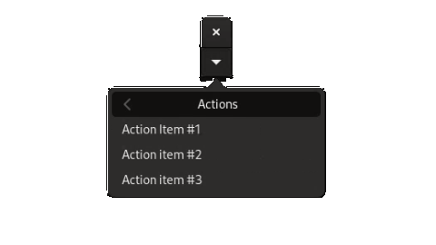
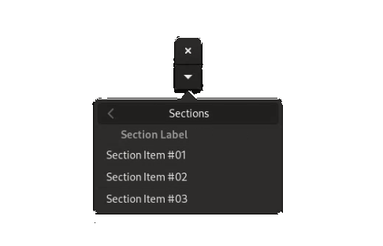

# Chapter 8: Menus

In this chapter, we will learn:
+ How to create complex, nested menus
+ How to display menus using `PopoverMenu` and `MenuBar`
+ Best-practice style guides for menus

---

In the [chapter on actions](./03_actions.md) we learned that we can trigger an action using [`Button`](@ref), by assigning an action to it using [`set_action!`](@ref).
This works if we want to have a GUI element that has one or maybe a few actions. In practice, an application can have hundreds of different actions. Asking users to trigger these using an equal number of buttons would be unsustainable. For situations like these, we should instead turn to **menus**.

## MenuModel Architecture

In Mousetrap, menus follow the [model-view architectural pattern](https://en.wikipedia.org/wiki/Model%E2%80%93view%E2%80%93controller). To create a menu, we need
the menu model, which holds information about how the menu is structured, along with a view, which takes the models and transforms them into an interactable
widget users can manipulate. Changing the model changes the view.

!!! details "Running Snippets from this Section"

    To follow along with code snippets from this section, we can use the following `main.jl` file:
    ```julia
    using Mousetrap 
    main() do app::Application

        window = Window(app)
        
        # create dummy action
        action = Action("dummy.action", app) do x 
            println("triggered.")
        end

        # model that we will be modifying in the snippet
        root = MenuModel()

        # snippet goes here

        # display menu
        add_submenu!(root, "Title", model)
        view = PopoverButton(PopoverMenu(root))
        set_child!(window, view)
        present!(window)
    end
    ```

## Menu Items

[`MenuModel`](@ref), the model component of Mousetrap menus, is a list of **menu items** in a specific order. If item `A` is added before item `B` at runtime, then `A` will appear above item `B`. There are multiple different types of menu items, all with their own purpose. The function we choose to add an item to the model determines the item's type. There are four types of menu items, which we will go over in this section.

### Item Type #1: Action

The first and most simple item type is called "action". Added via [`add_action!`](@ref), which takes both a label and an [`Action`](@ref) instance, this item is a simple button with text. If the user clicks the button, the action is executed.

Similar to `Button`, if the action is disabled (via [`set_enabled!`](@ref)) or does not yet have a callback registered, the menu item will appear "greyed out" and cannot be activated.

```cpp
add_action!(model, "Action Item #1", action)
add_action!(model, "Action item #2", action)
add_action!(model, "Action item #3", action)
```



### Item Type #2: Widgets

Secondly, we have perhaps the most powerful type of item: A custom widget. We add an item of this type using [`add_widget!`](@ref), which only takes a single argument, the widget itself. This widget can be arbitrarily complex, though it is usually not advisable to insert an entire `ColumnView` into a tiny menu. Good-practice examples include `Button`, `Entry`, `CheckButton`, `ToggleButton`, `Switch`, and `SpinButton`, all of which are intractable.

We do not supply an `Action` instance with this item, if we want the user interacting with the menu item to trigger behavior, we will have to connect that behavior to the signals of the widget we inserted into the menu, or any of its event controllers.

```cpp
add_widget!(model, hbox(Label("Choose Value:  "), SpinButton(0, 1, 0.01)))
add_widget!(model, Scale(0, 1, 0.01, ORIENTATION_HORIZONTAL))
add_widget!(model, hbox(Label("Enter Text:  "), Entry()))
```


Widgets are the most flexible type of menu item. They should be used with caution, and only if absolutely necessary. It is often better to create an action that opens a separate [`Window`](@ref) that contains the widget, as opposed to directly adding the widget to the menu.

### Item Type #3: Submenu

`MenuModel` can be **nested**, which means we can insert a `MenuModel` into another `MenuModel`. This is similar to `ListView` or file-system tree: a folder can contain regular files (menu items), or it can contain other folders (menu models), which in turn can also contain another file or folder, etc. `MenuModel` can similarly be infinitely nested, though it is usually not recommended to go deeper than two or three levels.

We call a `MenuModel` that is nested within another model a **submenu**. It will show up as a button with a label, along with an indicator that it is a submenu, usually a `>` shape. Clicking this item will reveal the submenu.

To add this type of submenu item, we use [`add_submenu!`](@ref), which takes a title and another menu model:

```julia
submenu_01 = MenuModel()
add_widget!(submenu_01, submenu_content())
add_submenu!(model, "Submenu #1", submenu_01)

submenu_02 = MenuModel()
add_widget!(submenu_02, submenu_content())
add_submenu!(model, "Submenu #2", submenu_02)
```


Clicking on of these items will reveal the submenu content:


Where `submenu_content()` returns a simple place-holder widget, in reality, this will be many other menu items or other submenus.

### Item Type #4: Icons

A prettier analog to the "action"-type menu item, an "icon"-type item. Added via [`add_icon!`](@ref), it takes an [`Icon`](@ref), along with an action. The entire menu item will be just the icon, it may not have any text. If the icon is clicked, the action is executed.

```julia
add_icon!(model, Icon(#=...=#), action)
add_icon!(model, Icon(#=...=#), action)
add_icon!(model, Icon(#=...=#), action)
add_icon!(model, Icon(#=...=#), action)    
```


Where we used the default Gnome icons for weather indicators as placeholders.

When creating a menu item with an action, we have to decide whether to use a simple text label or an icon. We may not have both.

### Item Type #5: Sections

Lastly, we have **sections**. Sections are like submenus, in that they are a menu inside another menu. The difference is in the way this inner menu is displayed.

When adding a submenu with `add_submenu!`, a single new item will appear in the outer menu. When clicked, the menu "slides" to reveal the submenu. 

With sections, the inner menu is instead inserted directly into the outer menu; both are shown at the same time. 

We add a "section"-type item using [`add_section!`](@ref), which takes another menu model and a title, which will be used as a header for the section:

```julia
section = MenuModel()
add_action!(section, "Section Item #01", #= action =#)
add_action!(section, "Section Item #02", #= action =#)
add_action!(section, "Section Item #03", #= action =#)
add_section!(model, "Section Label", section)
```



We see that the section label, `"Section Label"` in this case, is displayed above all its items, which are inserted into the outer menu. In this way, sections can be helpful to group multiple menu items, which makes a menu easier to parse without adding another nested level via a submenu.

#### Section Formats

[`add_section!`](@ref) takes one additional, optional argument, which is a [`SectionFormat`](@ref). This enum has a number of values that govern how the section is displayed:

+ `SECTION_FORMAT_CIRCULAR_BUTTONS` displays all its elements in circular buttons
+ `SECTION_FORMAT_HORIZONTAL_BUTTONS`: display its elements as a row of rectangular buttons
+ `SECTION_FORMAT_INLINE_BUTTONS`: display all buttons right of the section heading

The following shows these section formats:

```julia
# generate a menu model with the 4 weather icons, then add as section with given format
function add_icon_section(title::String, format::SectionFormat)
        
    section = MenuModel()
    add_icon!(section, Icon(#=...=#), action)
    add_icon!(section, Icon(#=...=#), action)
    add_icon!(section, Icon(#=...=#), action)
    add_icon!(section, Icon(#=...=#), action)    
    add_section!(icon_model, title, section, format)
end

add_icon_section("Normal", SECTION_FORMAT_NORMAL)
add_icon_section("Horizontal Buttons", SECTION_FORMAT_HORIZONTAL_BUTTONS)
add_icon_section("Inline Buttons:  ", SECTION_FORMAT_INLINE_BUTTONS)
add_icon_section("Circular Buttons", SECTION_FORMAT_CIRCULAR_BUTTONS)
```


Using `SectionFormat` and mixing several menu item types, we can construct arbitrarily complex menus. We should realize that the highest priority when constructing menu items is the **user experience**. Presenting users with a giant, deeply nested mess of buttons may be very functional, but it may not be very usable to anyone but the developers themself.

---

## Displaying Menus

Now that we have learned to construct the menu **model**, we should turn our attention to the **view**, a widget displaying a `MenuModel`.

### PopoverMenu

[`PopoverMenu`](@ref) is a sibling of [`Popover`](@ref). It consists of a small dialog that is only displayed when we ask it to. While `Popover` displays an arbitrary widget, `PopoverMenu` displays a menu model.

For ease of use, it's easiest to connect the `PopoverMenu` to a [`PopoverButton`](@ref), just like we did with `Popover`:

```julia
model = MenuModel()

# fill `model` here

popover_menu = PopoverMenu(model)
popover_button = PopoverButton(popover_menu)

# add the button to the window so we can click it
set_child!(window, popover_button)
```

The `PopoverMenu`-`PopoverButton` combo should be reserved for **context menus**, which are menus that act on some local part of the application. For a menu that affects the entire application and should be accessible at all times, we should use the next menu model view instead.

### MenuBar

Familiar to any user of a modern desktop GUI, [`MenuBar`](@ref) is a widget that is usually displayed at the top of the main application window:


We see that `MenuBar` is a horizontal list of items. When the user clicks on one of the items, a nested menu opens. Just like before, menus can be nested a theoretically infinite number of times.

Unlike `PopoverMenu`, `MenuBar` requires its `MenuModel` to have a certain structure: **all top-level items have to be submenus**.

What does this mean? Let's work through the menu shown in the image above. We created it using the following snippet:

```julia
root = MenuModel()

file_submenu = MenuModel()
add_action!(file_submenu, "Open", #= action =#)    

file_recent_submenu = MenuModel()
add_action!(file_recent_submenu, "Project 01", #= action =#)
add_action!(file_recent_submenu, "Project 02", #= action =#)
add_action!(file_recent_submenu, "Other...", #= action =#)
add_submenu!(file_submenu, "Recent...", file_recent_submenu)

add_action!(file_submenu, "Save", #= action =#)
add_action!(file_submenu, "Save As...", #= action =#)
add_action!(file_submenu, "Exit", #= action =#)

help_submenu = MenuModel()
add_submenu!(root, "File", file_submenu)
add_submenu!(root, "Help", help_submenu)

menubar = MenuBar(model)
```

Where in a real application, each item will have a different action.

This code can be quite hard to read. To make the nesting easier to understand, we'll write it out as if it were a file system folder structure:

```
model \
    File \
        Open
        Recent... \
            Project 01
            Project 02
            Other...
        Save
        Save As
        Exit
    Help \
        (...)
```

Where any line suffixed with a `\` is a submenu.

We see that we have four models in total. The top-most menu model is called `root`, it is what `MenuBar` will be initialized with.
Next, we have the model called `file_submenu`, which has the title `File`. It contains five items, titled `Open`, `Recent...`, `Save`, `Save As`, and `Exit`. `Recent...` is a submenu-type item, created from a `MenuModel` called `file_recent_submenu` in the above code. This model, in turn, has three items.  On the same level as `File`, we have a second menu `Help`.

The **top-level** menu is `root`. It is used as the argument for the constructor of `MenuBar`. We see that all direct children of `root` (`File` and `Help`) **are themselves submenus** (they were added using `add_submenu!`). 

No direct child of `root` is an "action"-, "widget"-, "icon"- or "section"-type item. This is what is required for `MenuBar`. All top-level items have to be submenus.

!!! warning
    Due to a bug in the backend, as of `v0.3.0`, a menu model used for a `MenuBar` **may not have a "widget"-type item in a submenu of a submenu**.

    This means we *can* add a widget to any submenu of `root`, but we may not add 
    a widget to any submenu that is nested any deeper than a direct child of `root`.

    This bug does not affect `PopoverMenu`, for whom we can put a widget at any 
    depth. `PopoverMenu` has no requirement as to the structure of its menu model, while `MenuBar` requires that all top-level items are submenus and that no submenu of a submenu may have a "widget"-type item.

## Main Menu (macOS only)

!!! compat
    Features from this section are only available with Mousetrap `v0.3.1` or newer, and should only be used by applications targeting macOS. We can use `Sys.isapple` to verify the user's operating system.

On macOS, applications are able to target the [**main menu**](https://support.apple.com/en-gb/guide/mac-help/mchlp1446/mac), which is the menubar at the very top of the screen (outside the Mousetrap window). This bar contains the Apple menu, as well as a native menubar with application-specific options. To bind a `Mousetrap.MenuModel` to this menubar, we use `set_menubar` on our `Application` instance:

```julia
main() do app::Application

    model = MenuModel()
    # fill model here
    
    if Sys.isapple()
        set_menubar(app, model) # associate model with the Apple main menu
    end
end
```

Note that it may be necessary to call `set_menubar` again when the `MenuModel` is modified in order for the main menu to be updated.

---

## Style End Note

Menus are extremely powerful and complex to construct. With practice and good software / UI design, we can create deep, complex menus that are still easy to understand and use. We, as developers, should make this our priority. 

Some additional notes:

### Ellipses

Some may be curious as to why some menu items have `...` added at the end of their labels, while others do not. This is not a universal standard, but it is common for `...` to indicate that clicking this item will open another window, submenu, or dialog. If clicking an item simply triggers an action (such as `Save` or `Exit`), `...` is omitted. If the item opens a window, widget, or submenu, `...` is appended to the menu label, as is the case with `Recent...` above.

### Maximum Menu Depth

Regarding menu depth, the best practice is to never go deeper than three levels. The above example with `File > Recent... > Project 01` shows a good situation in which a 3-level-deep menu may be justified. Going any deeper is rarely a good course of action. Adding a section should always be considered *before* deciding to add a submenu.

### Section Grouping

Lastly, some schools of UI design believe that **every menu item should be inside a section**. For example, if we were to follow this philosophy for our above `MenuBar` example, we would redesign it like this:


This adds considerable complexity to the code (adding 4 models, one for each section, making our total 8). In return, items are grouped logically, and each item gets a "heading", which helps make long menus easier to understand. For this small example, this is most likely unnecessary, but it will be more attractive for a menubar with dozens of items.

In the end, each UI designer should decide for themselves which technique to use. What all should agree on, however, is that ease of use for the end-user is the most important thing. It should trump ease of development in every case. If something is harder for us developers but makes it easier for our users, we should go through the effort of doing it.
