# Chapter 9: Native Rendering

In this chapter we will learn:
+ How to use `RenderArea`
+ How to draw any shape
+ How to efficiently show an image as a texture
+ How to influence blending
+ How to apply a 3D transform to a shape
+ How to compile a GLSL Shader and set its uniforms

---

!!! danger "Native Rendering on MacOS"
    All classes and functions in this chapter **are impossible to use on MacOS**. For this platform,
    mousetrap was compiled in a way where any function relating to OpenGL was made unavailable. This 
    is because of Apples decision to deprecate OpenGL in a way where only physical owners of a Mac
    can compile libraries that have it as a dependency. See [here](https://github.com/users/Clemapfel/projects/2?pane=issue&itemId=33978341) for more information.

    If a disabled object is attempted to be instantiated on MacOS, a **fatal error** will be thrown at runtime.

---

In the [chapter on widgets](04_widgets.md), we learned that we can create new widgets by combining already predefined widgets as a *compound widget*. We can create a new widget that has a `Scale`, but we can't render our own scale with, for example, a square knob. In this chapter, this will change.

By using the native rendering facilities mousetrap provides, we are free to create any shape we want, assembling new widgets pixel-by-pixel, line-by-line, then adding interactivity using the [event controller system](./05_event_handling.md).

## RenderArea

The central widget of this chapter is [`RenderArea`](@ref), which is a canvas used to display native graphics. At first, it may seem very simple:

```julia
render_area = RenderAre()
```

This widget will render as a transparent area, because `RenderArea` has no graphic properties of its own. Instead, we need to create separate **shapes**, then **bind them for rendering**, after which `RenderArea` will display the shapes for us. Still, `RenderArea` will follow the properties just like any other widget, for example, it will have an allocated size that follows size-hinting and the expansion property.

## Shapes

In general, shapes are defined by a number of **vertices**. A vertex has a position in 2D space, a color, and a texture coordinate. In this chapter, we will learn what each of these properties does and how they coalesce to form a shape.

### Vertex Coordinate System

A shape's vertices define where inside the `RenderArea` it will be drawn. The coordinate system shapes use is different from the one we use for widgets. OpenGL, on which the native rendering component of mousetrap is based, uses the **right-hand coordinate system**, which is familiar from traditional math:


(source: [learnopengl.com](https://learnopengl.com/img/getting-started))

For now, we assume the z-coordinate for any vertex is set to 0, reducing the coordinate system to a 2D plane. 

We will refer to this coordinate system as **GL coordinates**, while the widget coordinate system used for `ClickEventController` and the like as **widget space coordinates**.

To further illustrate the difference between GL and widget space coordinates, consider this table, where `w` is the widgets' width, `h` is the widgets' height, in pixels:
 
| Conceptual Position | GL Coordinate | Widget Space Coordinate |
|---------------------|---------------|-------------------------|
| top left            | `(-1, +1)`    | `(0, 0)` |
| top                 | `( 0, +1)`    | `(w / 2, 0)`|
| top right           | `(+1, +1)`    | `(w, 0)`|
| left                | `(-1,  0)`    | `(0, y / 2)`|
| center              | `( 0,  0)`    | `(w / 2, y / 2)`|
| right               | `(+1,  0)`    | `(w, y / 2)`|
| bottom left         | `(-1, -1)`    | `(0, y)`|
| bottom              | `( 0, -1)`    | `(w / 2, y)`|
| bottom right        | `(+1, -1)`    | `(w, y)`|

We see that the OpenGL coordinate system is **normalized**, meaning the values of each coordinate are inside `[-1, 1]`, while the widget-space coordinate system is **absolute**, meaning the values of each coordinate take the allocated size of the widget into account, being inside `[0, w]` and `[0, h]` for the x- and y-coordinates, respectively, in pixels.

The gl coordinate system is anchored at the center of the render area, unlike widget space, which is anchored at the top left of a widget's allocated area.

At any point, we can convert between the coordinate system using [`from_gl_coordinates`](@ref) and [`to_gl_coordinates`](@ref), which take the `RenderArea` as their first argument. These functions convert gl-to-widget-space and widget-space-to-gl coordinates, respectively. Of course, the widget space coordinates depend on the current size of the `RenderArea`. When it is resized, the old coordinates may be out of date, which is why using the *normalized* GL system is preferred in an application where the canvas can change size frequently.

### Rendering Shapes

We'll now create our first shape, which is a point. A point is always exactly one pixel in size.

```julia
shape = Shape()
as_point!(shape, Vector2f(0, 0))
```

Where we use `Vector2f(0, 0)` as the points position, meaning it will appear at the origin of the `RenderArea`, its center.

The above is directly equivalent to the following:

```julia
shape = Point(Vector2f(0, 0))
typeof(shape)
```
```
mousetrap.Shape
```

Note that, here, `shape` is still of type `Shape`. [`Point`](@ref) is simply a convenience function for initializing a shape, then calling [`as_point!`](@ref) on that instance.

For this shape to show up on screen, we need to **bind it for rendering**. To do this, we create a [`RenderTask`](@ref) with the shape, then use [`add_render_task!`](@ref) to add it to the scheduled tasks of our `RenderArea`. From this point onwards, anytime the `RenderArea` goes through a render cycle, it will also draw all its tasks, including our point:

```julia
shape = Point(Vector2f(0, 0))
add_render_task!(render_area, RenderTask(shape))
```

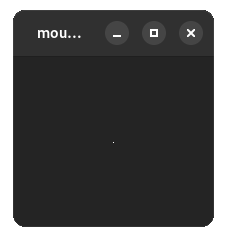

!!! details "How to generate this Image"
    ```julia
    using mousetrap
    main() do app::Application

        window = Window(app)
        set_title!(window, "mousetrap.jl")
        render_area = RenderArea()

        shape = Point(Vector2f(0, 0))
        add_render_task!(render_area, RenderTask(shape))

        frame = AspectFrame(1.0, render_area)
        set_size_request!(frame, Vector2f(150, 150))
        set_margin!(frame, 10)
        set_child!(window, frame)
        present!(window)
    end
    ```

If we want to remove a task from our render area, we need to call [`clear_render_tasks!`](@ref), then add all other render tasks again.

### Shape Types

Mousetrap offers a wide variety of pre-defined shape types. Thanks to this, we don't have to manually adjust each vertex position.

#### Point

As we've seen, [`Point`](@ref) is always exactly one pixel in size. Its constructor takes a single `Vector2f`:

```julia
point = Point(Vector2f(0, 0))
```


#### Points

[`Points`](@ref) is a number of points. Instead of taking a single `Vector2f`, its constructor takes `Vector{Vector2f}`:

```julia
points = Points([
    Vector2f(-0.5, 0.5), 
    Vector2f(0.5, 0.5), 
    Vector2f(0.0, -0.5)
])
```

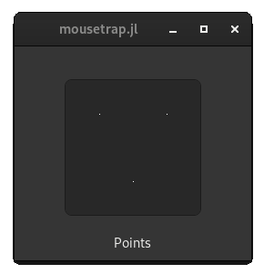

This shape is a convenience function, it is much more performant to render a `Points` with four vertices, than rendering four `Point` with one vertex each.

#### Line 

A [`Line`](@ref) is defined by two points, between which a 1-pixel thick line will be drawn:

```julia
line = Line(
    Vector2f(-0.5, +0.5), 
    Vector2f(+0.5, -0.5)
)
```

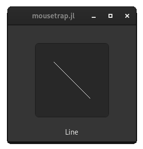

#### Lines

[`Lines`](@ref) will draw a number of unconnected lines. It takes a vector of point pairs. For each of these, a 1-pixel thick line will be drawn:

```julia
lines = Lines([
    Vector2f(-0.5, 0.5) => Vector2f(0.5, -0.5),
    Vector2f(-0.5, -0.5) => Vector2f(0.5, 0.5)
])
```

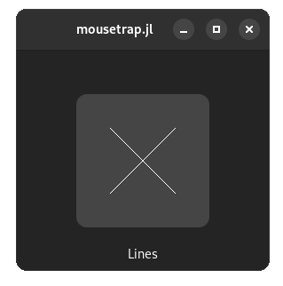

#### LineStrip

[`LineStrip`](@ref), not to be confused with `Lines`, is a *connected* series of lines. Thus, it takes a vector of points, as opposed to a vector of point pairs. 

A line will be drawn between each successive pair of coordinates, meaning the last vertex of the previous line will be used as the first vertex of the current line. If the supplied vector of points is `{a1, a2, a3, ..., a(n)}` then `LineStrip` will render as a series of lines with coordinate pairs `{a1, a2}, {a2, a3}, ..., {a(n-1), a(n)}`

```julia
line_strip = LineStrip([
    Vector2f(-0.5, +0.5),
    Vector2f(+0.5, +0.5),
    Vector2f(+0.5, -0.5),
    Vector2f(-0.5, -0.5)
])
```


#### Wireframe

[`Wireframe`](@ref) is similar to a `LineStrip`, except that it also connects the last and first vertex. For a supplied vector of points `{a1, a2, a3, ..., an}`, the series of lines will be `{a1, a2}, {a2, a3}, ..., {a(n-1), a(n)}, {a(n), a1}`, the last vertex-coordinate pair is what distinguishes it from a `LineStrip`. As such, `Wireframe` is sometimes also called a **line loop**.

```julia
wireframe = Wireframe([
    Vector2f(-0.5, +0.5),
    Vector2f(+0.5, +0.5),
    Vector2f(+0.5, -0.5),
    Vector2f(-0.5, -0.5)
])
```

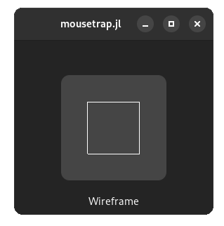

Note how this shape takes the exact same coordinates as `LineStrip`, but draws one more line, connecting the last to the first vertex.

#### Triangle

A [`Triangle`](@ref) is constructed as one would expect, using three `Vector2f`, one for each of its vertices:

```julia
triangle = Triangle(
    Vector2f(-0.5, 0.5),
    Vector2f(+0.5, 0.5),
    Vector2f(0.0, -0.5)
)
```

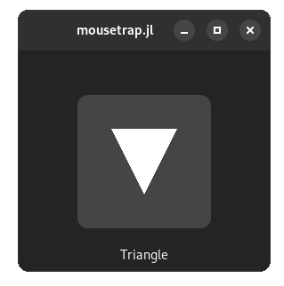

#### Rectangle

A [`Rectangle`](@ref) has four vertices. It is defined by its top-left point and its width and height. As such, it is always axis-aligned, though we can call [`rotate!`](@ref) after initialization to change this.

```julia
rectangle = Rectangle(
    Vector2f(-0.5, 0.5), # top left
    Vector2f(1, 1)       # width, height
)
```

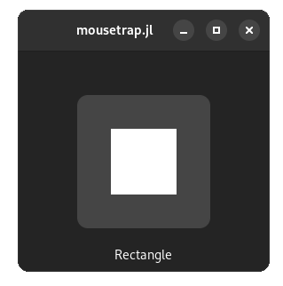

#### Circle

A [`Circle`](@ref) is constructed from a center point and radius. We also need to specify the number of outer vertices used for the circle. This number will determine how "smooth" the outline is. For example, a circle with 3 outer vertices is an equilateral triangle; a circle with 4 outer vertices is a square; a circle with 5 is a pentagon, etc. 

As the number of outer vertices increases, the shape approaches a mathematical circle, but will also require more processing power.

```julia
circle = Circle(
    Vector2f(0, 0), # center
    0.5,            # radius
    32              # n outer vertices
)
```

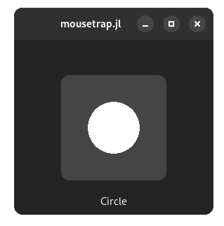

#### Ellipse

An [`Ellipse`](@ref) is a more generalized form of a `Circle`. It has two radii, the x- and y-radius:

```julia
ellipse = Ellipse(
    Vector2f(0, 0), # center
    0.6,            # x-radius
    0.4,            # y-radius
    32              # n outer vertices
)
```

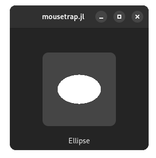

#### Polygon

The most general form of convex shapes, [`Polygon`](@ref) is constructed using a vector of vertices, which will be sorted clockwise, then their [outer hull](https://en.wikipedia.org/wiki/Convex_hull) will be calculated, which results in the final convex polygon:

```julia
polygon = Polygon([
    Vector2f(0.0, 0.75),
    Vector2f(0.75, 0.25),
    Vector2f(0.5, -0.75),
    Vector2f(-0.5, -0.5),
    Vector2f(-0.75, 0.0)
])
```

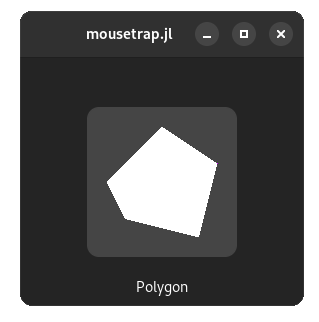

#### Rectangular Frame

A [`RectangularFrame`](@ref) takes a top-left vertex, a width, a height, and the x- and y-width, the latter of which is the thickness of the frame along the x- and y-axes:

```julia
rectangular_frame = RectangularFrame(
    Vector2f(-0.5, 0.5),  # top-left
    Vector2f(1, 1),       # width, height
    0.15,                 # x-thickness
    0.15,                 # y-thickness
)
```
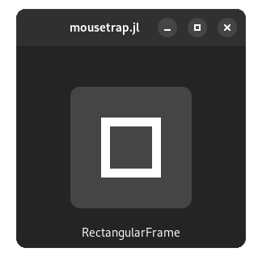

Note how the top left and size govern the position and size of the outer perimeter of the rectangular frame.

#### Circular Ring

For the round of a rectangular frame, we have [`CircularRing`](@ref), which takes a center, the radius of the outer perimeter, as well as the thickness. Like `Circle` and `Ellipse`, we have to specify the number of outer vertices, which decides the smoothness of the ring:

```julia
circular_ring = CircularRing(
    Vector2f(0, 0),  # center
    0.5,             # radius of outer circle
    0.15,            # thickness
    32               # n outer vertices
)
```

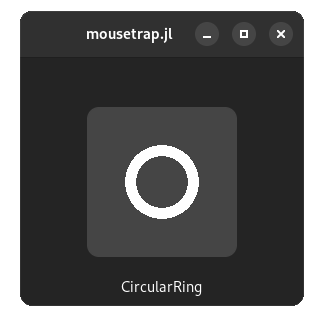

As before, the center and radius determine the position and size of the outer perimeter.

#### Elliptical Ring

A generalization of `CircularRing`, [`EllipticalRing`](@ref) has an ellipse as its outer shape. Its thickness along the horizontal and vertical dimension are supplied separately, making it more flexible than `CircularRing`.

```julia
elliptcal_ring = EllipticalRing(
    Vector2f(0, 0),  # center
    0.6,             # x-radius
    0.4,             # y-radius
    0.15,            # x-thickness
    0.15,            # y-thickness
    32               # n outer vertices
)
```

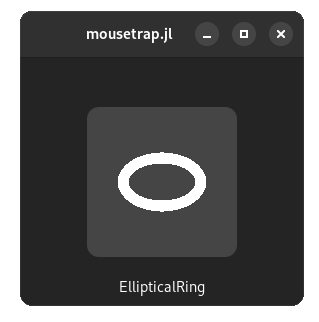

#### Outline

Lastly, we have a special shape. [`Outline`](@ref) does not take any vertex positions for its constructor. Instead, we construct an `Outline` shape from **another shape**. It will then generate a wireframe for the outer perimeters of the original shape.

As the name suggests, this is useful for generating outlines of another shape. By rendering the `Outline` on top of the original shape, we can achieve a similar effect to how `Frame` is used for widgets.

```julia
outline = Outline(triangle)
```
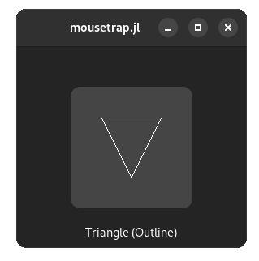

```julia
outline = Outline(rectangle)
```
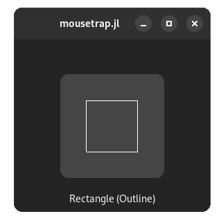

```julia
outline = Outline(circle)
```
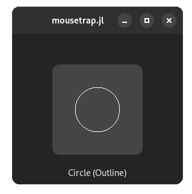

```julia
outline = Outline(ellipse)
```


```julia
outline = Outline(polygon)
```
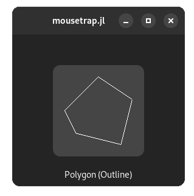

```julia
outline = Outline(rectangular_frame)
```
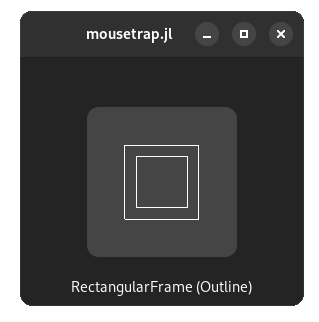

```julia
outline = Outline(circular_ring)
```
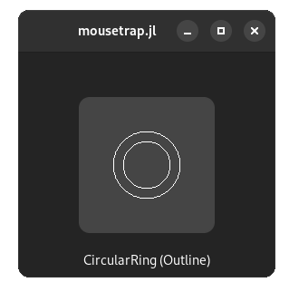

```julia
outline = Outline(elliptical_ring)
```
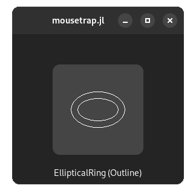

While possible, it doesn't make much sense to create an `Outline` from a shape that does not have a volume, such as `Point` or `Wireframe`.

Rendering the white outlines above on top of a white shape would make little sense, of course. To achieve the desired effect, we need to make the outline another color, which brings us to the additional properties of all `Shape`s.

### Shape Properties

#### Vertex Properties

Shapes are made up of vertices, whose properties we can manually edit. To se the property of a single vertex of a shape, we use [`set_vertex_color!`](@ref), [`set_vertex_position!`](@ref), and [`set_vertex_texture_coordinate!`](@ref). Each of these take an index, which is the index of the vertex in clockwise order. To know how many vertices a shape actually has, we use [`get_n_vertices`](@ref).

We will rarely need to modify individual vertices, as working on the `Shape` as a whole is much more convenient.

##### Centroid

The **centroid** of a shape is the intuitive "center of mass". In mathematical terms, it is the component-wise mean of all vertex coordinates. In practice, for many rotationally symmetrical shapes such as rectangles, triangles, circles, and ellipses, the centroid will be the "center" of the shape, as it is defined in common language. 

We can access the centroid using [`get_centroid`](@ref). To move a shape a certain distance, we move its centroid by that distance by calling [`set_centroid!`](@ref), which will automatically move all other vertices of the shape such that its new centroid is identical to the coordinates we specified.

#### Rotation

We can rotate all of a `Shape`s vertices around a point in GL coordinates by calling [`rotate!`](@ref), which takes an `Angle` as its first argument:

```julia
# rotate shape around its center
rotate!(shape, degrees(90), get_centroid(shape))
```

#### Color

To change the color of a shape as a whole, we use [`set_color!`](@ref). This simply calls `set_vertex_color!` on all of a shapes vertices. By default, a shape's color will be `RBGA(1, 1, 1, 1)`, pure white.

#### Visibility

We can prevent a shape from being rendered by setting [`set_is_visible!`](@ref) to `false`. This is different from making all vertices of a shape have an opacity of `0`. `is_visible` directly hooks into the shape's render function and **prevents it from being called**, as opposed to it completing rendering and not being visible on screen. This means making a shape invisible completely removes any performance penalty that would have been incurred during the render step.

Setting a shape's visibility to `false` is useful when [culling](https://en.wikipedia.org/wiki/Hidden-surface_determination) shapes to improve performance.

#### Bounding Box

We can access the [axis-aligned bounding box](https://en.wikipedia.org/wiki/Bounding_volume) of a shape with [`get_bounding_box`](@ref), which returns an [`AxisAlignedRectangle`](@ref). This is the smallest axis-aligned rectangle that still contains all of a shape's vertices.

Using this, we can query the top-left coordinate and size of the bounding box.

---

Lastly, each shape has an optional **texture**, which is what the texture coordinate properties of each vertex are used for. If a shape does not have a texture, it will be rendered as a solid color.

## Textures

In the chapter on widgets, we learned that we can use the `ImageDisplay` widget to display static images. This works, but has a number of disadvantages:

+ Image data is costly to update
+ Downloading image data is impossible
+ Scaling the image will always trigger linear interpolation
+ The image is always shown in full, as a rectangle

If we need the additional flexibility, we should instead use a `Shape` along with a [`Texture`](@ref), which represents an image living on the graphics card.

We create a texture from an `Image` like so:

```julia
image = Image()
load_from_file!(image, "path/to/image.png")

texture = Texture()
create_from_image!(texture, image)
```

Once `create_from_image!` is called, the image data is uploaded to the graphics cards' RAM, so we can safely discard the `Image` instance, unless we want to update the texture later on.

To display the texture on screen, we need to bind it to a shape, then render that shape:

```julia
texture_shape::Shape = Rectangle(Vector2f(-1, 1), Vector2f(2, 2))
set_texture!(texture_shape, texture)

add_render_tasK!(render_area, RenderTask(texture_shape))
```

How and where the texture is displayed depends on the shape's vertices **texture coordinate**. These coordinates are in `([0, 1], [0, 1])`, which we will call **texture space**. 

| Conceptual Position | Texture Coordinate |
|---------------------|---------------|
| top left            | `(0, 0)`    |
| top                 | `(0.5, 0)`    |
| top right           | `(1, 0)`    |
| left                | `(0, 0.5)`    |
| center              | `(0.5, 0.5)`    |
| right               | `(1, 0.5)`    |
| bottom left         | `(0, 1)`    |
| bottom              | `(0.5, 1)`    |
| bottom right        | `(1, 1)`    |

We see that, due to the normalized nature of this coordinate system, a texture coordinate is unable to reference a specific pixel. Instead, we use a floating-point coordinate, for which the graphics card will return an **interpolated color**. This is the color any specific pixel on the monitor should assume when the shape is displayed.

#### Scale Mode

Similar to `Image`s [`as_scaled`](@ref), we have options as to how we want the texture to behave when scaled to a size other than its native resolution. Mousetrap offers the following texture scale modes, which are represented by the enum [`TextureScaleMode`](@ref):

| `TextureScaleMode` | Meaning | Equivalent `InterpolationType` |
|--------------------|---------|-----|
| `TEXTURE_SCALE_MODE_NEAREST` | Nearest Neighbor Scaling | `INTERPOLATION_TYPE_NEAREST` |
| `TEXTURE_SCALE_MODE_LINEAR` | Linear Interpolation | `INTERPOLATION_TYPE_BILINEAR` |

While the resulting image behaves similarly to how `InterpolationType` will result in the final image, operating on a texture is much, much more performant. Rescaling a texture is essentially free when done by the graphics card, which is in stark contrast to the capabilities of a CPU, as would be needed for `Image`s `as_scaled`.

#### Wrap Mode

Wrap mode governs how the texture behaves when a vertices texture coordinates components are outside `[0, 1]`. Mousetrap offers the following wrap modes, which are all part of the enum [`TextureWrapMode`](@ref):

| `TextureWrapMode` | Pixel will be filled with |
|-------------------|--------|
| `TEXTURE_WRAP_MODE_ZERO` | `RGBA(0, 0, 0, 0)` | 
| `TEXTURE_WRAP_MODE_ONE`| `RGBA(1, 1, 1, 1)` |
| `TEXTURE_WRAP_MODE_STRETCH` | Nearest outer Edge |
| `TEXTURE_WRAP_MODE_REPEAT` | Equivalent pixel in `([0, 1], [0, 1]) ` |
| `TEXTURE_WRAP_MODE_MIRROR` | Equivalent pixel in `(1 - [0, 1], 1 - [0, 1])`| 

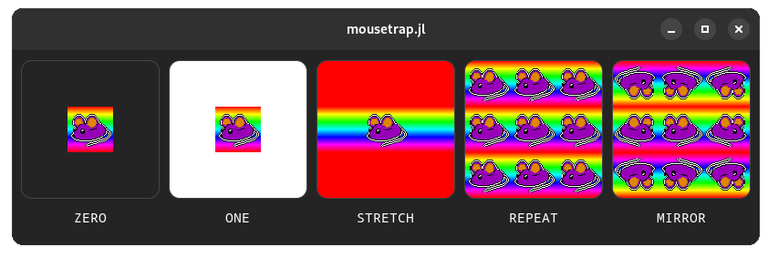

!!! details "How to generate this Image"
    ```julia
    using mousetrap

    # compound widget that displays a texture with a label
    struct TexturePage <: Widget
        center_box::CenterBox
        label::Label
        render_area::RenderArea
        texture::Texture
        shape::Shape

        function TexturePage(label::String, image::Image, wrap_mode::TextureWrapMode)
            out = new(
                CenterBox(ORIENTATION_VERTICAL),
                Label("<tt>" * label * "</tt>"),
                RenderArea(),
                Texture(),
                Rectangle(Vector2f(-1, 1), Vector2f(2, 2))
            )

            set_expand!(out.render_area, true)
            set_size_request!(out.render_area, Vector2f(150, 150))    

            set_start_child!(out.center_box, AspectFrame(1.0, Frame(out.render_area)))
            set_end_child!(out.center_box, out.label)
            set_margin!(out.label, 10)

            create_from_image!(out.texture, image)
            set_wrap_mode!(out.texture, wrap_mode)
            
            set_texture!(out.shape, out.texture)

            # zoom out texture coordinates by 1 unit
            set_vertex_texture_coordinate!(out.shape, 1, Vector2f(-1, -1))
            set_vertex_texture_coordinate!(out.shape, 2, Vector2f(2, -1))
            set_vertex_texture_coordinate!(out.shape, 3, Vector2f(2, 2))
            set_vertex_texture_coordinate!(out.shape, 4, Vector2f(-1, 2))

            add_render_task!(out.render_area, RenderTask(out.shape))
            return out
        end
    end
    mousetrap.get_top_level_widget(x::TexturePage) = x.center_box

    main() do app::Application
        window = Window(app)
        set_title!(window, "mousetrap.jl")

        render_area = RenderArea()
    
        image = Image()
        create_from_file!(image, "docs/src/assets/logo.png")
            # this assumes the script is run in `mousetrap.jl` root

        # replace RGBA(0, 0, 0, 0) pixels with rainbow color
        size = get_size(image)
        hue_step = 1 / size.x
        for i in 1:size.y
            for j in 1:size.x
                if get_pixel(image, i, j).a == 0
                    set_pixel!(image, i, j, HSVA(j * hue_step, 1, 1, 1))
                end
            end
        end

        box = Box(ORIENTATION_HORIZONTAL)
        set_spacing!(box, 10)
        set_margin!(box, 10)

        push_back!(box, TexturePage("ZERO", image, TEXTURE_WRAP_MODE_ZERO))
        push_back!(box, TexturePage("ONE", image, TEXTURE_WRAP_MODE_ONE))
        push_back!(box, TexturePage("STRETCH", image, TEXTURE_WRAP_MODE_STRETCH))
        push_back!(box, TexturePage("REPEAT", image, TEXTURE_WRAP_MODE_REPEAT))
        push_back!(box, TexturePage("MIRROR", image, TEXTURE_WRAP_MODE_MIRROR))

        set_child!(window, box)
        present!(window)
    end
    ```

Where the default wrap mode is `TEXTURE_WRAP_MODE_REPEAT`.

By being able to modify the vertex coordinates for every shape's vertices, we have much more control over how image data is displayed on screen. Only the part of the texture that conceptually overlaps a shape will be displayed, which is governed by that shape's vertices texture coordinates.

---

## RenderArea Size

Because shapes do not take into account the size and aspect ratio of their `RenderArea`, we, as developers, should take care that shapes are displayed correctly when this size changes.  

Consider the following example:

```julia
render_area = RenderArea()

shape = Ellipse(Vector2f(0, 0), 0.5, 0.5, 32)
add_render_task!(render_area, RenderTask(shape))

set_child!(window, render_area)
```

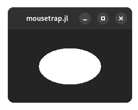

Where an ellipse with identical x- and y-radii is a circle.

Despite defining the shape as a circle, on screen, it appears stretched. This is because shapes use the GL coordinate system, which is **normalized**. Thus, how long the x- and y-radii of a circle are depends on the width and height of its render area. By widening the window, the render area expands, increasing its width and thus stretching our circle.

We have two ways to correct this. The easiest of which is putting the render area inside an `AspectFrame`, which forces it to always maintain the correct aspect ratio, square in this case:

```julia
render_area = RenderArea()

shape = Circle(Vector2f(0, 0), 0.5, 32)
add_render_task!(render_area, RenderTask(shape))

set_child!(window, AspectFrame(1.0, render_area)) # force 1:1 aspect ratio
```

While this corrects our circle, the entire `RenderArea` is now restrained in size, making this solution unviable for applications where we need a `RenderArea` to fill its entire area regardless of its aspect ratio.

The other way to correct the issue is to modify our circle when `RenderArea` changes shape. This is made possible by the `resize` signal of `RenderArea`, which is emitted whenever ts allocated area changes:

`resize` requires a signal handler with the following signature:
```julia
(::RenderArea, width::Integer, height::Integer, [::Data_t]) -> void
```
Where `width` and `height` are the new sizes of the `RenderArea` widget, in pixels.

Using this information and some simple geometry, we can change the x- and y-radius dynamically, whenever the `RenderArea` changes aspect ratio:

```julia
# define resize callback
function on_resize(::RenderArea, width::Integer, height::Integer, shape::Shape)

    # calculate y-to-x-ratio
    new_ratio = height / width

    # resize the shape by adjusting x-radius
    as_ellipse!(shape, 
        Vector2f(0, 0),     # old center
        0.5 * new_ratio,    # new x-radius
        0.5,                # old y-radius
        32                  # n vertices
    )
end

main() do app::Application
    window = Window(app)
    render_area = RenderArea()

    shape = Ellipse(Vector2f(0, 0), 0.5, 0.5, 32)
    add_render_task!(render_area, RenderTask(shape))

    # connect callback, providing our shape as `Data_t` argument
    connect_signal_resize!(render_area, on_resize, shape)

    set_child!(window, render_area)
    present!(window)
end
```

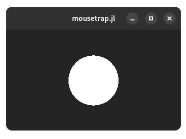

Here, the `RenderArea` has a non-square aspect ratio, yet the shape is still displayed as a proper circle. Using signal `resize` like this, we can protect ourselves against side effects from the normalized nature of GL coordinates.

---

## Anti Aliasing

When shapes are drawn to the screen, they are *rasterized*, which is when the graphics card takes the mathematical shape in memory and transforms it so that it can be displayed using a limited number of pixels. This process is imperfect. No number of pixels will be able to draw a perfect circle. One artifact that can appear during this process is **aliasing**, which, in non-technical terms, is when lines appear "jagged":


(Source: [learnopengl.com](https://learnopengl.com/Advanced-OpenGL/Anti-Aliasing))

To address the unsightly nature of this issue, a number of remedies are available, the most appropriate of which is called [multi-sampled anti-aliasing (MSAA)](https://www.khronos.org/opengl/wiki/Multisampling). User of mousetrap are not required to understand the algorithm behind it, only that it causes jagged edges to appear smoother. 

To enable MSAA, we provide an enum value of type [`AntiAliasingQuality`](@ref) to `RenderArea`s constructor:

```julia
msaa_on = RenderArea(ANTI_ALIASING_QUALITY_BETTER)
msaa_off = RenderArea(ANTI_ALIASING_QUALITY_OFF)
```

| `AntiAliasingQuality` Value | # MSAA Samples | 
|-----------------------------|------------|
| `ANTI_ALIASING_QUALITY_OFF` | 0 (no MSAA) |
| `ANTI_ALIASING_QUALITY_MINIMAL` | 2 | 
| `ANTI_ALIASING_QUALITY_GOOD` | 4 | 
| `ANTI_ALIASING_QUALITY_BETTER` | 8 | 
| `ANTI_ALIASING_QUALITY_BEST` | 16 | 

Where `ANTI_ALIASING_QUALITY_OFF` will be used when calling the `RenderArea` constructor with no arguments.

The higher the number of samples, the better the smoothing will be. MSAA comes at a cost: any quality other than `OFF` will induce the `RenderArea` to take about twice as much space in the graphic card's memory. Furthermore, the higher the number of samples, the more time each render step will take.

It's difficult to convey the result of MSAA using just pictures on a web page. Instead, readers are encouraged to run the following `main.jl`, which will show off the anti-aliasing in high resolution:

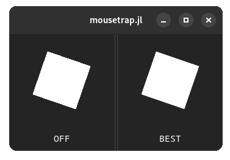

!!! details "How to generate this Image"
    ```julia
    main() do app::Application

        window = Window(app)
        set_title!(window, "mousetrap.jl")

        # create render areas with different MSAA modes
        left_area = RenderArea(ANTI_ALIASING_QUALITY_OFF)
        right_area = RenderArea(ANTI_ALIASING_QUALITY_BEST)

        # paned that will hold both areas
        paned = Paned(ORIENTATION_HORIZONTAL)

        # create singular shape, which will be shared between areas
        shape = Rectangle(Vector2f(-0.5, 0.5), Vector2f(1, 1))
        add_render_task!(left_area, RenderTask(shape))
        add_render_task!(right_area, RenderTask(shape))

        # rotate shape 1° per frame
        set_tick_callback!(paned) do clock::FrameClock

            # rotate shape 
            rotate!(shape, degrees(1), get_centroid(shape))

            # force redraw for both areas
            queue_render(left_area) 
            queue_render(right_area)

            # continue callback indefinitely
            return TICK_CALLBACK_RESULT_CONTINUE
        end

        # setup window layout for viewing
        for area in [left_area, right_area]
            set_size_request!(area, Vector2f(150, 150))
        end

        # caption labels
        left_label = Label("<tt>OFF</tt>")
        right_label = Label("<tt>BEST</tt>")

        for label in [left_label, right_label]
            set_margin!(label, 10)
        end

        # format paned
        set_start_child_shrinkable!(paned, false)
        set_end_child_shrinkable!(paned, false)
        set_start_child!(paned, vbox(AspectFrame(1.0, left_area), left_label))
        set_end_child!(paned, vbox(AspectFrame(1.0, right_area), right_label))

        # present
        set_child!(window, paned)
        present!(window)
    end
    ```
---

## Render Task

!!! info 
    The rest of this chapter will assume that readers are familiar with the basics of OpenGL, how to write GLSL shaders, what a shader uniform is, how blending works, and how a linear transform allows used to move a point in 3D space.

    With what we have learned so far in this chapter, we are already well-equipped to be able to accomplish most tasks that require the native rendering component, such as displaying static images or rendering shapes. Any information after this point should be considered optional to learn.

So far, we have registered render tasks using `add_render_task!(render_area, RenderTask(shape))`. Sometimes, we will have to deal with [`RenderTask`](@ref) on its own. Its constructor has the following signature:

```julia
RenderTask(::Shape ; [shader::Shader, transform::GLTransform, blend_mode::BlendMode])
```

Where any name after the `;` are [keyword arguments](https://docs.julialang.org/en/v1/devdocs/functions/#Keyword-arguments).

We see that a `RenderTask` actually bundles the following objects:
+ a `Shape`, which is the shape being rendered
+ a `Shader`, which is a shader program containing a vertex- and fragment- shader
+ a `GLTransform`, which is a spatial transform that will be applied to the shape using the vertex shader
+ a `BlendMode`, which governs which type of blending will take place during the [blit step](https://en.wikipedia.org/wiki/Bit_blit)

Using these four components, `RenderTask` gathers all objects necessary to render a shape to the screen. All components except for the `Shape` are *optional*. If not specified, a default value will be used instead. This is what allows less experienced users to fully ignore shaders, transforms and blend modes, simply calling `RenderTask(shape)` will take care of everything for them.

---

## Transforms

[`GLTransform`](@ref) is an object representing a spatial transform. It is called **GL**Transform, because it **uses the GL coordinate system**. Applying a `GLTransform` to a vector in widget- or texture-space will produce incorrect results. They should only be applied to the position attribute of a `Shape`s vertices.

Internally, a `GLTransform` is a 4x4 matrix of 32-bit floats. It is of size 4x4 because it is intended to be applied to OpenGL positions, which are vectors in 3D space. In mousetrap, the last coordinate of a spatial position is assumed to be `0`, but it is still part of each vectors' data.

At any time, we can directly access the underlying matrix of a `GLtransform` using `getindex` or `setindex!`:

```julia
transform = GLTransform()
for i in 1:4
    for j in 1:4
        print(transform[i, j], " ")
    end
    print("\n")
end
```
```
1 0 0 0
0 1 0 0
0 0 1 0
0 0 0 1
```

We see that after construction, `GLTransform` is initialized as the identity transform. No matter the current state of the transform, we can reset it back to this identity matrix by calling [`reset!`](@ref).

`GLTransform` has many common spatial transforms already available as convenient functions, which means we rarely have to modify its values manually. 

It provides the following transformations, which behave identically to those familiar from linear algebra:

+ [`translate!`](@ref), translates in 3D space
+ [`scale!`](@ref), scales along the x- and y-axis
+ [`rotate!`](@ref), rotates around a point in 3D space

We can combine two transforms using [`combine_with`](@ref). If we wish to apply the transform CPU-side to a `Vector2f` or `Vector3f`, we can use [`apply_to`](@ref). 

While we could apply the transform to each vertex of a `Shape` manually, then render the shape, it is much more performant to do this kind of math GPU-side. By registering the transform with a `RenderTask`, the transform will be forwarded to the vertex shaders, which is then applied to the shape's vertices automatically:

```julia
shape = Shape() 

transform = Transform()
translate!(transform, Vector2f(-0.5, 0.1))
rotate!(transform, degrees(180))

task = RenderTask(shape; transform = transform)
```

Where we used the `transform` keyword argument to specify the transform, while leaving the other render task component unspecified. This means the transform is applied automatically during rendering, allowing us to take advantage of the increased performance gained from the GPU architecture.

---

## Blend Mode

As the third component of a render task, we have the **blend mode**. This governs how two colors behave when rendered on top of each other. 

Let the color currently in the frame buffer be `destination`, while the newly added color will be `origin`.  Each [`BlendMode`](@ref), then, behaves as follows:

| `BlendMode`        | Resulting Color                     |
|--------------------|-------------------------------------|
| `BLEND_MODE_NONE`             | `origin.rgb + 0 * destination.rgb`  | 
| `BLEND_MODE_NORMAL`           | [traditional alpha-blending](https://en.wikipedia.org/wiki/Alpha_compositing)          |
| `BLEND_MODE_ADD`              | `origin.rgba + destination.rgba`    |
| `BLEND_MODE_SUBTRACT`         | `origin.rgba - destination.rgba`    |
| `BLEND_MODE_REVERSE_SUBTRACT` | `destination.rgba - origin.rgba`    | 
| `BLEND_MODE_MULTIPLY`         | `origin.rgba * destination.rgba`    |
| `BLEND_MODE_MIN`              | `min(origin.rgba, destination.rgba)` |
| `BLEND_MODE_MAX`              | `max(origin.rgba, destination.rgba)` | 

Where `+`, `*`, and `-` are component-wise operations.

Users may be familiar with the names of the blend modes in traditional image editors such as GIMP or Photoshop.

If left unspecified, `RenderTask` will use `BLEND_MODE_NORMAL`.

---

## Shaders

As the last component of a `RenderTask`, we have [`Shader`](@ref), which represents an OpenGL shader program, that contains already compiled **fragment** and **vertex** shaders. These shaders are written in [GLSL](https://learnopengl.com/Advanced-OpenGL/Advanced-GLSL), which will not be taught in this manual. 

### Compiling Shaders

To create a shader, we first instantiate [`Shader`](@ref), then use [`create_from_file!`](@ref) or [`create_from_string!`](@ref) to compile the shader, then bind it to the shader program, overriding whatever shader was bound before. 

We use `SHADER_TYPE_FRAGMENT` or `SHADER_TYPE_VERTEX` to specify which of the two shader types we are targeting.

```julia
shader = Shader()

# compile fragment shader
create_from_string!(shader, SHADER_TYPE_FRAGMENT, """
    #version 330
        
    in vec4 _vertex_color;
    in vec2 _texture_coordinates;
    in vec3 _vertex_position;

    out vec4 _fragment_color;

    void main()
    {
        vec2 pos = _vertex_position.xy;
        _fragment_color = vec4(pos.y, dot(pos.x, pos.y), pos.x, 1);
    }
""")

# bind with render tas, which will automatically apply it to each fragment of `shape`
task = RenderTask(shape; shader = shader)
add_render_task!(render_area, task)
```

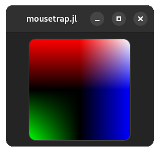

!!! details "How to generate this Image"
    ```julia
    using mousetrap
    main() do app::Application

        window = Window(app)
        set_title!(window, "mousetrap.jl")
        render_area = RenderArea()
        shape = Rectangle(Vector2f(-1, 1), Vector2f(2, 2))

        shader = Shader()
        create_from_string!(shader, SHADER_TYPE_FRAGMENT, """
            #version 330
                
            in vec4 _vertex_color;
            in vec2 _texture_coordinates;
            in vec3 _vertex_position;
        
            out vec4 _fragment_color;
        
            void main()
            {
                vec2 pos = _vertex_position.xy;
                _fragment_color = vec4(pos.y, dot(pos.x, pos.y), pos.x, 1);
            }
        """)
        
        task = RenderTask(shape; shader = shader)
        add_render_task!(render_area, task)

        frame = AspectFrame(1.0, Frame(render_area))
        set_size_request!(frame, Vector2f(150, 150))
        set_margin!(frame, 10)
        set_child!(window, frame)
        present!(window)
    end
    ```

If we do not initialize the vertex- or fragment shader, the **default shader component will be used**. It may be instructive to see how the default shaders are defined, as any user-defined shader should build upon them.

### Default Vertex Shader

This is the default vertex shader, used whenever we do not supply a custom vertex shader for a `Shader` instance:

```glsl
#version 330

layout (location = 0) in vec3 _vertex_position_in;
layout (location = 1) in vec4 _vertex_color_in;
layout (location = 2) in vec2 _vertex_texture_coordinates_in;

uniform mat4 _transform;

out vec4 _vertex_color;
out vec3 _vertex_position;
out vec2 _texture_coordinates;

void main()
{
    gl_Position = _transform * vec4(_vertex_position_in, 1.0);
    _vertex_color = _vertex_color_in;
    _vertex_position = _vertex_position_in;
    _texture_coordinates = _vertex_texture_coordinates_in;
}
```

We see that it requires OpenGL 3.3 due to the `location` syntax. In terms of behavior, this shader simply forwards the interpolated vertex attributes to the fragment shader.

The current vertices position is supplied via `_vertex_position_in`, the vertices texture coordinates as `_vertex_color_in` and the vertices texture coordinates are `_vertex_texture_coordinates`. These values will contain the data from the Julia-side `Shape`. We should take care that the `location` attribute exactly matches this order, `0` for vertex position, `1` for vertex color, `2` for texture coordinate.

The output variables of the vertex shader are `_vertex_color`, `_texture_coordinates` and `_vertex_position`, which need to be assigned with results gained from within the vertex shader. The shader has furthermore access to the uniform `_transform`, which holds the `GLTransform` the current `RenderTask` associates with the current `Shape`. 

### Default Fragment Shader

```glsl
#version 330

in vec4 _vertex_color;
in vec2 _texture_coordinates;
in vec3 _vertex_position;

out vec4 _fragment_color;

uniform int _texture_set;
uniform sampler2D _texture;

void main()
{
    if (_texture_set != 1)
        _fragment_color = _vertex_color;
    else
        _fragment_color = texture2D(_texture, _texture_coordinates) * _vertex_color;
}
```

The fragment shader is handed `_vertex_color`, `_texture_coordinate` and `_vertex_position`, which we recognize as the output of the vertex shader. The output of the fragment shader is `_fragment_color`.

The default fragment shader respects two uniforms, `_texture`, which is the texture of the shape we are currently rendering, and `_texture_set`, which is `1` if we called `set_texture!` on the current `Shape` instance, `0` otherwise.

Users aiming to experiment with shaders should take care to not modify the name or `location` of any of the `in` or `out` variables of either shader. These names, along with the required shader version, should not be altered.

### Binding Uniforms

Both the vertex and fragment shaders make use of uniforms. We've seen that `_transform`, `_texture` and `_texture_set` are assigned automatically. Mousetrap users can furthermore freely add new uniforms, assigning them in a convenient manner using `RenderTask`.

To bind a uniform, we first need a CPU-side value that should be uploaded to the graphics card. Let's say we want to use a certain color in our fragment shader, replacing the shape's fragment color with that color. We would write the fragment shader as follows:

```glsl
#version 330

in vec4 _vertex_color;
in vec2 _texture_coordinates;
in vec3 _vertex_position;

out vec4 _fragment_color;

uniform vec4 _color_rgba; // new uniform

void main()
{
    _fragment_color = _color_rgba;
}
```
To set the value of `_color_rgba`, we use [`set_uniform_rgba!`](@ref), which is called on the **render task**, not the shader itself. This will make the render task store the CPU-side value as long as it is needed, automatically setting it during rendering.

`set_uniform_rgba!` is one of many `set_uniform_*!` functions, that allow us to bind Julia-side values to OpenGL shader uniforms:

The following types can be assigned this way:

| Julia Type      | `RenderTask` function   | GLSL Uniform Type |
|---------------|-------------------------|-------------------|
| `Cfloat`       | `set_uniform_float`     | `float`           |
| `Cint`     | `set_uniform_int`       | `int`             |
| `Cuint`    | `set_uniform_uint`      | `uint`            |
| `Vector2f`    | `set_uniform_vec2`      | `vec2`            |
| `Vector3f`    | `set_uniform_vec3`      | `vec3`            |
| `Vector4f`    | `set_uniform_vec4`      | `vec4`            |
| `GLTransform` | `set_uniform_transform` | `mat4x4`          |
| `RGBA`        | `set_uniform_rgba`      | `vec4`            |
| `HSVA`        | `set_uniform_hsva`      | `vec4`            |

Using this knowledge, we set the `_color_rgba` uniform value like so:

```julia
# create shader
shader = Shader()
create_from_string!(shader, SHADER_TYPE_FRAGMENT, """
    #version 330

    in vec4 _vertex_color;
    in vec2 _texture_coordinates;
    in vec3 _vertex_position;

    out vec4 _fragment_color;

    uniform vec4 _color_rgba;

    void main()
    {
        _fragment_color = _color_rgba;
    }
""")

# create shape and task
shape = Shape()
task = RenderTask(shape; shader = shader) # shader bound to `shader` keyword argument

# set uniform
set_uniform_rgba!(task, "_color_rgba", RGBA(1, 0, 1, 1))
```

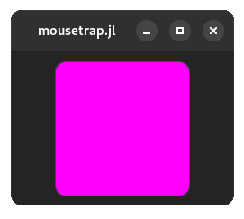

!!! details "How to generate this Image"
    ```julia
    using mousetrap
    main() do app::Application

        window = Window(app)
        set_title!(window, "mousetrap.jl")
        render_area = RenderArea()
        shape = Rectangle(Vector2f(-1, 1), Vector2f(2, 2))

        shader = Shader()
        create_from_string!(shader, SHADER_TYPE_FRAGMENT, """
            #version 330
                
            in vec4 _vertex_color;
            in vec2 _texture_coordinates;
            in vec3 _vertex_position;
        
            out vec4 _fragment_color;

            uniform vec4 _color_rgba;
        
            void main()
            {
                _fragment_color = _color_rgba;
            }
        """)
        
        task = RenderTask(shape; shader = shader)
        set_uniform_rgba!(task, "_color_rgba", RGBA(1, 0, 1, 1))

        add_render_task!(render_area, task)

        frame = AspectFrame(1.0, Frame(render_area))
        set_size_request!(frame, Vector2f(150, 150))
        set_margin!(frame, 10)
        set_child!(window, frame)
        present!(window)
    end
    ```

With this, we have a convenient way to specify shader uniforms, without having to manually update the shader each time it is bound for rendering. `RenderTask` does this for us.

---

## Rendering to a Texture

!!! warning
    This feature are not yet implemented, this section is incomplete.
