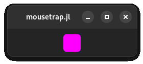

# Chapter 10: Theme & Widget Customization

In this chapter we will learn:
+ How to swap between light- and dark- mode
+ How to create custom animations
+ How to apply a spatial transform to any widget
+ How to change the look of individual widgets using style classes
+ Which pre-made style classes are available
+ How to create our own style class

---

As our app grows and becomes closer to what we personally envisioned for our project, some may want to not only customizes the layout and functionality of widgets, but the widges looks. This can range from small changes such as changing something that is blue by default to green, or large sweeping changes that affect the entire application, such as moving to a light- or dark-, low- or high-contrast theme, or even applying a completely custom theme.

Mousetrap allows for all of these options, using its very powerful theme customization component, we can customize our app to a point where most peope will not able to tell it was ever mousetrap- / GTK4-based at all.

## Switching between Dark- and Light Mode

The most common task that almost any app want to offers is for the user to be able to swap between ligth and dark mode. This is an ubiquitos feature of modern apps, and as such, mousetrap offers a very simpe way of changing the global theme.

Mousetrap supports four default application-wide themes, which are a values of enum [`Theme`](@ref):

+ `THEME_DEFAULT_LIGHT`
+ `THEME_DEFAULT_DARK`
+ `THEME_HIGH_CONTRAST_LIGHT`
+ `THEME_HIGH_CONTRAST_DARK`

At any point after the back-end has been initialized, we can swap the global theme using [`set_current_theme!`](@ref). This will immediately change the look  of all widgets and windows, allowing apps to change the entire GUI with just one function call at runtime.

For example, to create a window that has a button to switch between light and dark themes in its header bar, we could do the following:

```julia
main() do app::Application

    window = Window(app)

    # add theme swap button to windows header bar
    header_bar = get_header_bar(window)
    swap_button = Button()
    set_tooltip_text!(swap_button, "Click to Swap Themes")
    connect_signal_clicked!(swap_button, app) do self::Button, app::Application

        # get currently used theme
        current = get_current_theme(app)

        # swap light with dark, preservng whether the theme is high contrast
        if current == THEME_DEFAULT_DARK
            next = THEME_DEFAULT_LIGHT
        elseif current == THEME_DEFAULT_LIGHT
            next = THEME_DEFAULT_DARK
        elseif current == THEME_HIGH_CONTRAST_DARK
            next = THEME_HIGH_CONTRAST_LIGHT
        elseif current == THEME_HIGH_CONTRAST_LIGHT
            next = THEME_HIGH_CONTRAST_DARK
        end

        # set new theme
        set_current_theme!(app, next)
    end
    push_front!(header_bar, swap_button)
    present!(window)
end
```

---

## Animation

We've seen in the chapter on widgets that certain kind of widgets animate their chidren, for example when switching between two pages of a [`Stack`](@ref), or when a [`Revealer](@ref) reveals its child. Mousetrap offers a convenient mechanism for implementing animations like these ourselves, which this section will demonstrate.

I we want to animate a widget "fading out" over 1 second, that is, it's opacity changes from 1 to 0 over that period of time, we should decrease the opacity by a specified amount each frame. Actually tying the amount to the framerate of our window is ill-adviced, many things can influence the framerate and fluctuations would cause 
fluctuations in the speed of the fade-out. To address this, mousetrap offers [`Animation`](@ref), which acts as a *stable clock*, an object that inputs a value over a specified amount of time in a way that is independent of the frame rate.

Continuing with out fade-out example, we first need to instance the widget we want to fade-out, a `Button`, then we create an instance of `Animation`, which takes for its constructor the widget we want to animate, along with the target duration of the animation:

```julia
to_animate = Button(Label("Fade Out"))
animation = Animation(to_animate, seconds(1))
```

By tying the `Animation` to the widget it should target, mousetrap will automatically preserve the animation while that widget is visible, as well as tie the animations clock to the render cycle of that specific widget, meaning the `Animation` will not play if the widget is not visible.

To start the animation, we call [`play!`](@ref). Of course, we have not yet implement the behavior of the widgets opacity decreasing. To do this, we register a callback using [`on_tick!`](@ref), which requires a function with the signature:

```julia
(::Animation, value::Float64) -> Nothing
```

Where `value` is the animations output value. By default, this will be in `[0, 1]`, though we can freely choose the upper and lower bound using `set_lower!` and `set_upper!`. Once the animation is finished, the callback registered using [`on_done!`](@ref) is invoked.

Since a widgets opacity is already in `[0, 1]`, we can use the animations value directly:

```julia
to_animate = Button(Label("Fade Out"))
animation = Animation(to_animate, seconds(1))
on_tick!(animation, button) do self::Animation, value::Float64, target::Button
    set_opacity!(target, 1 - value)
end
```

Where we used `1 - value` to invert the range, such that the widgets starts fully opaque and decreases in opacity.

We can then start the animation using `play!`, for example by clicking the button:


!!! details "How to generate this Image"
    ```julia
    using Mousetrap
    main() do app::Application
        window = Window(app)
        set_title!(window, "mousetrap.jl")

        button = Button(Label("Fade Out"))
        aspect_frame = AspectFrame(1.0, button)
        set_margin!(aspect_frame, 10)

        animation = Animation(button, seconds(1))
        on_tick!(animation, button) do self::Animation, value::Float64, target::Button
            set_opacity!(target, 1 - value)
        end
        on_done!(animation, button) do self::Animation, target::Button
            set_is_visible!(target, false)
        end

        connect_signal_clicked!(button, animation) do self::Button, animation::Animation
            play!(animation)
        end

        set_child!(window, aspect_frame)
        present!(window);
    end
    ```

For cyclical animations, we can use [`set_repeat_count!`](@ref), which, when set to `0`, will loop the animation indefinitely. We can easily reverse an animation by setting [`set_is_reversed!`](@ref) to `true`.

Attentive readers may remember that pre-made animations for `Stack` and `Revealer` also include widgets spinning or sliding into position. With our tools so far, we have no good way of implemention motion like this. This is about to change.

## TransformBin

In the chapter on rendering, we learned that we can apply a `GLTransform` to a `Shape` in order to move that shape **without** actually changing its vertex data. [`TransformBin`](@ref), offers similar functionality to this, except it applies to any `Widget`, and with a much simpler interface.

By itself, `TransformBin` does not add any visual elements to its singular child, and it will always assume the same size as its child. Instead, it offers a number of functions that allow use to apply a spatial transformation to its child widget. The following functions are available:

| Function | Argument(s) | Effect |
|----------------------|-----------|--------|
| [`translate!`](@ref) | `Vector2f` | Move widget by number of pixels |
| [`rotate!`](@ref) | `Angle` | Rotate around widgets centroid |
| [`scale!`](@ref) | `Number, Number` | Scale height- and width by given factor |
| [`skew!`](@ref) | `Number, Number` | [Skew](https://en.wikipedia.org/wiki/Shear_mapping) widget along x- and y-axis |
| [`reset!`](@ref) | `(none)` | Reset transform to identity |

!!! tip "Rotate around a Point"
    To rotate a widget around a fixed point `p`, we can `translate!` the transform such 
    that the widgets new center is at `p`, `rotate!`, then `translate!` back to the widgets initial position. 

These functions are called on the `TransformBin` instance directly, we do not use a separate transform object. The arguments for these functions operate in absolute widget space, with `(0, 0)` being the top left corner of the `TransformBin`s size allocation, in pixels.

For example, to make a button spin one time when it is clicked, we can use `TransformBin` and `Animation` as follows:

```julia
# animation target
to_animate = Button(Label("Spin"))

# transform bin
transform_bin = TransformBin()
set_child!(transform_bin, to_animate)

# animation
animation = Animation(to_animate, seconds(1))
on_tick!(animation, transform_bin) do self::Animation, value::Float64, transform_bin::TransformBin
    # set the transform angle to value in [0, 360°]
    reset!(transform_bin)
    rotate!(transform_bin, degrees(value * 360))
end

# trigger animation when button is clicked
connect_signal_clicked!(to_animate, animation) do self::Button, animation::Animation
    play!(animation)
end
```


Note that applying a transform using `TransformBin` does not change the size allocation of the widget, it only applies the effect visually, similarly to how a `GLTransform` is only applied to the rendered image, not the `Shape` itself.

By default, the function used to map the elapsed duration of the `Animation` to the output value of `on_tick!` is linear (`f(x) = x`). Mousetrap offers additional functions with different shapes, allowing users to more easily implement animations that appear to speed up or slow down at certain points. We se this function using [`set_timing_function!`](@ref), which takes a value of the enum [`AnimationTimingFunction`](@ref). See its documentation for more information.

---

# Widget Themes & Style Classes

Mousetrap uses GTK4 / Adwaita, which is made by GNOME. As such, the pre-implemented widgets strictly adhere to the [GNOME human interface guidelines](https://developer.gnome.org/hig/). While this results in a clean, simple look, it also means the backends software design looks down upon customization, preferring uniformity over individual expression. Mousetrap does not share this ideology, if a developer wants to make every widget hot pink and have all buttons spin continuously, they should be able to, even if this is obviously ill adviced and awful UI design.


## Introduction

Widgets in mousetrap have their appearance governed by [Cascading Style Sheet (CSS)](https://developer.mozilla.org/en-US/docs/Web/CSS) file. This is a specification language used along with HTML to describe how a visual element should look, usually in a web browser. 

TODO

better suited for advanced users, which is why it will be reserved for the end of this chapter. 

Until then, mousetrap users with no experience in CSS can still style their widgets in easy and convenient way by apply **pre-defined style classes**. 

## StyleClass

## Pre-Defined Style Classes

### Color Accents


### Custom Style Class

We create a style class by chosing a name:

```julia
style_class = StyleClass("example_style")
```

We can then add a property, for example, `STYLE_PROPERTY_BACKGROUND_COLOR` governs the color . We set this property like so:

```julia
set_property!(style_class, STYLE_PROPERTY_BACKGROUND_COLOR, RGBA(1, 0, 1, 1))
```

We can then apply the class to a widget supporting this property, `Button` in this case:

```julia
style_class = StyleClass("example_style")
set_property!(style_class, STYLE_PROPERTY_BACKGROUND_COLOR, RGBA(1, 0, 1, 1))

button = Button()
apply_style_class!(button, style_class)
```



!!! details "How to generate this Image"
    ```julia
    using Mousetrap
    main() do app::Application
        window = Window(app)
        set_title!(window, "mousetrap.jl")

        style_class = StyleClass("example_style")
        set_property!(style_class, STYLE_PROPERTY_BACKGROUND_COLOR, RGBA(1, 0, 1, 1))
    
        button = Button()
        apply_style_class!(button, style_class)

        frame = AspectFrame(1.0, button)
        set_margin!(frame, 10)
        set_child!(window, frame)
        present!(window)
    end
    ```

## CSS Properties

Only the following CSS properties are supported, and only certain widgets support certain properties.

| Mousetrap Constant | CSS Equivalent |
|--------------------|----------------|
| `STYLE_PROPERTY_COLOR` | [`color`](https://developer.mozilla.org/en-US/docs/Web/CSS/color_value) |
| `STYLE_PROPERTY_BACKGROUND_COLOR` | [`background-color`](https://developer.mozilla.org/en-US/docs/Web/CSS/background-color) |
| `STYLE_PROPERTY_OPACITY` | [`opacity`](https://developer.mozilla.org/en-US/docs/Web/CSS/opacity) |
| `STYLE_PROPERTY_FILTER` | [`filter`](https://developer.mozilla.org/en-US/docs/Web/CSS/filter) |
| `STYLE_PROPERTY_FONT` | [`font`](https://developer.mozilla.org/en-US/docs/Web/CSS/font) |
| `STYLE_PROPERTY_FONT_FAMILY` | [`font-family`](https://developer.mozilla.org/en-US/docs/Web/CSS/font-family) |
| `STYLE_PROPERTY_FONT_SIZE` | [`font-size`](https://developer.mozilla.org/en-US/docs/Web/CSS/font-size) |
| `STYLE_PROPERTY_FONT_STYLE` | [`font-style`](https://developer.mozilla.org/en-US/docs/Web/CSS/font-style) |
| `STYLE_PROPERTY_FONT_WEIGHT` | [`font-weight`](https://developer.mozilla.org/en-US/docs/Web/CSS/text-transform) |
| `STYLE_PROPERTY_FONT_TRANSFORM` | [`font-transform`](https://developer.mozilla.org/en-US/docs/Web/CSS/text-transform) |
| `STYLE_PROPERTY_CARET_COLOR` | [`caret-color`](https://developer.mozilla.org/en-US/docs/Web/CSS/caret-color) |
| `STYLE_PROPERTY_TEXT_DECORATION` | [`text-decoration`](https://developer.mozilla.org/en-US/docs/Web/CSS/text-decoration) |
| `STYLE_PROPERTY_TEXT_DECORATION_COLOR` | [`text-decoration-color`](https://developer.mozilla.org/en-US/docs/Web/CSS/text-decoration-color) |
| `STYLE_PROPERTY_TEXT_DECORATION_STYLE` | [`text-decoration-style`](https://developer.mozilla.org/en-US/docs/Web/CSS/text-decoration-style) |
| `STYLE_PROPERTY_TEXT_SHADOW` | [`text-shadow`](https://developer.mozilla.org/en-US/docs/Web/CSS/text-shadow) |
| `STYLE_PROPERTY_ICON_SIZE` | Size of an `Icon`, no css equivalent |
| `STYLE_PROPERTY_TRANSFORM` | [`transform`](https://developer.mozilla.org/en-US/docs/Web/CSS/transform) |
| `STYLE_PROPERTY_TRANSFORM_ORIGIN` | [`transform-origin`](https://developer.mozilla.org/en-US/docs/Web/CSS/transform-origin) |
| `STYLE_PROPERTY_BORDER` | [`border`](https://developer.mozilla.org/en-US/docs/Web/CSS/border) |
| `STYLE_PROPERTY_BORDER_STYLE` | [`border-style`](https://developer.mozilla.org/en-US/docs/Web/CSS/border-style) |
| `STYLE_PROPERTY_BORDER_COLOR` | [`border-color`](https://developer.mozilla.org/en-US/docs/Web/CSS/border-color) |
| `STYLE_PROPERTY_BORDER_WIDTH` | [`border-width`](https://developer.mozilla.org/en-US/docs/Web/CSS/border-width) |
| `STYLE_PROPERTY_BORDER_RADIUS` | [`border-radius`](https://developer.mozilla.org/en-US/docs/Web/CSS/border-radius) |
| `STYLE_PROPERTY_BORDER_SPACING` | [`border-spacing`](https://developer.mozilla.org/en-US/docs/Web/CSS/border-spacing) |
| `STYLE_PROPERTY_OUTLINE` | [`outline`](https://developer.mozilla.org/en-US/docs/Web/CSS/outline) |
| `STYLE_PROPERTY_OUTLINE_STYLE` | [`outline-style`](https://developer.mozilla.org/en-US/docs/Web/CSS/outline-style) |
| `STYLE_PROPERTY_OUTLINE_COLOR` | [`outline-color`](https://developer.mozilla.org/en-US/docs/Web/CSS/outline-color) |
| `STYLE_PROPERTY_OUTLINE_WIDTH` | [`outline-width`](https://developer.mozilla.org/en-US/docs/Web/CSS/outline-width) |
| `STYLE_PROPERTY_BOX_SHADOW` | [`box-shadow`](https://developer.mozilla.org/en-US/docs/Web/CSS/box-shadow) |
| `STYLE_PROPERTY_BACKGROUND_CLIP` | [`background-clip`](https://developer.mozilla.org/en-US/docs/Web/CSS/background-clip) |
| `STYLE_PROPERTY_BACKGROUND_ORIGIN` | [`background-origin`](https://developer.mozilla.org/en-US/docs/Web/CSS/background-origin) |
| `STYLE_PROPERTY_BACKGROUND_SIZE` | [`background-size`](https://developer.mozilla.org/en-US/docs/Web/CSS/background-size) |
| `STYLE_PROPERTY_BACKGROUND_POSITION` | [`background-position`](https://developer.mozilla.org/en-US/docs/Web/CSS/background-position) |
| `STYLE_PROPERTY_BACKGROUND_REPEAT` | [`background-repeat`](https://developer.mozilla.org/en-US/docs/Web/CSS/background-repeat) |
| `STYLE_PROPERTY_TRANSITION` | [`transition`](https://developer.mozilla.org/en-US/docs/Web/CSS/transition) |
| `STYLE_PROPERTY_TRANSITION_PROPERTY` | [`transition-property`](https://developer.mozilla.org/en-US/docs/Web/CSS/transition-property) |
| `STYLE_PROPERTY_TRANSITION_DURATION` | [`transition-duration`](https://developer.mozilla.org/en-US/docs/Web/CSS/transition-duration) |
| `STYLE_PROPERTY_TRANSITION_TIMING_FUNCTION` | [`transition-timing-function`](https://developer.mozilla.org/en-US/docs/Web/CSS/transition-timing-function) |
| `STYLE_PROPERTY_TRANSITION_DELAY` | [`transition-delay`](https://developer.mozilla.org/en-US/docs/Web/CSS/transition-delay) |
| `STYLE_PROPERTY_ANIMATION` | [`animation`](https://developer.mozilla.org/en-US/docs/Web/CSS/animation) |
| `STYLE_PROPERTY_ANIMATION_NAME` | [`animation-name`](https://developer.mozilla.org/en-US/docs/Web/CSS/animation-name) |
| `STYLE_PROPERTY_ANIMATION_DURATION` | [`animation-duration`](https://developer.mozilla.org/en-US/docs/Web/CSS/animation-duration) |
| `STYLE_PROPERTY_ANIMATION_TIMING_FUNCTION` | [`animation-timing-function`](https://developer.mozilla.org/en-US/docs/Web/CSS/animation-timing-function) |
| `STYLE_PROPERTY_ANIMATION_ITERATION_COUNT` | [`animation-iteration-count`](https://developer.mozilla.org/en-US/docs/Web/CSS/animation-iteration-count) |
| `STYLE_PROPERTY_ANIMATION_DIRECTION` | [`animation-direction`](https://developer.mozilla.org/en-US/docs/Web/CSS/animation-direction) |
| `STYLE_PROPERTY_ANIMATION_PLAY_STATE` | [`animation-play-state`](https://developer.mozilla.org/en-US/docs/Web/CSS/animation-play-state) |
| `STYLE_PROPERTY_ANIMATION_DELAY` | [`animation-delay`](https://developer.mozilla.org/en-US/docs/Web/CSS/animation-delay) |
| `STYLE_PROPERTY_ANIMATION_FILL_MODE` | [`animation-fill-mode`](https://developer.mozilla.org/en-US/docs/Web/CSS/animation-fill-mode) |

The exact syntax for each property will not be taught here, we can follow the links in the above table to learn which property supports which values. 

With our magenta button example, we assigned a color to a CSS property:

```julia
set_property!(style_class, STYLE_PROPERTY_BACKGROUND_COLOR, RGBA(1, 0, 1, 1))
```

This is actually shortform for the following:

```julia
set_property!(
    style_class, 
    STYLE_PROPERTY_SELF, 
    STYLE_PROPERTY_BACKGROUND_COLOR, 
    serialize(RGBA(1, 0, 1, 1))
)
```

Where 
+ `serialize` converts a mousetrap `RGBA` instance to it's CSS string representation. 
+ `STYLE_PROPERTY_BACKGROUND_COLOR` is a constant representing the `backgound-color` CSS property
+ `STYLE_PROPERTY_SELF` is the **style target**, which governs which widgets the css property is applied to

`STYLE_PROPERTY_SELF` means all properties with that target are applied to the widget we call `apply_style_class!` on, our `Button` instance in this case. 

Often, we want to create a style class that is applied to only certain children 