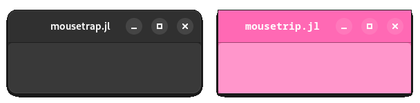
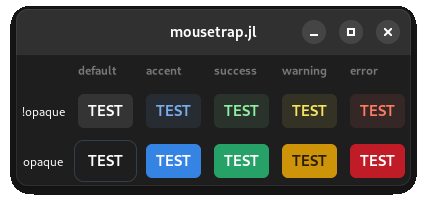
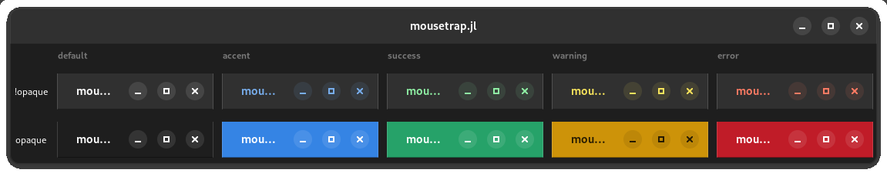
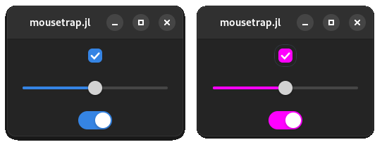

# Chapter 10: Theme & Widget Customization

In this chapter, we will learn:
+ How to swap between light- and dark- mode
+ How to create custom animations
+ How to apply a spatial transform to any widget
+ How to change the look of a widget using CSS
+ How to change the default colors used for the global theme
+ How to animate widgets using CSS

!!! compat 
    These features are only available in Mousetrap v0.2.0 or newer

---

As our app grows and becomes closer to what we envisioned for our project, we want to not only customize the layout and functionality of widgets but also how each widget looks. This can range from small changes such as changing something that is blue by default to green, or large sweeping changes that affect the entire application, such as moving to a light- or dark-, low- or high-contrast theme, or even using a completely custom theme.

Mousetrap allows for all of these options. Using its very powerful theme customization component, we can customize our app to a point where most will not be able to tell it was ever Mousetrap- / GTK4-based at all.

## Switching between Dark- and Light Mode

The most common task that almost any app will want to offer is for the user to be able to swap between light and dark mode. This is a ubiquitous feature of modern UI, as such, Mousetrap offers a very simple way of changing the global theme.

Mousetrap supports four default application-wide themes, which are values of enum [`Theme`](@ref):

+ `THEME_DEFAULT_LIGHT`
+ `THEME_DEFAULT_DARK`
+ `THEME_HIGH_CONTRAST_LIGHT`
+ `THEME_HIGH_CONTRAST_DARK`

At any point after the back-end has been initialized, we can swap the global theme using [`set_current_theme!`](@ref). This will immediately change the look of all widgets and windows, allowing apps to change the entire GUI with just one function call at runtime.

For example, to create a window that has a button to switch between light and dark themes in its header bar, we could do the following:

```julia
main() do app::Application

    window = Window(app)

    # add theme swap button to windows header bar
    header_bar = get_header_bar(window)
    swap_button = Button()
    set_tooltip_text!(swap_button, "Click to Swap Themes")
    connect_signal_clicked!(swap_button, app) do self::Button, app::Application

        # get currently used theme
        current = get_current_theme(app)

        # swap light with dark, preservng whether the theme is high contrast
        if current == THEME_DEFAULT_DARK
            next = THEME_DEFAULT_LIGHT
        elseif current == THEME_DEFAULT_LIGHT
            next = THEME_DEFAULT_DARK
        elseif current == THEME_HIGH_CONTRAST_DARK
            next = THEME_HIGH_CONTRAST_LIGHT
        elseif current == THEME_HIGH_CONTRAST_LIGHT
            next = THEME_HIGH_CONTRAST_DARK
        end

        # set new theme
        set_current_theme!(app, next)
    end
    push_front!(header_bar, swap_button)
    present!(window)
end
```

---

## Animation

We've seen in the chapter on widgets that certain kind of widgets animate their children. For example, when switching between two pages of a [`Stack`](@ref), or when a [`Revealer`](@ref) reveals its child, an animation is played depending on which enum value was chosen using [`set_transition_type!`](@ref). 

Mousetrap offers a convenient mechanism for implementing animations like this from scratch, which this section will demonstrate.

If we want to animate a widget "fading out" over 1 second, that is, its opacity changes from 1 to 0 over that period of time, we should decrease the opacity by a specified amount each frame. Tying the amount to the frame rate of our window is ill-advised, many things can influence the frame rate and fluctuations would cause fluctuations in the speed of the fade-out. 

To address this, Mousetrap offers [`Animation`](@ref), which acts as a *stable clock*, an object that outputs a value over a specified amount of time in a way that is independent of the frame rate.

Continuing with our fade-out example, we first need to instance the widget we want to fade out, a `Button`. We then create an instance of `Animation`, which takes for its constructor the widget we want to animate, along with the target duration of the animation:

```julia
to_animate = Button(Label("Fade Out"))
animation = Animation(to_animate, seconds(1))
```

By tying the `Animation` to the widget we will target, Mousetrap will automatically preserve the animation while that widget is visible, as well as tie the animation clock to the render cycle of that specific widget, meaning the `Animation` will not play if the widget is not visible.

To start the animation, we call [`play!`](@ref). Of course, we have not yet implemented the behavior of the widgets' opacity decreasing. To do this, we register a callback using `Animation`'s [`on_tick!`](@ref), which requires a function with the signature:

```julia
(::Animation, value::Float64) -> Nothing
```

Where `value` is the animations output value. By default, this will be in `[0, 1]`, though we can freely choose the upper and lower bound using [`set_lower!`](@ref) and [`set_upper!`](@ref). Once the animation is finished, the callback registered using [`on_done!`](@ref) is invoked.

Since a widget's opacity is already in `[0, 1]`, we can use the animations value directly:

```julia
to_animate = Button(Label("Fade Out"))
animation = Animation(to_animate, seconds(1))
on_tick!(animation, button) do self::Animation, value::Float64, target::Button
    set_opacity!(target, 1 - value)
end
```

Where we used `1 - value` to invert the range, such that the widget starts fully opaque and decreases in opacity.

We can then start the animation using `play!`, for example, by clicking the button:


!!! details "How to generate this Image"
    ```julia
    using Mousetrap
    main() do app::Application
        window = Window(app)
        set_title!(window, "Mousetrap.jl")

        button = Button(Label("Fade Out"))
        aspect_frame = AspectFrame(1.0, button)
        set_margin!(aspect_frame, 10)

        animation = Animation(button, seconds(1))
        on_tick!(animation, button) do self::Animation, value::Float64, target::Button
            set_opacity!(target, 1 - value)
        end
        on_done!(animation, button) do self::Animation, target::Button
            set_is_visible!(target, false)
        end

        connect_signal_clicked!(button, animation) do self::Button, animation::Animation
            play!(animation)
        end

        set_child!(window, aspect_frame)
        present!(window);
    end
    ```

For cyclical animations, we can use [`set_repeat_count!`](@ref) to specify the number of times the animation should loop, or `0` to loop infinitely. We can easily reverse an animation by setting [`set_is_reversed!`](@ref) to `true`.


If we want an animation to run indefinitely, but *not* repeat, for example to animate an object continuously bouncing, setting the animation duration to a very large value is not right way to achieve this, as it [may cause side-effects](https://github.com/Clemapfel/Mousetrap.jl/issues/63). Instead, use [`set_tick_callback!`](@ref). This function registers a callback to be invoked once per frame in synch with the corresponding widgets render cycle. By keeping track of the elapsed time, we can time animations this way without using `Animation`. The tick callback will continue until a value other than `TICK_CALLBACK_RESULT_CONTINUE` is returned. For an example of converting a regular `Animation`-based animation to tick callback, see [here](https://github.com/Clemapfel/Mousetrap.jl/issues/63).

`Animation` should be reserved to short "one-shot" animations such as an object sliding or spinning, or to cyclical animations, which are just those short animations repeating.

Attentive readers may remember that pre-made animations for `Stack` and `Revealer` also include widgets spinning or moving around the screen. So far, we have no good way of implementing motion like this. This is about to change.

## TransformBin

In the chapter on rendering, we learned that we can apply a `GLTransform` to a `Shape`, a non-widget, in order to move that shape **without** changing its vertex data. [`TransformBin`](@ref) offers similar functionality to this, except it only applies to widgets.

`TransformBin` is a widget that does not add any visual elements to its singular child. It furthermore always assumes the same size as its child. Instead, it offers a number of functions that allow us to apply a spatial transformation:

| Function | Argument(s) | Effect |
|----------------------|-----------|--------|
| [`translate!`](@ref) | `Vector2f` | Move widget by number of pixels |
| [`rotate!`](@ref) | `Angle` | Rotate around widgets' centroid |
| [`scale!`](@ref) | `Number, Number` | Scale height and width by given factor |
| [`skew!`](@ref) | `Number, Number` | [Skew](https://en.wikipedia.org/wiki/Shear_mapping) widget along x- and y-axis |
| [`reset!`](@ref) | `(none)` | Reset transform to identity |

!!! tip "Rotate around a Point"
    To rotate a widget around a fixed point `p`, we can `translate!` such 
    that the widget's new center is at `p`, `rotate!`, then `translate!` back to the widget's initial position. 

These functions are called on the `TransformBin` instance directly, we do not use a separate transform object. The arguments for these functions operate in absolute widget space, with `(0, 0)` being the top left corner of the `TransformBin`s size allocation, in pixels.

For example, to make a button spin one time when it is clicked, we can use `TransformBin` and `Animation` as follows:

```julia
# animation target
to_animate = Button(Label("Spin"))

# transform bin
transform_bin = TransformBin()
set_child!(transform_bin, to_animate)

# animation
animation = Animation(to_animate, seconds(1))
on_tick!(animation, transform_bin) do self::Animation, value::Float64, transform_bin::TransformBin
    # set the transform angle to value in [0, 360°]
    reset!(transform_bin)
    rotate!(transform_bin, degrees(value * 360))
end

# trigger animation when button is clicked
connect_signal_clicked!(to_animate, animation) do self::Button, animation::Animation
    play!(animation)
end
```


Note that applying a transform using `TransformBin` does not change the size allocation of the widget, it only applies the effect visually, similarly to how a `GLTransform` is only applied to the rendered image, not the `Shape` itself.

By default, the function used to map the elapsed duration of the `Animation` to the output value of `on_tick!` is linear in shape (`f(x) = x`). Mousetrap offers additional functions with different shapes, allowing users to more easily implement animations that appear to speed up or slow down at certain points. Using [`set_timing_function!`](@ref), which takes a value of the enum [`AnimationTimingFunction`](@ref), we can choose from multiple presets. See its documentation for more information.

---

# Widget Themes & Style Classes

Mousetrap uses [Cascading Style Sheets (CSS)](https://developer.mozilla.org/en-US/docs/Web/CSS) to define the exact look of a widget. A UI theme is nothing more than a huge CSS file from which all widgets take information about how they should be rendered. 

!!! warning "CSS"
    The rest of this chapter will assume that readers are familiar with the basics of CSS. Readers are encouraged to consult [this documentation](https://developer.mozilla.org/en-US/docs/Web/CSS/Reference) for CSS-related questions.

## Applying CSS Properties to a Widget

We can define a CSS modifier class as a string, then compile that string using [`add_css!`](@ref), which makes that modifier class globally available:

```julia
# define modifier class `sharp-corners`
add_css!("""
.sharp-corners {
   border-radius: 0%;
}
""")
```

We can then apply this class to any widget using [`add_css_class!`](@ref), at which point the widgets' appearance will change accordingly. To remove the modifier, we call [`remove_css_class!`](@ref). A widget can have more than one modifier class. To list all applied CSS classes, we use [`get_css_classes`](@ref).

For a list of CSS properties supported by Mousetrap, see [here](https://docs.gtk.org/gtk4/css-properties.html).

For example, the following defines a `ToggleButton` that, when toggled, applies the following CSS class to both the `Window` (which is a Widget), and its `HeaderBar`:

```julia
using Mousetrap
add_css!("""
.custom {
    background-color: hotpink;
    font-family: monospace;
    border-radius: 0%;
}
""")

main() do app::Application

    window = Window(app)
    set_title!(window, "Mousetrap.jl")
    
    button = ToggleButton()
    connect_signal_toggled!(button, window) do self::ToggleButton, window::Window
        if get_is_active(self) 
            add_css_class!(window, "custom")
            add_css_class!(get_header_bar(window), "custom")
        else
            remove_css_class!(window, "custom")
            remove_css_class!(get_header_bar(window), "custom")
        end
    end
    set_child!(window, button)
    present!(window)
end
```



While a pink window is usually not recommended, making small adjustments to interactive widgets, or changing which font a widget uses, can be very useful when polishing our application's look and feel.

For a more practical example, after defining the following CSS modifier class:

```css
.monospaced {
    font-family: monospace;
}
```

We can make an `Entry` or `TextView` use monospaced text by calling `add_css_class!(widget, "monospaced")` on each widget instance.

---

## Changing a Widgets Color

The following implements `set_accent_color!`, which is not part of Mousetrap. `set_accent_color!` takes a widget, one of the below constants, as well as a boolean indicating whether the window should be opaque, as its arguments. When applied to a widget, this function changes that widgets color to one of the 5 pre-defined UI colors, such that their look fits well with the default UI theme:

```julia
using Mousetrap

# define widget colors
const WidgetColor = String
const WIDGET_COLOR_DEFAULT = "default"
const WIDGET_COLOR_ACCENT = "accent"
const WIDGET_COLOR_SUCCESS = "success"
const WIDGET_COLOR_WARNING = "warning"
const WIDGET_COLOR_ERROR = "error"

# create CSS classes for all of the widget colors
for name in [WIDGET_COLOR_DEFAULT, WIDGET_COLOR_ACCENT, WIDGET_COLOR_SUCCESS, WIDGET_COLOR_WARNING, WIDGET_COLOR_ERROR]
    # compile CSS and append it to the global CSS style provider state
    add_css!("""
    $name:not(.opaque) {
        background-color: @$(name)_fg_color;
    }
    .$name.opaque {
        background-color: @$(name)_bg_color;
        color: @$(name)_fg_color;
    }
    """)
end

# function to set the accent color of a widget
function set_accent_color!(widget::Widget, color, opaque = true)
    if !(color in [WIDGET_COLOR_DEFAULT, WIDGET_COLOR_ACCENT, WIDGET_COLOR_SUCCESS, WIDGET_COLOR_WARNING, WIDGET_COLOR_ERROR])
        log_critical("In set_color!: Color ID `" * color * "` is not supported")
    end    
    add_css_class!(widget, color)
    if opaque
        add_css_class!(widget, "opaque")
    end
end
```

Users are encouraged to just copy the above code into their own project, for `set_accent_color!` to become available.

We can use this function like so:

```julia
# widget factory
create_widget() = Button(Label("TEST"))

# create column view
column_view = ColumnView()

# column 1: whether `opaque` was set to true
column = push_back_column!(column_view, " ")
set_widget_at!(column_view, column, 1, Label("<small>!opaque</small>"))
set_widget_at!(column_view, column, 2, Label("<small>opaque</small>"))

for color in [
    WIDGET_COLOR_DEFAULT, # column 2: default look of a widget
    WIDGET_COLOR_ACCENT,  # column 3: accented, usually blue
    WIDGET_COLOR_SUCCESS, # column 4: marked successful, usually green
    WIDGET_COLOR_WARNING, # column 5: marked as warning, usually yellow
    WIDGET_COLOR_ERROR]   # column 6: marked as destructive action, usually red
    column = push_back_column!(column_view, color)
    
    # row 1: accented widget, not opaque
    widget = create_widget()
    set_accent_color!(widget, color, false)
    set_widget_at!(column_view, column, 1, widget)

    # row 2: accented widget, opaque
    widget = create_widget()
    set_accent_color!(widget, color, true)
    set_widget_at!(column_view, column, 2, widget)
end
```

Here, we created a column view that shows all permutations of the arguments of `set_accent_color!`. We defined `create_widget() = Button(Label("TEST"))`, therefore each cell will have a button with a label:



`set_accent_color!` allows us to change the color of each button. It can be applied to any widget, however:



Where we use a `HeaderBar` instead of `Button`. CSS modifiers can be applied to any widget, even windows.

## Changing the Themes Palette

To change a color used by the global theme, we need to redefine one of the themes [color constants](https://docs.gtk.org/gtk4/css-properties.html#colors) using CSS.

For example, the global accent color, blue by default, can be redefined to any other color using the following function, which is also not part of Mousetrap:

```julia
set_accent_color!(color::RGBA) = add_css!("@define-color accent_bg_color $(serialize(color));")
```

For example, calling `set_accent_color!(RGBA(1, 0, 1, 1))` changes the accent color to magenta, which is applied to all widgets globally:



For names of palette colors other than `accent_bg_color`, see [here](https://gitlab.gnome.org/GNOME/libadwaita/-/blob/main/src/stylesheet/_colors.scss?ref_type=heads).

## CSS Animations

`Animation` offers an in-engine way to do animations, which is usually preferred. However, [CSS animations](https://developer.mozilla.org/en-US/docs/Web/CSS/CSS_animations/Using_CSS_animations) are supported as well, and are defined as they would be in pure CSS:

```julia
# define CSS animation and modifier
add_css!("""
@keyframes spin-animation {
    0%   { transform: rotate(0turn)   scale(1); }
    50%  { transform: rotate(0.5turn) scale(2); }
    100% { transform: rotate(1turn)   scale(1); }
}

.spinning {
    animation: spin-animation;
    animation-duration: 1s;
    animation-iteration-count: infinite;
    animation-timing-function: ease-in-out;
}
""")

main() do app::Application
    window = Window(app)
    button = Button()

    # apply modifier, this sets the animation-related properties
    add_css_class!(button, "spinning")

    set_child!(window, AspectFrame(1.0, button))
    present!(window)
end
```


While we could create this animation using `Mousetrap.Animation` and `TransformBin`, using CSS means that we do not have to instance these two objects for every widget we want to animate, we can instead just apply the CSS modifier class to any instance. In return, the CSS-based animation cannot depend on any external variables and is thus only suited for animations that remain the same each time they are played. 
